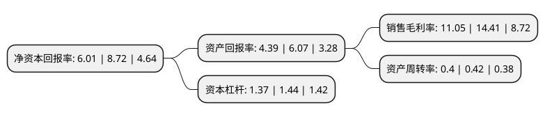

> 本页面由自动化程序生成于 2022年5月20日 01:19
> 内容可能存在错误，如有bug请提交issue至：https://github.com/Eroleice/doc-pi/issues
{.is-warning}

# 上市公司基本情况

## 基本资料

江苏大烨智能电气股份有限公司（以下简称“大烨智能”）成立于2011年12月21日，南京市。于2017年07月03日在深交所创业板上市。

大烨智能注册资本31,692.048万元，配电网的安全，稳定，自动化和信息化等方面的技术研究，产品开发和生产服务，公司产品包括配电自动化终端，智能中压开关设备，变电站自动化系统，低压电气成套设备等。以下是详细信息：

- 公司名称: 江苏大烨智能电气股份有限公司
- 股票代码: 300670.SZ
- 所在地: 江苏 - 南京市
- 成立日期: 2011年12月21日
- 注册资本: 31,692.048万元
- 法定代表人: 陈杰
- 主营业务: 配电网的安全，稳定，自动化和信息化等方面的技术研究，产品开发和生产服务，公司产品包括配电自动化终端，智能中压开关设备，变电站自动化系统，低压电气成套设备等
- 公司官网: www.daybright.cn
- 公司介绍: 公司是一家在配电网自动化领域里具有自主创新能力的高成长性高新技术企业。公司自成立以来，始终致力于配电网的安全、稳定、自动化和信息化等方面的技术研究、产品开发、服务、生产和销售，公司产品在提高电网安全与稳定性、改善电能质量、提高电力企业自动化和信息化水平方面起到非常重要的作用。公司拥有多项国家专利技术和计算机软件著作权，已建立了以继电保护技术、测控技术、通信技术和应用软件技术为基础的核心技术平台，形成了面向电气控制与自动化前沿领域的产品布局。公司已被认定为“高新技术企业”、“企业技术中心”、“公司银行信用”等级AAA级。

## 股东及高管情况

上市公司第一大股东为陈杰，持股115,317,000股，占比36.39%，为上市公司实际控制人。

截至2022年03月31日，上市公司的前十大股东中，共有9名自然人股东，1名机构股东，其中5%以上大股东共有2名。上市公司前十大股东明细如下：

> 截至2022年03月31日，上市公司前十大股东信息如下：

| 股东名称 | 持股数量（股） | 持股比例 |
| --- | --- | --- |
| 陈杰 | 115,317,000 | 36.39% |
| 南京明昭投资管理有限公司 | 24,362,995 | 7.69% |
| 吴国栋 | 11,173,621 | 3.53% |
| 王国华 | 4,833,500 | 1.53% |
| 林孔周 | 4,277,100 | 1.35% |
| 蔡兴隆 | 3,765,025 | 1.19% |
| 王骏 | 2,429,048 | 0.77% |
| 姚灿灿 | 1,172,000 | 0.37% |
| 王健 | 1,123,300 | 0.35% |
| 王玥 | 1,079,100 | 0.34% |

## 利润表分析

上市公司2021年总收入为5.13亿元，净利润为0.56亿元，实现盈利。

## 杜邦分析

> 数据列示周期：2021年 | 2020年 | 2019年
{.is-info}

上市公司的净资产收益率在近一年有所下降，下降幅度为-31.08%，其变化情况分解如下：
- 上市公司的销售毛利率在近一年下降了-23.32%，可能是生产效率的下降、商品原材料价格上涨或商品价格的下跌所致。
- 上市公司的资产周转率在近一年下降了-4.76%，可能是源自于更慢的销售回款或库存管理效果下降。
- 上市公司的财务杠杆比率在近一年下降了-4.86%，可能是减少负债降低财务费用。

