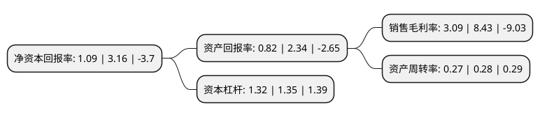

> 本页面由自动化程序生成于 2022年5月20日 01:19
> 内容可能存在错误，如有bug请提交issue至：https://github.com/Eroleice/doc-pi/issues
{.is-warning}

# 上市公司基本情况

## 基本资料

深圳市英可瑞科技股份有限公司（以下简称“英可瑞”）成立于2002年04月24日，深圳市。于2017年11月01日在深交所创业板上市。

英可瑞注册资本15,778.125万元，主营业务:从事电力电子行业领域中，智能高频开关电源及相关电力电子产品的研发，生产和销售。主要产品:电动汽车充电电源产品，电力操作电源产品，其他电源及电力电子产品。以下是详细信息：

- 公司名称: 深圳市英可瑞科技股份有限公司
- 股票代码: 300713.SZ
- 所在地: 广东 - 深圳市
- 成立日期: 2002年04月24日
- 注册资本: 15,778.125万元
- 法定代表人: 尹伟
- 主营业务: 主营业务:从事电力电子行业领域中，智能高频开关电源及相关电力电子产品的研发，生产和销售主要产品:电动汽车充电电源产品，电力操作电源产品，其他电源及电力电子产品
- 公司官网: www.szincrease.com
- 公司介绍: 公司主要从事智能高频开关电源及相关电力电子产品的研发、生产和销售。公司定位于智能高频开关电源核心部件供应商，目前产品主要包括电动汽车充电电源模块及系统、电力操作电源模块及系统以及其他电源产品。产品主要应用在新能源汽车充电设施、电力系统、通信系统、轨道交通等领域。

## 股东及高管情况

上市公司第一大股东为尹伟，持股70,705,092股，占比44.81%，为上市公司实际控制人。

截至2022年03月31日，上市公司的前十大股东中，共有9名自然人股东，1名机构股东，其中5%以上大股东共有3名。上市公司前十大股东明细如下：

> 截至2022年03月31日，上市公司前十大股东信息如下：

| 股东名称 | 持股数量（股） | 持股比例 |
| --- | --- | --- |
| 尹伟 | 70,705,092 | 44.81% |
| 邓琥 | 12,205,790 | 7.74% |
| 刘文锋 | 10,932,614 | 6.93% |
| 建水县深瑞企业管理中心(有限合伙) | 5,272,587 | 3.34% |
| 吕有根 | 2,667,758 | 1.69% |
| 何勇志 | 2,576,938 | 1.63% |
| 丰建国 | 1,581,500 | 1% |
| 周军 | 607,300 | 0.38% |
| 王瑞香 | 313,000 | 0.2% |
| 费占军 | 300,700 | 0.19% |

## 利润表分析

上市公司2021年总收入为2.55亿元，净利润为0.07亿元，实现盈利。

## 杜邦分析

> 数据列示周期：2021年 | 2020年 | 2019年
{.is-info}

上市公司的净资产收益率在近一年有所下降，下降幅度为-65.51%，其变化情况分解如下：
- 上市公司的销售毛利率在近一年下降了-63.35%，可能是生产效率的下降、商品原材料价格上涨或商品价格的下跌所致。
- 上市公司的资产周转率在近一年下降了-3.57%，可能是源自于更慢的销售回款或库存管理效果下降。
- 上市公司的财务杠杆比率在近一年下降了-2.22%，可能是减少负债降低财务费用。

