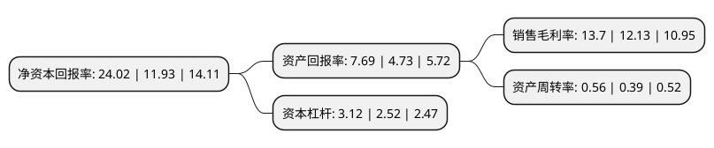

> 本页面由自动化程序生成于 2022年5月20日 01:20
> 内容可能存在错误，如有bug请提交issue至：https://github.com/Eroleice/doc-pi/issues
{.is-warning}

# 上市公司基本情况

## 基本资料

宁德时代新能源科技股份有限公司（以下简称“宁德时代”）成立于2011年12月16日，宁德市。于2018年06月11日在深交所创业板上市。

宁德时代注册资本233,085.12万元，公司是全球领先的动力电池系统提供商，专注于新能源汽车动力电池系统，储能系统的研发，生产和销售，致力于为全球新能源应用提供一流解决方案。公司在电池材料，电池系统，电池回收等产业链关键领域拥有核心技术优势及可持续研发能力，形成了全面，完善的生产服务体系。公司主要产品包括动力电池系统，储能系统和锂电池材料。以下是详细信息：

- 公司名称: 宁德时代新能源科技股份有限公司
- 股票代码: 300750.SZ
- 所在地: 福建 - 宁德市
- 成立日期: 2011年12月16日
- 注册资本: 233,085.12万元
- 法定代表人: 周佳
- 主营业务: 公司是全球领先的动力电池系统提供商，专注于新能源汽车动力电池系统，储能系统的研发，生产和销售，致力于为全球新能源应用提供一流解决方案公司在电池材料，电池系统，电池回收等产业链关键领域拥有核心技术优势及可持续研发能力，形成了全面，完善的生产服务体系公司主要产品包括动力电池系统，储能系统和锂电池材料
- 公司官网: www.catlbattery.com/www.catl.com
- 公司介绍: 公司是全球领先的动力电池系统提供商，专注于新能源汽车动力电池系统、储能系统的研发、生产和销售，致力于为全球新能源应用提供一流解决方案。公司在电池材料、电池系统、电池回收等产业链关键领域拥有核心技术优势及可持续研发能力，形成了全面、完善的生产服务体系。公司拥有国际一流的研发团队，设立了“福建省院士专家工作站”，拥有锂离子电池企业省级重点实验室、中国合格评定国家认可委员会(CNAS)认证的测试验证中心，参与了《电动客车安全技术条件》、《电动汽车用锂离子动力蓄电池安全要求》、《电力储能用锂离子电池》等多个国家、行业规范及标准的制定。公司承担了“十二五”国家新能源汽车产业技术创新工程项目、“十三五”国家重点研发计划新能源汽车专项项目和智能电网与装备专项项目、国家火炬计划产业化示范项目等国家级项目，为首批入选工信部《汽车动力蓄电池行业规范条件》目录的十家动力电池企业之一、《锂离子电池行业规范条件》目录的八家锂离子电池企业之一。公司曾获得中国化学与物理电源行业协会“中国动力和储能用锂离子电池前10强企业”、中国储能网“中国储能产业最具影响力企业”、工信部和财政部“2017年国家技术创新示范企业”等多项荣誉。

## 股东及高管情况

上市公司第一大股东为宁波梅山保税港区瑞庭投资有限公司，持股569,480,527股，占比24.43%，**疑似为**上市公司实际控制人。

截至2022年03月31日，上市公司的前十大股东中，共有2名自然人股东，6名机构股东，1个产品账户，1个海外主体，其中5%以上大股东共有4名。上市公司前十大股东明细如下：

> 未能通过持股比例判定出上市公司实际控制人（持股30%以上）
> 可能存在通过间接持股、联合持股、协议控制等方式拥有实际控制权的主体，具体请参考上市公司定期公告！
{.is-warning}

> 截至2022年03月31日，上市公司前十大股东信息如下：

| 股东名称 | 持股数量（股） | 持股比例 |
| --- | --- | --- |
| 宁波梅山保税港区瑞庭投资有限公司 | 569,480,527 | 24.43% |
| 黄世霖 | 259,850,100 | 11.15% |
| 香港中央结算有限公司(陆股通) | 179,145,441 | 7.69% |
| 宁波联合创新新能源投资管理合伙企业(有限合伙) | 157,900,338 | 6.77% |
| 李平 | 111,950,154 | 4.8% |
| 深圳市招银叁号股权投资合伙企业(有限合伙) | 46,231,887 | 1.98% |
| 湖北长江招银动力投资合伙企业(有限合伙) | 42,915,098 | 1.84% |
| HHLR管理有限公司-中国价值基金(交易所) | 38,841,872 | 1.67% |
| 宁波梅山保税港区博瑞荣合投资合伙企业(有限合伙) | 32,538,300 | 1.4% |
| 西藏鸿商资本投资有限公司 | 27,224,521 | 1.17% |

## 利润表分析

上市公司2021年总收入为1,303.55亿元，净利润为178.6亿元，实现盈利。

## 杜邦分析

> 数据列示周期：2021年 | 2020年 | 2019年
{.is-info}

上市公司的净资产收益率在近一年有所上升，上升幅度为101.34%，其变化情况分解如下：
- 上市公司的销售毛利率在近一年上升了12.94%，可能是生产效率的提升、商品原材料价格下跌或商品价格的上涨所致。
- 上市公司的资产周转率在近一年上升了43.59%，可能是源自于更快的销售回款或库存管理效果提升。
- 上市公司的财务杠杆比率在近一年上升了23.81%，可能是增加负债扩大生产规模。

