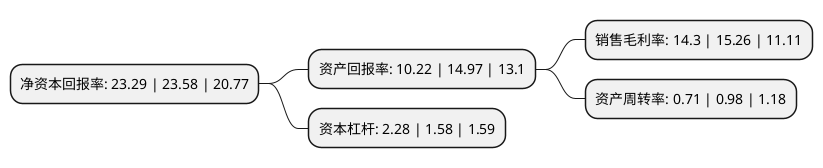

> 本页面由自动化程序生成于 2022年5月20日 01:20
> 内容可能存在错误，如有bug请提交issue至：https://github.com/Eroleice/doc-pi/issues
{.is-warning}

# 上市公司基本情况

## 基本资料

锦浪科技股份有限公司（以下简称“锦浪科技”）成立于2005年09月09日，宁波市。于2019年03月19日在深交所创业板上市。

锦浪科技注册资本24,758.025万元，本公司立足于新能源行业，专注于分布式光伏发电领域，为一家专业从事分布式光伏发电系统核心设备组串式逆变器研发，生产，销售和服务的高新技术企业。公司的主要产品为组串式逆变器，其主要用途为将太阳能电池组件产生的电能，变为稳定的，符合电网电能质量要求的交流电能接入电网，是太阳能光伏发电系统不可缺少的核心设备。以下是详细信息：

- 公司名称: 锦浪科技股份有限公司
- 股票代码: 300763.SZ
- 所在地: 浙江 - 宁波市
- 成立日期: 2005年09月09日
- 注册资本: 24,758.025万元
- 法定代表人: 王一鸣
- 主营业务: 本公司立足于新能源行业，专注于分布式光伏发电领域，为一家专业从事分布式光伏发电系统核心设备组串式逆变器研发，生产，销售和服务的高新技术企业公司的主要产品为组串式逆变器，其主要用途为将太阳能电池组件产生的电能，变为稳定的，符合电网电能质量要求的交流电能接入电网，是太阳能光伏发电系统不可缺少的核心设备
- 公司官网: www.ginlong.com
- 公司介绍: 公司主要从事光伏并网逆变器、风力并网逆变器及分布式风力发电机组的研发、生产、销售和服务。公司作为知名的并网逆变器供应商，自成立以来，就注重自主研发，生产的产品具有质量高、性能好等优异的特点，随着技术的积累和研发实力的提升，公司在光伏逆变器、风力逆变器、风光混合逆变器、储能并网一体式混合逆变器等多个领域居于行业的前列，公司拥有多项核心技术，并注重知识产权保护，在行业内拥有较高的的技术影响力和一定的市场地位。众多优秀技术人才。公司研发团队被评为浙江省重点创新团队，建有企业院士工作站。截至2018年3月30日，公司已取得专利证书的专利51项，并获得了多项荣誉与奖项。公司自成立初即坚持全球化布局，凭借优异的产品性能和可靠的产品质量，公司在亚洲、欧洲、美洲及澳洲等多个国家和地区积累了众多优质客户，与公司形成了长期稳定的合作关系，除国内市场外，公司产品销往美国、英国、荷兰、澳大利亚、墨西哥、印度等全球多个国家和地区，赢得了客户的高度认可。

## 股东及高管情况

上市公司第一大股东为王一鸣，持股66,626,548股，占比26.91%，**疑似为**上市公司实际控制人。

截至2022年03月31日，上市公司的前十大股东中，共有3名自然人股东，3名机构股东，3个产品账户，1个海外主体，其中5%以上大股东共有5名。上市公司前十大股东明细如下：

> 未能通过持股比例判定出上市公司实际控制人（持股30%以上）
> 可能存在通过间接持股、联合持股、协议控制等方式拥有实际控制权的主体，具体请参考上市公司定期公告！
{.is-warning}

> 截至2022年03月31日，上市公司前十大股东信息如下：

| 股东名称 | 持股数量（股） | 持股比例 |
| --- | --- | --- |
| 王一鸣 | 66,626,548 | 26.91% |
| 林伊蓓 | 24,018,064 | 9.7% |
| 宁波聚才财聚投资管理有限公司 | 21,726,049 | 8.78% |
| 王峻适 | 20,277,648 | 8.19% |
| 宁波东元创业投资有限公司 | 16,601,769 | 6.71% |
| 宁波高新区华桐恒德创业投资合伙企业(有限合伙) | 4,847,210 | 1.96% |
| 上海浦发发展银行股份有限公司-广发高端制造股票型发起式证券投资基金 | 4,567,306 | 1.84% |
| 香港中央结算有限公司(陆股通) | 4,515,464 | 1.82% |
| 全国社保基金四零六组合 | 4,054,380 | 1.64% |
| 广发基金管理有限公司-社保基金四二零组合 | 3,283,488 | 1.33% |

## 利润表分析

上市公司2021年总收入为33.12亿元，净利润为4.73亿元，实现盈利。

## 杜邦分析

> 数据列示周期：2021年 | 2020年 | 2019年
{.is-info}

上市公司的净资产收益率在近一年有所下降，下降幅度为-1.23%，其变化情况分解如下：
- 上市公司的销售毛利率在近一年下降了-6.29%，可能是生产效率的下降、商品原材料价格上涨或商品价格的下跌所致。
- 上市公司的资产周转率在近一年下降了-27.55%，可能是源自于更慢的销售回款或库存管理效果下降。
- 上市公司的财务杠杆比率在近一年上升了44.3%，可能是增加负债扩大生产规模。

