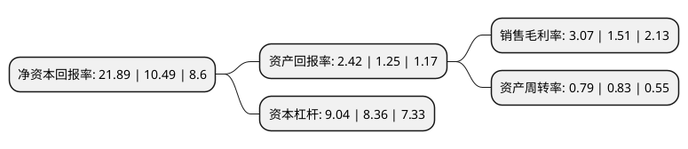

> 本页面由自动化程序生成于 2022年5月20日 01:20
> 内容可能存在错误，如有bug请提交issue至：https://github.com/Eroleice/doc-pi/issues
{.is-warning}

# 上市公司基本情况

## 基本资料

浙江运达风电股份有限公司（以下简称“运达股份”）成立于2001年11月30日，杭州市。于2019年04月26日在深交所创业板上市。

运达股份注册资本33,899.017万元，公司目前产品主要为1。5MW，2。0MW和2。5MW系列风电机组，公司的主营业务为大型风力发电机组的研发，生产和销售。以下是详细信息：

- 公司名称: 浙江运达风电股份有限公司
- 股票代码: 300772.SZ
- 所在地: 浙江 - 杭州市
- 成立日期: 2001年11月30日
- 注册资本: 33,899.017万元
- 法定代表人: 高玲
- 主营业务: 公司目前产品主要为15MW，20MW和25MW系列风电机组，公司的主营业务为大型风力发电机组的研发，生产和销售
- 公司官网: www.chinawindey.com
- 公司介绍: 公司是一家由浙江省机电集团公司控股，中国节能投资公司为主要大股东的省级国有企业，前身是浙江省机电研究院风电研究所，从事风力发电机组技术研究、产品研发已有近40年的历史。公司主营大型风力发电机组的设计、生产和销售以及风电场的运行维护、备品备件的供应；并提供风场规划、管理及服务。是国家高新技术企业和高新技术研发中心，曾获“全国机械工业先进集体”“浙江省龙头骨干企业”“国家创新型试点企业”等荣誉称号。2010年国家科技部“风力发电系统国家重点实验室”落户运达风电，是我国风电领域批准建设的第一批企业国家重点实验室。

## 股东及高管情况

上市公司第一大股东为浙江省机电集团有限公司，持股135,000,000股，占比39.82%，为上市公司实际控制人。

截至2022年03月31日，上市公司的前十大股东中，共有4名机构股东，5个产品账户，1个海外主体，其中5%以上大股东共有1名。上市公司前十大股东明细如下：

> 截至2022年03月31日，上市公司前十大股东信息如下：

| 股东名称 | 持股数量（股） | 持股比例 |
| --- | --- | --- |
| 浙江省机电集团有限公司 | 135,000,000 | 39.82% |
| 香港中央结算有限公司(陆股通) | 9,395,243 | 2.77% |
| 中国太平洋人寿保险股份有限公司-传统-普通保险产品 | 6,905,577 | 2.04% |
| 全国社保基金六零二组合 | 4,157,605 | 1.23% |
| 中节能实业发展有限公司 | 3,750,000 | 1.11% |
| 中节能科技投资有限公司 | 2,830,070 | 0.83% |
| 中国人寿保险股份有限公司-传统-普通保险产品-005L-CT001深 | 2,403,495 | 0.71% |
| 中国银行股份有限公司-国投瑞银新能源混合型证券投资基金 | 2,301,013 | 0.68% |
| 中国太平洋人寿保险股份有限公司-分红-个人分红 | 2,216,054 | 0.65% |
| 方正证券-中信银行-方正证券金立方一年持有期混合型集合资产管理计划 | 2,008,231 | 0.59% |

## 利润表分析

上市公司2021年总收入为160.4亿元，净利润为4.93亿元，实现盈利。

## 杜邦分析

> 数据列示周期：2021年 | 2020年 | 2019年
{.is-info}

上市公司的净资产收益率在近一年有所上升，上升幅度为108.67%，其变化情况分解如下：
- 上市公司的销售毛利率在近一年上升了103.31%，可能是生产效率的提升、商品原材料价格下跌或商品价格的上涨所致。
- 上市公司的资产周转率在近一年下降了-4.82%，可能是源自于更慢的销售回款或库存管理效果下降。
- 上市公司的财务杠杆比率在近一年上升了8.13%，可能是增加负债扩大生产规模。

