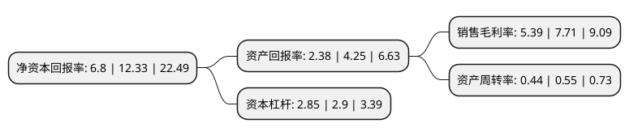

> 本页面由自动化程序生成于 2022年5月20日 01:20
> 内容可能存在错误，如有bug请提交issue至：https://github.com/Eroleice/doc-pi/issues
{.is-warning}

# 上市公司基本情况

## 基本资料

上能电气股份有限公司（以下简称“上能电气”）成立于2012年03月30日，无锡市。于2020年04月10日在深交所创业板上市。

上能电气注册资本13,200.048万元，公司主要从事电力电子设备的研发，生产，销售。专注于电力电子变换技术，运用电力电子变换技术为光伏发电，电化学储能接入电网以及电能质量治理提供解决方案，主要产品包括光伏逆变器(PV Inverter)，储能双向变流器(PCS)以及有源滤波器(APF)，低压无功补偿器(SVG)，智能电能质量矫正装置(SPC)等产品，并提供光伏发电系统和储能系统的集成业务。以下是详细信息：

- 公司名称: 上能电气股份有限公司
- 股票代码: 300827.SZ
- 所在地: 江苏 - 无锡市
- 成立日期: 2012年03月30日
- 注册资本: 13,200.048万元
- 法定代表人: 吴强
- 主营业务: 公司主要从事电力电子设备的研发，生产，销售专注于电力电子变换技术，运用电力电子变换技术为光伏发电，电化学储能接入电网以及电能质量治理提供解决方案，主要产品包括光伏逆变器(PV Inverter)，储能双向变流器(PCS)以及有源滤波器(APF)，低压无功补偿器(SVG)，智能电能质量矫正装置(SPC)等产品，并提供光伏发电系统和储能系统的集成业务
- 公司官网: www.si-neng.com
- 公司介绍: 公司是一家集电力电子产品研发、制造与销售为一体的国家高新技术企业,公司专注于电力电子变换技术，运用电力电子变换技术为光伏发电、电化学储能接入电网以及电能质量治理提供解决方案,主要产品包括光伏逆变器(PV Inverter)、储能双向变流器(PCS)以及有源滤波器(APF)、低压无功补偿器(SVG)、智能电能质量矫正装置(SPC)等产品，并提供光伏发电系统和储能系统的集成业务。公司承担了江苏省重点项目“高效型光伏并网逆变器建设项目”和“基于大数据协同控制的高效智能集散式光伏逆变成套系统项目”，以及“大功率模块化T型三电平双向储能光伏逆变器项目”、“基于物联网单块光伏电池板特性参数检测技术的智能光伏电站系统的产业化项目”等,同时，公司还为青海黄河上游水电开发有限责任公司的“共和100MWp试验测试基地储能示范项目”提供光伏储能系统解决方案,公司被福布斯评为“2017年福布斯中国非上市公司潜力企业20强”,获得多项专利并建有院士工作站、CNAS认证实验室(国家级)、博士后创新实践基地、省级企业技术中心、省工程技术研究中心、江苏省唯一的能源光伏逆变系统工程中心。

## 股东及高管情况

上市公司第一大股东为吴强，持股28,170,000股，占比21.34%，**疑似为**上市公司实际控制人。

截至2022年03月31日，上市公司的前十大股东中，共有6名自然人股东，4名机构股东，其中5%以上大股东共有4名。上市公司前十大股东明细如下：

> 未能通过持股比例判定出上市公司实际控制人（持股30%以上）
> 可能存在通过间接持股、联合持股、协议控制等方式拥有实际控制权的主体，具体请参考上市公司定期公告！
{.is-warning}

> 截至2022年03月31日，上市公司前十大股东信息如下：

| 股东名称 | 持股数量（股） | 持股比例 |
| --- | --- | --- |
| 吴强 | 28,170,000 | 21.34% |
| 段育鹤 | 16,420,018 | 12.44% |
| 无锡朔弘投资合伙企业(有限合伙) | 11,700,000 | 8.86% |
| 陈敢峰 | 7,200,460 | 5.45% |
| 无锡云峰投资合伙企业(有限合伙) | 4,500,000 | 3.41% |
| 无锡华峰投资合伙企业(有限合伙) | 4,050,000 | 3.07% |
| 李建飞 | 3,600,000 | 2.73% |
| 无锡大昕投资合伙企业(有限合伙) | 3,330,000 | 2.52% |
| 赵龙 | 2,700,000 | 2.05% |
| 姜正茂 | 2,683,400 | 2.03% |

## 利润表分析

上市公司2021年总收入为10.92亿元，净利润为0.58亿元，实现盈利。

## 杜邦分析

> 数据列示周期：2021年 | 2020年 | 2019年
{.is-info}

上市公司的净资产收益率在近一年有所下降，下降幅度为-44.85%，其变化情况分解如下：
- 上市公司的销售毛利率在近一年下降了-30.09%，可能是生产效率的下降、商品原材料价格上涨或商品价格的下跌所致。
- 上市公司的资产周转率在近一年下降了-20%，可能是源自于更慢的销售回款或库存管理效果下降。
- 上市公司的财务杠杆比率在近一年下降了-1.72%，可能是减少负债降低财务费用。

