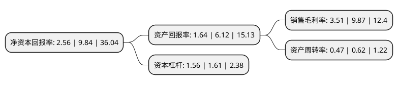

> 本页面由自动化程序生成于 2022年5月20日 01:21
> 内容可能存在错误，如有bug请提交issue至：https://github.com/Eroleice/doc-pi/issues
{.is-warning}

# 上市公司基本情况

## 基本资料

深圳爱克莱特科技股份有限公司（以下简称“爱克股份”）成立于2009年09月18日，深圳市。于2020年09月16日在深交所创业板上市。

爱克股份注册资本15,600万元，从事景观照明智能控制系统及LED景观照明灯具的研发，生产和销售，主要产品为景观照明智能控制系统和LED景观照明灯具系列产品。以下是详细信息：

- 公司名称: 深圳爱克莱特科技股份有限公司
- 股票代码: 300889.SZ
- 所在地: 广东 - 深圳市
- 成立日期: 2009年09月18日
- 注册资本: 15,600万元
- 法定代表人: 谢明武
- 主营业务: 从事景观照明智能控制系统及LED景观照明灯具的研发，生产和销售，主要产品为景观照明智能控制系统和LED景观照明灯具系列产品
- 公司官网: www.exc-led.com
- 公司介绍: 公司是从事景观照明智能控制系统及LED景观照明灯具的研发、生产和销售的国家级高新技术企业，公司始终以客户需求为导向，致力于为客户提供稳定可靠的LED景观照明产品。公司专注于景观照明领域的技术研发、产品设计与生产制造，在智能控制系统和景观照明产品领域具备较强的产品开发和制造能力，能够满足客户大规模的定制化需求，已成为国内大型景观照明项目所需产品的核心供应商之一。公司产品成功应用于国内诸多大型城市整体亮化项目，包括深圳改革开放40周年庆典主题灯光秀项目、青岛上合组织峰会主题灯光秀项目、厦门金砖会议主题灯光秀项目、杭州G20峰会钱江新城主题灯光秀项目、武汉两江四岸长江灯光秀项目等。公司已被认定为广东省景观LED工程技术研究中心。公司产品被认定为广东省名牌产品，产品通过了CCC认证、CE认证、CQC认证及ROHS认证。

## 股东及高管情况

上市公司第一大股东为谢明武，持股45,337,500股，占比29.06%，**疑似为**上市公司实际控制人。

截至2022年03月31日，上市公司的前十大股东中，共有8名自然人股东，2个产品账户，其中5%以上大股东共有4名。上市公司前十大股东明细如下：

> 未能通过持股比例判定出上市公司实际控制人（持股30%以上）
> 可能存在通过间接持股、联合持股、协议控制等方式拥有实际控制权的主体，具体请参考上市公司定期公告！
{.is-warning}

> 截至2022年03月31日，上市公司前十大股东信息如下：

| 股东名称 | 持股数量（股） | 持股比例 |
| --- | --- | --- |
| 谢明武 | 45,337,500 | 29.06% |
| 张锋斌 | 16,500,000 | 10.58% |
| 冯仁荣 | 9,825,000 | 6.3% |
| 陈利 | 9,225,000 | 5.91% |
| 郑闳升 | 6,124,800 | 3.93% |
| 深圳市高新投人才股权投资基金管理有限公司-深圳市人才创新创业二号股权投资基金合伙企业(有限合伙) | 2,880,000 | 1.85% |
| 深圳市红土智能股权投资管理有限公司-深圳市红土智能股权投资基金合伙企业(有限合伙) | 2,350,000 | 1.51% |
| 郭群涛 | 1,725,000 | 1.11% |
| 陈永建 | 985,500 | 0.63% |
| 何德康 | 930,579 | 0.6% |

## 利润表分析

上市公司2021年总收入为11.32亿元，净利润为0.39亿元，实现盈利。

## 杜邦分析

> 数据列示周期：2021年 | 2020年 | 2019年
{.is-info}

上市公司的净资产收益率在近一年有所下降，下降幅度为-73.98%，其变化情况分解如下：
- 上市公司的销售毛利率在近一年下降了-64.44%，可能是生产效率的下降、商品原材料价格上涨或商品价格的下跌所致。
- 上市公司的资产周转率在近一年下降了-24.19%，可能是源自于更慢的销售回款或库存管理效果下降。
- 上市公司的财务杠杆比率在近一年下降了-3.11%，可能是减少负债降低财务费用。

