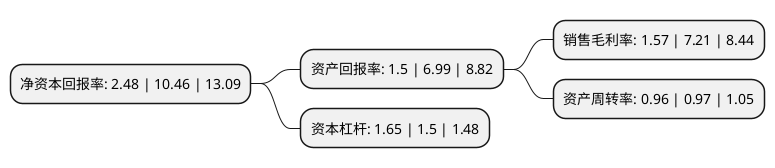

> 本页面由自动化程序生成于 2022年5月20日 01:21
> 内容可能存在错误，如有bug请提交issue至：https://github.com/Eroleice/doc-pi/issues
{.is-warning}

# 上市公司基本情况

## 基本资料

康平科技(苏州)股份有限公司（以下简称“康平科技”）成立于2004年04月19日，苏州市。于2020年11月18日在深交所创业板上市。

康平科技注册资本9,600万元，主要产品为电动工具用电机，电动工具整机及零配件。主要从事电动工具用电机，电动工具整机及相关零配件的研发，设计，生产和销售。以下是详细信息：

- 公司名称: 康平科技(苏州)股份有限公司
- 股票代码: 300907.SZ
- 所在地: 江苏 - 苏州市
- 成立日期: 2004年04月19日
- 注册资本: 9,600万元
- 法定代表人: 江建平
- 主营业务: 主要产品为电动工具用电机，电动工具整机及零配件主要从事电动工具用电机，电动工具整机及相关零配件的研发，设计，生产和销售
- 公司官网: www.chinakangping.com
- 公司介绍: 公司是电动工具领域专业的电机供应商与整机制造商。公司一直专注于电动工具用电机及电动工具整机的生产研发和销售，产品质量受到了国际市场的广泛认可，多年来积累了大量的客户资源。目前，公司与百得、TTI、麦太保与高壹工机等著名跨国电动工具生产企业均建立了稳定的合作关系。上述客户作为电动工具行业的领先企业，拥有很好的企业形象和声誉，在很大程度上帮助了公司迅速成长，实现协同发展，同时也是公司具备未来增长潜力的重要因素之一。这些大客户通常具有很强的质量及品牌意识，在选择产品尤其是电机产品时，特别关注供应商的综合实力，因此，能够成为其供应商充分体现了公司较强的产品竞争能力。同时，公司通过不断发掘下游行业中的核心客户，围绕“成本、质量、交期”三要素打造自身竞争力，不仅可以一定程度上避免价格上的恶性竞争，逐步扩大和强化公司的品牌优势。此外，为适应多元化产品的行业发展趋势，公司跳出传统的电动工具范畴，不断丰富产品种类及应用领域，在深耕金属切削类、砂磨类等生产型电动工具的同时，积极推进家用电器与汽车配件用电机以及园林类电动工具等产品的研发生产。

## 股东及高管情况

上市公司第一大股东为江苏康平控股集团有限公司，持股40,140,000股，占比41.81%，为上市公司实际控制人。

截至2022年05月13日，上市公司的前十大股东中，共有2名自然人股东，8名机构股东，其中5%以上大股东共有7名。上市公司前十大股东明细如下：

> 截至2022年05月13日，上市公司前十大股东信息如下：

| 股东名称 | 持股数量（股） | 持股比例 |
| --- | --- | --- |
| 江苏康平控股集团有限公司 | 40,140,000 | 41.81% |
| 江苏康平控股集团有限公司 | 40,140,000 | 41.81% |
| 江苏康平控股集团有限公司 | 40,140,000 | 41.81% |
| 香港康惠国际集团有限公司 | 18,900,000 | 19.69% |
| 香港康惠国际集团有限公司 | 18,900,000 | 19.69% |
| 苏州翰博投资企业(有限合伙) | 6,250,000 | 6.51% |
| 苏州国品投资管理有限公司 | 5,760,000 | 6% |
| 华泰证券股份有限公司 | 257,880 | 0.27% |
| 赵兵 | 175,400 | 0.18% |
| 贾挺焕 | 169,000 | 0.18% |

## 利润表分析

上市公司2021年总收入为11.53亿元，净利润为0.18亿元，实现盈利。

## 杜邦分析

> 数据列示周期：2021年 | 2020年 | 2019年
{.is-info}

上市公司的净资产收益率在近一年有所下降，下降幅度为-76.29%，其变化情况分解如下：
- 上市公司的销售毛利率在近一年下降了-78.22%，可能是生产效率的下降、商品原材料价格上涨或商品价格的下跌所致。
- 上市公司的资产周转率在近一年下降了-1.03%，可能是源自于更慢的销售回款或库存管理效果下降。
- 上市公司的财务杠杆比率在近一年上升了10%，可能是增加负债扩大生产规模。

