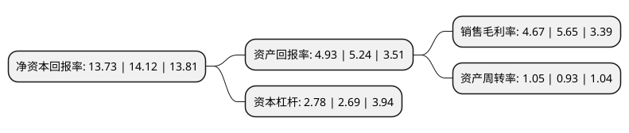

> 本页面由自动化程序生成于 2022年5月20日 01:21
> 内容可能存在错误，如有bug请提交issue至：https://github.com/Eroleice/doc-pi/issues
{.is-warning}

# 上市公司基本情况

## 基本资料

中伟新材料股份有限公司（以下简称“中伟股份”）成立于2014年09月15日，铜仁市。于2020年12月23日在深交所创业板上市。

中伟股份注册资本60,567.305万元，主要从事锂电池正极材料前驱体的研发，生产，加工及销售，主要产品包括三元前驱体，四氧化三钴，分别用于生产三元正极材料，钴酸锂正极材料。以下是详细信息：

- 公司名称: 中伟新材料股份有限公司
- 股票代码: 300919.SZ
- 所在地: 贵州 - 铜仁市
- 成立日期: 2014年09月15日
- 注册资本: 60,567.305万元
- 法定代表人: 邓伟明
- 主营业务: 主要从事锂电池正极材料前驱体的研发，生产，加工及销售，主要产品包括三元前驱体，四氧化三钴，分别用于生产三元正极材料，钴酸锂正极材料
- 公司官网: www.cngrgf.com.cn
- 公司介绍: 公司主要从事锂电池正极材料前驱体的研发、生产、加工及销售，主要产品包括三元前驱体、四氧化三钴，分别用于生产三元正极材料、钴酸锂正极材料。三元正极材料、钴酸锂正极材料进一步加工制造成锂电池，最终应用于新能源汽车、储能及消费电子等领域。公司所属产业为战略性新兴产业。为进一步增强锂电池正极材料前驱体主要原材料的保障能力，公司向产业链上游延伸，已形成了镍、钴中间品湿法加工硫酸镍、硫酸钴以及锂离子电池循环回收产能，与前驱体产业形成了良好的产业链协同优势。公司凭借优异的技术研发实力、严苛的品质管控要求、快速的产业化能力，前驱体产销量稳居全球前三，与LG化学、厦门钨业、当升科技、振华新材、天津巴莫、北大先行等国内外一流正极材料客户建立了稳定合作关系。

## 股东及高管情况

上市公司第一大股东为湖南中伟控股集团有限公司，持股344,000,000股，占比56.8%，为上市公司实际控制人。

截至2022年03月31日，上市公司的前十大股东中，共有1名自然人股东，6名机构股东，3个产品账户，其中5%以上大股东共有1名。上市公司前十大股东明细如下：

> 截至2022年03月31日，上市公司前十大股东信息如下：

| 股东名称 | 持股数量（股） | 持股比例 |
| --- | --- | --- |
| 湖南中伟控股集团有限公司 | 344,000,000 | 56.8% |
| 北京君联晟源股权投资合伙企业(有限合伙) | 24,979,000 | 4.12% |
| 邓伟明 | 20,911,000 | 3.45% |
| 铜仁弘新成达企业管理咨询合伙企业(有限合伙) | 12,180,000 | 2.01% |
| 前海股权投资基金(有限合伙) | 11,470,000 | 1.89% |
| 厦门建发新兴创业投资有限公司-厦门建发新兴产业股权投资贰号合伙企业(有限合伙) | 8,090,000 | 1.34% |
| 贵州省贵鑫瑞和创业投资管理有限责任公司-贵州新动能产业投资基金合伙企业(有限合伙) | 7,630,000 | 1.26% |
| 兴投(平潭)资本管理有限公司-江苏疌泉绿色产业股权投资基金(有限合伙) | 6,930,000 | 1.14% |
| 铜仁恒盛励能企业管理咨询合伙企业(有限合伙) | 6,698,900 | 1.11% |
| 兴资睿盈(平潭)资产管理有限公司-福州经济技术开发区兴睿永瀛股权投资合伙企业(有限合伙) | 6,424,044 | 1.06% |

## 利润表分析

上市公司2021年总收入为200.72亿元，净利润为9.38亿元，实现盈利。

## 杜邦分析

> 数据列示周期：2021年 | 2020年 | 2019年
{.is-info}

上市公司的净资产收益率在近一年有所下降，下降幅度为-2.76%，其变化情况分解如下：
- 上市公司的销售毛利率在近一年下降了-17.35%，可能是生产效率的下降、商品原材料价格上涨或商品价格的下跌所致。
- 上市公司的资产周转率在近一年上升了12.9%，可能是源自于更快的销售回款或库存管理效果提升。
- 上市公司的财务杠杆比率在近一年上升了3.35%，可能是增加负债扩大生产规模。

