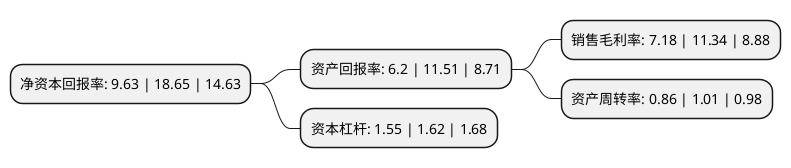

> 本页面由自动化程序生成于 2022年5月20日 01:21
> 内容可能存在错误，如有bug请提交issue至：https://github.com/Eroleice/doc-pi/issues
{.is-warning}

# 上市公司基本情况

## 基本资料

三友联众集团股份有限公司（以下简称“三友联众”）成立于2008年05月16日，东莞市。于2021年01月22日在深交所创业板上市。

三友联众注册资本12,562.951万元，专业从事继电器产品生产。以下是详细信息：

- 公司名称: 三友联众集团股份有限公司
- 股票代码: 300932.SZ
- 所在地: 广东 - 东莞市
- 成立日期: 2008年05月16日
- 注册资本: 12,562.951万元
- 法定代表人: 宋朝阳
- 主营业务: 专业从事继电器产品生产
- 公司官网: www.sanyourelay.com
- 公司介绍: 公司是国内专业的继电器产品生产制造商。历经多年发展，公司已形成集技术研发、模具开发制造、设备开发制造、生产制造、售后服务为一体的全流程服务体系，产品广泛应用于家用电器、智能电表、工业控制、智能家居、通讯设施、汽车制造和新能源应用等领域。公司重视自主创新，具有良好的技术研发基础设施和技术条件。公司拥有专业的实验室，先后获得美国UL目击实验室、中国CNAS国家认可实验室和德国VDE数据实验室资格证书。凭借在产品研发、设备研发制造、模具研发制造、生产制造、产品质量控制和管理团队方面的优势，公司积累了众多客户资源，尤其是大客户开发方面，拥有丰富的服务经验。公司与Samsung、GE、BSH、LG、Diehl、Schneider、Arcelik、Whirlpool等著名跨国企业建立了合作关系；长期服务于格力电器、美的集团、奥克斯集团、老板电器、苏泊尔等国内知名家电企业；在电力行业，公司与三星医疗、海兴电力、科陆电子、Sagemcom等国内外著名企业保持长期的合作关系；在汽车行业，公司亦与宇通汽车、比亚迪、天津一汽等汽车制造企业建立了合作关系。

## 股东及高管情况

上市公司第一大股东为宋朝阳，持股33,000,000股，占比26.27%，**疑似为**上市公司实际控制人。

截至2022年03月31日，上市公司的前十大股东中，共有6名自然人股东，4名机构股东，其中5%以上大股东共有5名。上市公司前十大股东明细如下：

> 未能通过持股比例判定出上市公司实际控制人（持股30%以上）
> 可能存在通过间接持股、联合持股、协议控制等方式拥有实际控制权的主体，具体请参考上市公司定期公告！
{.is-warning}

> 截至2022年03月31日，上市公司前十大股东信息如下：

| 股东名称 | 持股数量（股） | 持股比例 |
| --- | --- | --- |
| 宋朝阳 | 33,000,000 | 26.27% |
| 傅天年 | 15,200,000 | 12.1% |
| 徐新强 | 12,300,000 | 9.79% |
| 东莞市昊与轩投资合伙企业(有限合伙) | 8,747,770 | 6.96% |
| 东莞市艾力美投资合伙企业(有限合伙) | 7,701,500 | 6.13% |
| 万向创业投资股份公司 | 4,235,880 | 3.37% |
| 张亚杰 | 2,384,057 | 1.9% |
| 深圳市惠友创嘉创业投资合伙企业(有限合伙) | 2,370,804 | 1.89% |
| 潘友金 | 2,197,124 | 1.75% |
| 罗吉祥 | 1,702,327 | 1.36% |

## 利润表分析

上市公司2021年总收入为16.92亿元，净利润为1.21亿元，实现盈利。

## 杜邦分析

> 数据列示周期：2021年 | 2020年 | 2019年
{.is-info}

上市公司的净资产收益率在近一年有所下降，下降幅度为-48.36%，其变化情况分解如下：
- 上市公司的销售毛利率在近一年下降了-36.68%，可能是生产效率的下降、商品原材料价格上涨或商品价格的下跌所致。
- 上市公司的资产周转率在近一年下降了-14.85%，可能是源自于更慢的销售回款或库存管理效果下降。
- 上市公司的财务杠杆比率在近一年下降了-4.32%，可能是减少负债降低财务费用。

