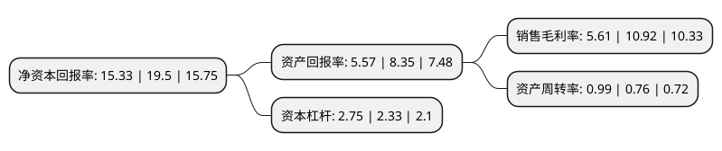

> 本页面由自动化程序生成于 2022年5月20日 01:21
> 内容可能存在错误，如有bug请提交issue至：https://github.com/Eroleice/doc-pi/issues
{.is-warning}

# 上市公司基本情况

## 基本资料

宁波震裕科技股份有限公司（以下简称“震裕科技”）成立于1994年10月18日，宁波市。于2021年03月18日在深交所创业板上市。

震裕科技注册资本9,308万元，专业从事精密级进冲压模具及下游精密结构件的研发，设计，生产和销售，主要产品包括电机铁芯和动力锂电池精密结构件。以下是详细信息：

- 公司名称: 宁波震裕科技股份有限公司
- 股票代码: 300953.SZ
- 所在地: 浙江 - 宁波市
- 成立日期: 1994年10月18日
- 注册资本: 9,308万元
- 法定代表人: 蒋震林
- 主营业务: 专业从事精密级进冲压模具及下游精密结构件的研发，设计，生产和销售，主要产品包括电机铁芯和动力锂电池精密结构件
- 公司官网: www.zhenyumould.com
- 公司介绍: 公司是专业从事精密级进冲压模具及下游精密结构件的研发、设计、生产和销售的高新技术企业。公司拥有丰富的精密级进冲压模具开发经验和完整的制造体系，以精密级进冲压模具的设计开发为核心，为全球范围内的家用电器制造商及汽车、工业工控制造商等提供定制化的精密级进冲压模具。同时，公司以自身设计开发的冲压模具为基础，向客户提供精密结构件产品，广泛应用于家电、新能源锂电池、汽车、工业工控等行业领域。公司精密级进冲压模具主要应用于家用电器、汽车、工业工控等领域电机铁芯的冲压制造，在家用电器、汽车、工业自动化等行业制造体系中占据核心位置。

## 股东及高管情况

上市公司第一大股东为蒋震林，持股29,338,600股，占比31.52%，为上市公司实际控制人。

截至2022年03月31日，上市公司的前十大股东中，共有3名自然人股东，6名机构股东，1个产品账户，其中5%以上大股东共有4名。上市公司前十大股东明细如下：

> 截至2022年03月31日，上市公司前十大股东信息如下：

| 股东名称 | 持股数量（股） | 持股比例 |
| --- | --- | --- |
| 蒋震林 | 29,338,600 | 31.52% |
| 洪瑞娣 | 13,184,200 | 14.16% |
| 宁波聚信投资合伙企业(有限合伙) | 4,977,200 | 5.35% |
| 尚融(宁波)投资中心(有限合伙) | 4,680,000 | 5.03% |
| 西藏津盛泰达创业投资有限公司 | 3,416,600 | 3.67% |
| 宁波海达鼎兴创业投资有限公司 | 2,500,000 | 2.69% |
| 民生证券-中信证券-民生证券震裕科技战略配售1号集合资产管理计划 | 2,256,000 | 2.42% |
| 王爱国 | 1,950,000 | 2.09% |
| 杭州维基创业投资合伙企业(有限合伙) | 1,750,000 | 1.88% |
| 杭州海达必成创业投资管理合伙企业(有限合伙)-杭州汇普直方股权投资合伙企业(有限合伙) | 1,666,700 | 1.79% |

## 利润表分析

上市公司2021年总收入为30.34亿元，净利润为1.7亿元，实现盈利。

## 杜邦分析

> 数据列示周期：2021年 | 2020年 | 2019年
{.is-info}

上市公司的净资产收益率在近一年有所下降，下降幅度为-21.38%，其变化情况分解如下：
- 上市公司的销售毛利率在近一年下降了-48.63%，可能是生产效率的下降、商品原材料价格上涨或商品价格的下跌所致。
- 上市公司的资产周转率在近一年上升了30.26%，可能是源自于更快的销售回款或库存管理效果提升。
- 上市公司的财务杠杆比率在近一年上升了18.03%，可能是增加负债扩大生产规模。

