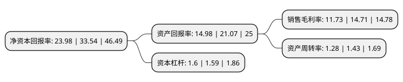

> 本页面由自动化程序生成于 2022年5月20日 01:22
> 内容可能存在错误，如有bug请提交issue至：https://github.com/Eroleice/doc-pi/issues
{.is-warning}

# 上市公司基本情况

## 基本资料

深圳市崧盛电子股份有限公司（以下简称“崧盛股份”）成立于2011年07月08日，深圳市。于2021年06月07日在深交所创业板上市。

崧盛股份注册资本9,452万元，专注于中，大功率LED驱动电源产品的研发，生产和销售业务，公司主要产品LED驱动电源是LED照明灯具的重要部件。以下是详细信息：

- 公司名称: 深圳市崧盛电子股份有限公司
- 股票代码: 301002.SZ
- 所在地: 广东 - 深圳市
- 成立日期: 2011年07月08日
- 注册资本: 9,452万元
- 法定代表人: 田年斌
- 主营业务: 专注于中，大功率LED驱动电源产品的研发，生产和销售业务，公司主要产品LED驱动电源是LED照明灯具的重要部件
- 公司官网: www.szsosen.com
- 公司介绍: 公司自成立以来一直专注于中、大功率LED驱动电源产品的研发、生产和销售业务，是目前国内中、大功率LED驱动电源产品的主要供应商之一。公司产品主要供应下游LED照明生产厂商用于制造中、大功率LED照明产品，终端产品主要应用于城市路桥、高速公路、隧道、机场等大型户外LED照明设施，以及工业厂房、仓库等LED工业照明设施，同时正向植物照明等新兴应用领域拓展。截至2019年12月31日，公司拥有已授权专利79项，其中发明专利10项，实用新型专利68项，外观设计专利1项，同时公司还参与《照明用LED驱动电源技术要求》T/CECS10021-2019等行业标准的编制工作。

## 股东及高管情况

上市公司第一大股东为王宗友，持股23,017,591股，占比24.35%，**疑似为**上市公司实际控制人。

截至2022年03月31日，上市公司的前十大股东中，共有5名自然人股东，5名机构股东，其中5%以上大股东共有3名。上市公司前十大股东明细如下：

> 未能通过持股比例判定出上市公司实际控制人（持股30%以上）
> 可能存在通过间接持股、联合持股、协议控制等方式拥有实际控制权的主体，具体请参考上市公司定期公告！
{.is-warning}

> 截至2022年03月31日，上市公司前十大股东信息如下：

| 股东名称 | 持股数量（股） | 持股比例 |
| --- | --- | --- |
| 王宗友 | 23,017,591 | 24.35% |
| 田年斌 | 23,017,588 | 24.35% |
| 深圳崧盛投资合伙企业(有限合伙) | 7,661,166 | 8.11% |
| 深圳崧盛信息技术合伙企业(有限合伙) | 2,831,400 | 3% |
| 邹超洋 | 2,366,547 | 2.5% |
| 海宁东证汉德投资合伙企业(有限合伙) | 2,175,000 | 2.3% |
| 浙江美浓资产管理有限公司 | 1,750,000 | 1.85% |
| 宁波梅山保税港区东证夏德投资合伙企业(有限合伙) | 1,740,000 | 1.84% |
| 蒋晓琴 | 1,716,000 | 1.82% |
| 凌彩萌 | 845,236 | 0.89% |

## 利润表分析

上市公司2021年总收入为11亿元，净利润为1.29亿元，实现盈利。

## 杜邦分析

> 数据列示周期：2021年 | 2020年 | 2019年
{.is-info}

上市公司的净资产收益率在近一年有所下降，下降幅度为-28.5%，其变化情况分解如下：
- 上市公司的销售毛利率在近一年下降了-20.26%，可能是生产效率的下降、商品原材料价格上涨或商品价格的下跌所致。
- 上市公司的资产周转率在近一年下降了-10.49%，可能是源自于更慢的销售回款或库存管理效果下降。
- 上市公司的财务杠杆比率在近一年上升了0.63%，可能是增加负债扩大生产规模。

