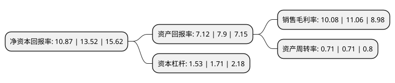

> 本页面由自动化程序生成于 2022年5月20日 01:22
> 内容可能存在错误，如有bug请提交issue至：https://github.com/Eroleice/doc-pi/issues
{.is-warning}

# 上市公司基本情况

## 基本资料

江苏扬电科技股份有限公司（以下简称“扬电科技”）成立于1993年12月31日，泰州市。于2021年06月22日在深交所创业板上市。

扬电科技注册资本8,400万元，公司主要从事节能电力变压器，铁心，非晶及纳米晶磁性电子元器件三大系列产品的研发，生产与销售，主要产品包括节能型SBH15非晶合金变压器，节能型S13/S14硅钢变压器，非晶铁心，硅钢铁心，非晶辊剪带材，非晶磁芯，纳米晶磁芯和相关器件以下是详细信息：

- 公司名称: 江苏扬电科技股份有限公司
- 股票代码: 301012.SZ
- 所在地: 江苏 - 泰州市
- 成立日期: 1993年12月31日
- 注册资本: 8,400万元
- 法定代表人: 程俊明
- 主营业务: 公司主要从事节能电力变压器，铁心，非晶及纳米晶磁性电子元器件三大系列产品的研发，生产与销售，主要产品包括节能型SBH15非晶合金变压器，节能型S13/S14硅钢变压器，非晶铁心，硅钢铁心，非晶辊剪带材，非晶磁芯，纳米晶磁芯和相关器件
- 公司官网: www.jsyddq.cn
- 公司介绍: 公司以建设资源节约型社会、服务电力现代化为使命，致力于减少电力能源输送过程中的损耗，公司的节能电力变压器产品可有效降低配网端的电能损耗，目前业务已遍及国内20多个省市，广泛应用于城乡电网改造、住宅小区、工矿企业及基础设施建设项目中。报告期内，节能电力变压器系列产品的市场占有率分别为7.48%、6.70%和10.05%，市场占有率保持稳定；2017年起，公司进一步探索低损耗非晶、纳米晶软磁材料在电子领域的应用，建立了“带材—磁芯—电子元器件”的完整产业链，致力于提供整套磁性技术解决方案，公司的非晶及纳米晶磁性电子元器件产品主要应用于绿色家电、新能源汽车、光伏设备等，并与田村精工、胜美达、东静研电子、甲神电机、TDK等国内外知名企业建立了良好的合作关系。

## 股东及高管情况

上市公司第一大股东为程俊明，持股27,300,000股，占比32.5%，为上市公司实际控制人。

截至2022年03月31日，上市公司的前十大股东中，共有9名自然人股东，1名机构股东，其中5%以上大股东共有4名。上市公司前十大股东明细如下：

> 截至2022年03月31日，上市公司前十大股东信息如下：

| 股东名称 | 持股数量（股） | 持股比例 |
| --- | --- | --- |
| 程俊明 | 27,300,000 | 32.5% |
| 赵恒龙 | 11,700,000 | 13.93% |
| 朱祥 | 6,000,000 | 7.14% |
| 周峰 | 4,800,000 | 5.71% |
| 朱敏 | 3,600,000 | 4.29% |
| 泰州扬源企业管理中心(有限合伙) | 3,000,000 | 3.57% |
| 徐秋实 | 2,400,000 | 2.86% |
| 徐仁彬 | 1,200,000 | 1.43% |
| 徐洪 | 1,200,000 | 1.43% |
| 张田华 | 600,000 | 0.71% |

## 利润表分析

上市公司2021年总收入为5.11亿元，净利润为0.51亿元，实现盈利。

## 杜邦分析

> 数据列示周期：2021年 | 2020年 | 2019年
{.is-info}

上市公司的净资产收益率在近一年有所下降，下降幅度为-19.6%，其变化情况分解如下：
- 上市公司的销售毛利率在近一年下降了-8.86%，可能是生产效率的下降、商品原材料价格上涨或商品价格的下跌所致。
- 上市公司的资产周转率在近一年下降了0%，可能是源自于更慢的销售回款或库存管理效果下降。
- 上市公司的财务杠杆比率在近一年下降了-10.53%，可能是减少负债降低财务费用。

