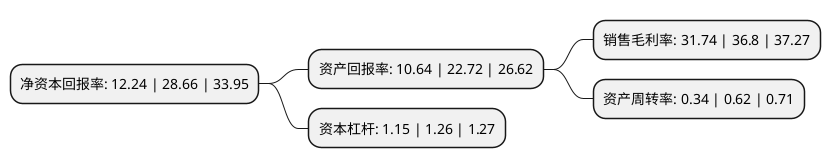

> 本页面由自动化程序生成于 2022年5月20日 01:22
> 内容可能存在错误，如有bug请提交issue至：https://github.com/Eroleice/doc-pi/issues
{.is-warning}

# 上市公司基本情况

## 基本资料

无锡江南奕帆电力传动科技股份有限公司（以下简称“江南奕帆”）成立于2011年06月28日，无锡市。于2021年07月07日在深交所创业板上市。

江南奕帆注册资本3,733.35万元，公司的主营业务为从事专业定制化微特减速电机的研发，制造和销售，主要产品包括输配电行业储能减速电机及房车减速电机。以下是详细信息：

- 公司名称: 无锡江南奕帆电力传动科技股份有限公司
- 股票代码: 301023.SZ
- 所在地: 江苏 - 无锡市
- 成立日期: 2011年06月28日
- 注册资本: 3,733.35万元
- 法定代表人: 陈渊技
- 主营业务: 公司的主营业务为从事专业定制化微特减速电机的研发，制造和销售，主要产品包括输配电行业储能减速电机及房车减速电机
- 公司官网: www.yifanmotor.com
- 公司介绍: 公司的主营业务为从事专业定制化微特减速电机的研发、制造和销售，主要产品包括输配电行业储能减速电机及房车减速电机，产品应用于输配电高压开关和房车配件领域。公司凭借过硬的产品质量和优质的服务，已成为诺克工业、西门子、伊顿、施耐德电气等世界著名企业重要的全球供应商，国内客户主要包括平高电气、中国西电、许继电气、泰开电气、大全集团、兴机电器等国内知名电气设备制造商。公司与上述国内外客户建立了长期、稳定的合作关系。作为高新技术企业，公司始终专注于定制化微特减速电机领域。截至本招股说明书签署日，公司拥有50项专利，包括18项发明专利、29项实用新型专利和3项外观设计专利。

## 股东及高管情况

上市公司第一大股东为刘锦成，持股15,440,000股，占比41.36%，为上市公司实际控制人。

截至2022年03月31日，上市公司的前十大股东中，共有9名自然人股东，1名机构股东，其中5%以上大股东共有4名。上市公司前十大股东明细如下：

> 截至2022年03月31日，上市公司前十大股东信息如下：

| 股东名称 | 持股数量（股） | 持股比例 |
| --- | --- | --- |
| 刘锦成 | 15,440,000 | 41.36% |
| 龚建芬 | 4,200,000 | 11.25% |
| 陈渊技 | 4,200,000 | 11.25% |
| 宋益群 | 2,800,000 | 7.5% |
| 无锡一帆投资企业(有限合伙) | 840,000 | 2.25% |
| 何洪 | 280,000 | 0.75% |
| 余笃定 | 231,800 | 0.62% |
| 苏静 | 213,700 | 0.57% |
| 高志勇 | 120,000 | 0.32% |
| 孙定坤 | 120,000 | 0.32% |

## 利润表分析

上市公司2021年总收入为2.06亿元，净利润为0.65亿元，实现盈利。

## 杜邦分析

> 数据列示周期：2021年 | 2020年 | 2019年
{.is-info}

上市公司的净资产收益率在近一年有所下降，下降幅度为-57.29%，其变化情况分解如下：
- 上市公司的销售毛利率在近一年下降了-13.75%，可能是生产效率的下降、商品原材料价格上涨或商品价格的下跌所致。
- 上市公司的资产周转率在近一年下降了-45.16%，可能是源自于更慢的销售回款或库存管理效果下降。
- 上市公司的财务杠杆比率在近一年下降了-8.73%，可能是减少负债降低财务费用。

