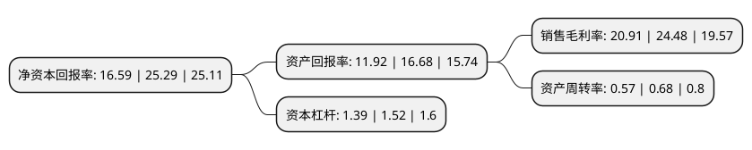

> 本页面由自动化程序生成于 2022年5月20日 01:22
> 内容可能存在错误，如有bug请提交issue至：https://github.com/Eroleice/doc-pi/issues
{.is-warning}

# 上市公司基本情况

## 基本资料

西安中熔电气股份有限公司（以下简称“中熔电气”）成立于2007年04月20日，西安市。于2021年07月15日在深交所创业板上市。

中熔电气注册资本6,627.743万元，主营业务为熔断器及相关配件的研发，生产和销售，主要产品为电力熔断器，电子类熔断器，激励熔断器，其中主导产品为电力熔断器。以下是详细信息：

- 公司名称: 西安中熔电气股份有限公司
- 股票代码: 301031.SZ
- 所在地: 陕西 - 西安市
- 成立日期: 2007年04月20日
- 注册资本: 6,627.743万元
- 法定代表人: 方广文
- 主营业务: 主营业务为熔断器及相关配件的研发，生产和销售，主要产品为电力熔断器，电子类熔断器，激励熔断器，其中主导产品为电力熔断器
- 公司官网: www.sinofuse.com
- 公司介绍: 公司主营业务为熔断器及相关配件的研发、生产和销售，主要产品为电力熔断器、电子类熔断器、激励熔断器，其中主导产品为电力熔断器。公司产品系列丰富，现有近40个产品系列、约6,000种产品规格，主要应用于新能源汽车、新能源风光发电及储能、通信、轨道交通等中高端市场领域，为上述领域中涉及的各类高低压电源、配电系统、控制系统以及用电设备等提供电路保护。公司战略布局清晰，注重新兴产业发展，通过快速跟踪新兴市场需求，以科技创新为驱动，持续开发新产品及迭代产品，不断开拓新市场、新领域。公司始终聚焦电力熔断器中高端市场，在陆续进入通信、新能源光伏等新兴工业领域并成为市场主导参与者后，重点布局轨道交通和新能源汽车市场。经多年深耕，公司积累了丰富的产品线及较高的品牌知名度，已成长为国内电力熔断器行业领军企业，在国内新能源汽车用熔断器市场份额排名第一。

## 股东及高管情况

上市公司第一大股东为方广文，持股8,949,000股，占比13.5%，**疑似为**上市公司实际控制人。

截至2022年03月31日，上市公司的前十大股东中，共有6名自然人股东，3名机构股东，1个产品账户，其中5%以上大股东共有4名。上市公司前十大股东明细如下：

> 未能通过持股比例判定出上市公司实际控制人（持股30%以上）
> 可能存在通过间接持股、联合持股、协议控制等方式拥有实际控制权的主体，具体请参考上市公司定期公告！
{.is-warning}

> 截至2022年03月31日，上市公司前十大股东信息如下：

| 股东名称 | 持股数量（股） | 持股比例 |
| --- | --- | --- |
| 方广文 | 8,949,000 | 13.5% |
| 石晓光 | 4,637,607 | 7% |
| 西安中昱企业管理咨询合伙企业(有限合伙) | 3,914,000 | 5.91% |
| 刘冰 | 3,695,241 | 5.58% |
| 李昭德 | 3,249,000 | 4.9% |
| 汪桂飞 | 3,176,213 | 4.79% |
| 西安中盈企业管理咨询合伙企业(有限合伙) | 3,075,001 | 4.64% |
| 深圳市安鹏股权投资基金管理有限公司-青岛安鹏中熔股权投资基金合伙企业(有限合伙) | 2,966,101 | 4.48% |
| 宁波梅山保税港区晨道投资合伙企业(有限合伙)-长江晨道(湖北)新能源产业投资合伙企业(有限合伙) | 2,436,000 | 3.68% |
| 王伟 | 2,398,369 | 3.62% |

## 利润表分析

上市公司2021年总收入为3.84亿元，净利润为0.8亿元，实现盈利。

## 杜邦分析

> 数据列示周期：2021年 | 2020年 | 2019年
{.is-info}

上市公司的净资产收益率在近一年有所下降，下降幅度为-34.4%，其变化情况分解如下：
- 上市公司的销售毛利率在近一年下降了-14.58%，可能是生产效率的下降、商品原材料价格上涨或商品价格的下跌所致。
- 上市公司的资产周转率在近一年下降了-16.18%，可能是源自于更慢的销售回款或库存管理效果下降。
- 上市公司的财务杠杆比率在近一年下降了-8.55%，可能是减少负债降低财务费用。

