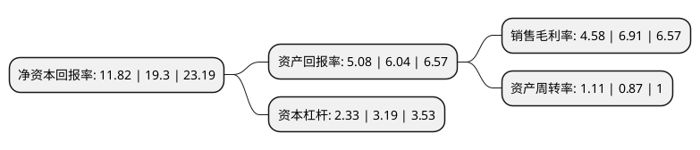

> 本页面由自动化程序生成于 2022年5月20日 01:22
> 内容可能存在错误，如有bug请提交issue至：https://github.com/Eroleice/doc-pi/issues
{.is-warning}

# 上市公司基本情况

## 基本资料

久盛电气股份有限公司（以下简称“久盛电气”）成立于2004年05月19日，湖州市。于2021年10月27日在深交所创业板上市。

久盛电气注册资本16,164.941万元，公司主要从事防火类特种电缆以及电力电缆等的研发，生产，销售和服务，主要产品矿物绝缘电缆，无机矿物绝缘金属护套电缆等防火类特种电缆，塑料绝缘电缆以及中低压电力电缆。以下是详细信息：

- 公司名称: 久盛电气股份有限公司
- 股票代码: 301082.SZ
- 所在地: 浙江 - 湖州市
- 成立日期: 2004年05月19日
- 注册资本: 16,164.941万元
- 法定代表人: 张建华
- 主营业务: 公司主要从事防火类特种电缆以及电力电缆等的研发，生产，销售和服务，主要产品矿物绝缘电缆，无机矿物绝缘金属护套电缆等防火类特种电缆，塑料绝缘电缆以及中低压电力电缆
- 公司官网: www.teccable.com
- 公司介绍: 公司主要从事防火类特种电缆以及电力电缆等的研发、生产、销售和服务，致力于成为防火类特种电缆领域的行业专家以及创新代表。公司及其创始团队深耕细分领域，专注防火类特种电缆，是国内市场上最早研发矿物绝缘电缆等防火类特种电缆的主要力量，逐步开拓和培育了国内矿物绝缘电缆等防火类特种电缆市场。公司不断加大对市场需求广度和深度的挖掘力度，提高科研创新实力，在矿物绝缘加热电缆等部分高附加值产品系列方面亦储备了相应的技术并已部分实现产能转化。未来，公司将在提升现有产品竞争优势的同时，进一步丰富高附加值产品系列，不断提升自身盈利能力，更好地满足市场需求，逐步实现目前国内市场对部分高端特种电缆的进口替代。

## 股东及高管情况

上市公司第一大股东为湖州迪科实业投资有限公司，持股69,955,119股，占比43.28%，为上市公司实际控制人。

截至2022年03月31日，上市公司的前十大股东中，共有6名自然人股东，4名机构股东，其中5%以上大股东共有2名。上市公司前十大股东明细如下：

> 截至2022年03月31日，上市公司前十大股东信息如下：

| 股东名称 | 持股数量（股） | 持股比例 |
| --- | --- | --- |
| 湖州迪科实业投资有限公司 | 69,955,119 | 43.28% |
| 张建华 | 11,951,251 | 7.39% |
| 湖州融祥投资合伙企业(有限合伙) | 5,940,615 | 3.67% |
| 单建明 | 4,819,379 | 2.98% |
| 干梅林 | 4,743,765 | 2.93% |
| 通光集团有限公司 | 4,000,823 | 2.48% |
| 沈伟民 | 3,789,046 | 2.34% |
| 林丹阳 | 2,424,741 | 1.5% |
| 周月亮 | 2,177,955 | 1.35% |
| 招商证券股份有限公司 | 1,954,118 | 1.21% |

## 利润表分析

上市公司2021年总收入为19.53亿元，净利润为0.89亿元，实现盈利。

## 杜邦分析

> 数据列示周期：2021年 | 2020年 | 2019年
{.is-info}

上市公司的净资产收益率在近一年有所下降，下降幅度为-38.76%，其变化情况分解如下：
- 上市公司的销售毛利率在近一年下降了-33.72%，可能是生产效率的下降、商品原材料价格上涨或商品价格的下跌所致。
- 上市公司的资产周转率在近一年上升了27.59%，可能是源自于更快的销售回款或库存管理效果提升。
- 上市公司的财务杠杆比率在近一年下降了-26.96%，可能是减少负债降低财务费用。

