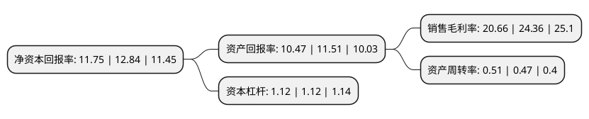

> 本页面由自动化程序生成于 2022年5月20日 01:23
> 内容可能存在错误，如有bug请提交issue至：https://github.com/Eroleice/doc-pi/issues
{.is-warning}

## 股东及高管情况

上市公司第一大股东为谭勇，持股134,839,650股，占比54.45%，为上市公司实际控制人。

截至2022年04月19日，上市公司的前十大股东中，共有6名自然人股东，2名机构股东，2个产品账户，其中5%以上大股东共有1名。上市公司前十大股东明细如下：

> 截至2022年04月19日，上市公司前十大股东信息如下：

| 股东名称 | 持股数量（股） | 持股比例 |
| --- | --- | --- |
| 谭勇 | 134,839,650 | 54.45% |
| 中科汇通(厦门)股权投资基金有限公司 | 8,125,000 | 3.28% |
| 李鹏 | 5,887,500 | 2.38% |
| 宗丽丽 | 5,695,000 | 2.3% |
| 王振水 | 5,585,220 | 2.26% |
| 嘉陵松琦 | 5,577,500 | 2.25% |
| 杨金森 | 5,002,500 | 2.02% |
| 珠海横琴中科浏阳河创业投资合伙企业(有限合伙) | 4,825,000 | 1.95% |
| 民生证券-中信证券-民生证券新特电气战略配售1号集合资产管理计划 | 3,678,077 | 1.49% |
| 民生证券投资有限公司 | 2,913,328 | 1.18% |

## 利润表分析

上市公司2021年总收入为4.07亿元，净利润为0.84亿元，实现盈利。

## 杜邦分析

> 数据列示周期：2021年 | 2020年 | 2019年
{.is-info}

上市公司的净资产收益率在近一年有所下降，下降幅度为-8.49%，其变化情况分解如下：
- 上市公司的销售毛利率在近一年下降了-15.19%，可能是生产效率的下降、商品原材料价格上涨或商品价格的下跌所致。
- 上市公司的资产周转率在近一年上升了8.51%，可能是源自于更快的销售回款或库存管理效果提升。
- 上市公司的财务杠杆比率在近一年下降了0%，可能是减少负债降低财务费用。

