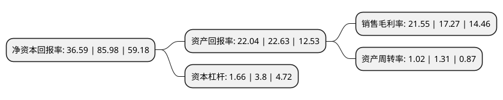

> 本页面由自动化程序生成于 2022年5月20日 01:23
> 内容可能存在错误，如有bug请提交issue至：https://github.com/Eroleice/doc-pi/issues
{.is-warning}

# 上市公司基本情况

## 基本资料

江苏海力风电设备科技股份有限公司（以下简称“海力风电”）成立于2009年08月18日，南通市。于2021年11月24日在深交所创业板上市。

海力风电注册资本21,739.148万元，公司主营业务为风电设备零部件的研发，生产和销售，主要产品包括风电塔筒，桩基及导管架等以下是详细信息：

- 公司名称: 江苏海力风电设备科技股份有限公司
- 股票代码: 301155.SZ
- 所在地: 江苏 - 南通市
- 成立日期: 2009年08月18日
- 注册资本: 21,739.148万元
- 法定代表人: 许世俊
- 主营业务: 公司主营业务为风电设备零部件的研发，生产和销售，主要产品包括风电塔筒，桩基及导管架等
- 公司官网: www.jshlfd.com
- 公司介绍: 公司主营业务为风电设备零部件的研发、生产和销售，主要产品包括风电塔筒、桩基及导管架等，产品涵盖2MW至5MW等市场主流规格产品以及6.45MW、8MW等大功率等级产品。公司及子公司海灵重工均系经江苏省科技厅、财政厅、税务局联合认定的高新技术企业。公司拥有江苏省企业技术中心、江苏省研究生工作站等高水平、高规格的研发平台，曾荣获中华全国工商联合会科技进步奖二等奖、江苏机械工业科技进步三等奖等荣誉，并被江苏省机械行业协会评为“全省机械行业创新型先进企业”。此外，公司还取得了特种设备制造许可证、安全生产许可证以及钢结构工程专业承包三级等资质证书。经过长期的技术积淀，公司在风电设备零部件方面，特别是海上风电塔筒及桩基方面形成了多项自主知识产权，2020年6月30日，公司拥有专利授权76项，其中发明专利授权8项。

## 股东及高管情况

上市公司第一大股东为许世俊，持股69,399,876股，占比31.92%，为上市公司实际控制人。

截至2022年03月31日，上市公司的前十大股东中，共有6名自然人股东，3名机构股东，1个产品账户，其中5%以上大股东共有3名。上市公司前十大股东明细如下：

> 截至2022年03月31日，上市公司前十大股东信息如下：

| 股东名称 | 持股数量（股） | 持股比例 |
| --- | --- | --- |
| 许世俊 | 69,399,876 | 31.92% |
| 许成辰 | 31,413,615 | 14.45% |
| 沙德权 | 23,556,750 | 10.84% |
| 南通海力股权投资中心(有限合伙) | 5,860,374 | 2.7% |
| 如东县新天和资产管理有限公司 | 4,076,087 | 1.87% |
| 烟台保昌股权投资管理有限公司-如东鑫濠产业投资基金管理中心(有限合伙) | 4,076,087 | 1.87% |
| 南通润熙股权投资中心(有限合伙) | 3,260,870 | 1.5% |
| 陈海骏 | 3,141,360 | 1.45% |
| 赵小兵 | 3,070,685 | 1.41% |
| 沈飞 | 2,827,215 | 1.3% |

## 利润表分析

上市公司2021年总收入为54.58亿元，净利润为11.76亿元，实现盈利。

## 杜邦分析

> 数据列示周期：2021年 | 2020年 | 2019年
{.is-info}

上市公司的净资产收益率在近一年有所下降，下降幅度为-57.44%，其变化情况分解如下：
- 上市公司的销售毛利率在近一年上升了24.78%，可能是生产效率的提升、商品原材料价格下跌或商品价格的上涨所致。
- 上市公司的资产周转率在近一年下降了-22.14%，可能是源自于更慢的销售回款或库存管理效果下降。
- 上市公司的财务杠杆比率在近一年下降了-56.32%，可能是减少负债降低财务费用。

