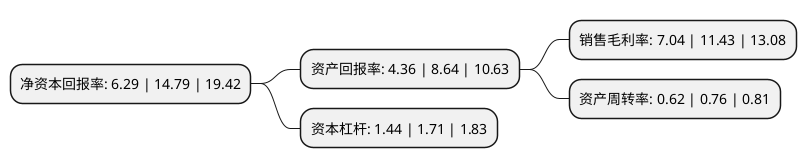

> 本页面由自动化程序生成于 2022年5月20日 01:23
> 内容可能存在错误，如有bug请提交issue至：https://github.com/Eroleice/doc-pi/issues
{.is-warning}

# 上市公司基本情况

## 基本资料

江苏通灵电器股份有限公司（以下简称“通灵股份”）成立于1984年07月09日，镇江市。于2021年12月10日在深交所创业板上市。

通灵股份注册资本12,000万元，发行人主要从事太阳能光伏组件接线盒及其他配件等产品的研发，生产，销售和服务，是我国光伏接线盒行业规模较大的企业之一。公司主要产品为太阳能光伏组件接线盒。以下是详细信息：

- 公司名称: 江苏通灵电器股份有限公司
- 股票代码: 301168.SZ
- 所在地: 江苏 - 镇江市
- 成立日期: 1984年07月09日
- 注册资本: 12,000万元
- 法定代表人: 严荣飞
- 主营业务: 发行人主要从事太阳能光伏组件接线盒及其他配件等产品的研发，生产，销售和服务，是我国光伏接线盒行业规模较大的企业之一公司主要产品为太阳能光伏组件接线盒
- 公司官网: www.jstl.com.cn
- 公司介绍: 公司是专业的太阳能光伏组件连接系统制造商。主要产品包括太阳能光伏组件接线盒、连接器、线束等太阳能光伏组件连接系统成品及配件。企业经过近十年的发展，现已形成占地面积58亩，固定资产1.2亿元，年设计生产能力8亿元的股份公司。公司过硬的产品质量、优良的售后服务，为企业创造了品牌优势。它先后获得了“扬中市3O强企业”“高新技术企业”、“重合同守信用企业”、“AAA级资信企业”、省、地、市级“文明单位”称号。并通过ISO9001-2008质量管理体系、lSO14OO1环境管理体系、0HSAS18OO1职业健康安全管理体系认证和CMMI能力成熟度模型集成认证。公司产品分别获得“高新技术产品”、“江苏省名牌产品”、“江苏省专利新产品金奖”，并通过金太阳CGC、CQC、莱茵TUV、南德TUV、UL、VDE、ROHS、CE、JET等认证。

## 股东及高管情况

上市公司第一大股东为江苏尚昆生物设备有限公司，持股34,890,248股，占比29.08%，**疑似为**上市公司实际控制人。

截至2022年03月31日，上市公司的前十大股东中，共有2名自然人股东，7名机构股东，1个产品账户，其中5%以上大股东共有4名。上市公司前十大股东明细如下：

> 未能通过持股比例判定出上市公司实际控制人（持股30%以上）
> 可能存在通过间接持股、联合持股、协议控制等方式拥有实际控制权的主体，具体请参考上市公司定期公告！
{.is-warning}

> 截至2022年03月31日，上市公司前十大股东信息如下：

| 股东名称 | 持股数量（股） | 持股比例 |
| --- | --- | --- |
| 江苏尚昆生物设备有限公司 | 34,890,248 | 29.08% |
| 李前进 | 16,955,147 | 14.13% |
| 严华 | 15,501,605 | 12.92% |
| 扬中市金融控股集团有限公司 | 9,000,000 | 7.5% |
| 江苏大行临港产业投资有限公司 | 3,602,000 | 3% |
| 镇江国有投资控股集团有限公司 | 3,450,000 | 2.88% |
| 扬中市通泰投资管理合伙企业(有限合伙) | 3,000,000 | 2.5% |
| 杭州城和股权投资基金合伙企业(有限合伙) | 2,161,000 | 1.8% |
| 杭州浙农鑫翔创业投资合伙企业(有限合伙) | 720,000 | 0.6% |
| 杭州浙科汇福创业投资合伙企业(有限合伙) | 720,000 | 0.6% |

## 利润表分析

上市公司2021年总收入为11.32亿元，净利润为0.79亿元，实现盈利。

## 杜邦分析

> 数据列示周期：2021年 | 2020年 | 2019年
{.is-info}

上市公司的净资产收益率在近一年有所下降，下降幅度为-57.47%，其变化情况分解如下：
- 上市公司的销售毛利率在近一年下降了-38.41%，可能是生产效率的下降、商品原材料价格上涨或商品价格的下跌所致。
- 上市公司的资产周转率在近一年下降了-18.42%，可能是源自于更慢的销售回款或库存管理效果下降。
- 上市公司的财务杠杆比率在近一年下降了-15.79%，可能是减少负债降低财务费用。

