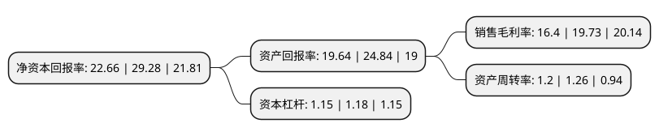

> 本页面由自动化程序生成于 2022年5月20日 01:23
> 内容可能存在错误，如有bug请提交issue至：https://github.com/Eroleice/doc-pi/issues
{.is-warning}

# 上市公司基本情况

## 基本资料

浙江恒威电池股份有限公司（以下简称“浙江恒威”）成立于1999年01月14日，嘉兴市。于2022年03月09日在深交所创业板上市。

浙江恒威注册资本10,133.34万元，高性能环保碱性电池和环保碳性电池的研发，生产及销售;主要产品为LR03，LR6，LR14，LR20，6LR61系列环保碱性电池及R03，R6，R14，R20系列环保碳性电池，产品广泛应用于小型家用电器，数码产品，智能化家居用品，无线安防设备，户外电子设备，医疗电子仪器，电动玩具，无线通讯设备等民用，工业领域。以下是详细信息：

- 公司名称: 浙江恒威电池股份有限公司
- 股票代码: 301222.SZ
- 所在地: 浙江 - 嘉兴市
- 成立日期: 1999年01月14日
- 注册资本: 10,133.34万元
- 法定代表人: 汪剑平
- 主营业务: 高性能环保碱性电池和环保碳性电池的研发，生产及销售;主要产品为LR03，LR6，LR14，LR20，6LR61系列环保碱性电池及R03，R6，R14，R20系列环保碳性电池，产品广泛应用于小型家用电器，数码产品，智能化家居用品，无线安防设备，户外电子设备，医疗电子仪器，电动玩具，无线通讯设备等民用，工业领域
- 公司官网: www.hwbattery.com
- 公司介绍: 公司专业从事高性能环保锌锰电池的研发、生产及销售，主要产品包括LR03、LR6、LR14、LR20、6LR61系列碱性电池及R03、R6、R14、R20、6F22系列碳性电池。公司产品广泛应用于小型家用电器、新型消费类电器、无线安防设备、智能家居用品、户外电子设备、无线通讯设备、医疗电子仪器、电动玩具、数码产品、移动照明等民用、工业领域。经过二十多年的潜心研发和探索，公司已成长为一家拥有先进制造设备及核心生产技术，综合实力居行业前列的锌锰电池生产商。公司集锌锰电池技术与产品的研究、开发、生产及销售于一体，生产全系列环保锌锰电池，产品具有安全性高、电性能佳及绿色环保等特点，产品主要电性能超过IEC及国家标准50%以上，获得中国进入WTO推荐产品称号。公司先后被评为市级研发中心、市级企业技术中心、省级高新技术企业研究开发中心、浙江省企业研究院以及国家高新技术企业。公司是GB/T8897.2-2013原电池《外形尺寸和电性能要求》、GB24462-2009《民用原电池安全通用要求》以及GB/T20155-2018《电池中汞、镉、铅含量的测定》等多套国家标准的主要起草和制定单位，公司自主研发的高性能碱性Zn-MnO2电池负极凝胶剂的产业化被列为国家火炬计划产业化示范项目。

## 股东及高管情况

上市公司第一大股东为嘉兴恒茂企业管理有限公司，持股38,220,150股，占比37.72%，为上市公司实际控制人。

截至2022年03月31日，上市公司的前十大股东中，共有8名自然人股东，2名机构股东，其中5%以上大股东共有3名。上市公司前十大股东明细如下：

> 截至2022年03月31日，上市公司前十大股东信息如下：

| 股东名称 | 持股数量（股） | 持股比例 |
| --- | --- | --- |
| 嘉兴恒茂企业管理有限公司 | 38,220,150 | 37.72% |
| 汪剑平 | 12,511,725 | 12.35% |
| 汪剑红 | 9,390,675 | 9.27% |
| 汪骁阳 | 4,954,200 | 4.89% |
| 傅煜 | 4,898,250 | 4.83% |
| 谢建勇 | 1,875,000 | 1.85% |
| 嘉兴恒惠企业管理合伙企业(有限合伙) | 1,800,000 | 1.78% |
| 潘家全 | 1,000,000 | 0.99% |
| 高雁峰 | 900,000 | 0.89% |
| 金华 | 183,800 | 0.18% |

## 利润表分析

上市公司2021年总收入为5.46亿元，净利润为0.89亿元，实现盈利。

## 杜邦分析

> 数据列示周期：2021年 | 2020年 | 2019年
{.is-info}

上市公司的净资产收益率在近一年有所下降，下降幅度为-22.61%，其变化情况分解如下：
- 上市公司的销售毛利率在近一年下降了-16.88%，可能是生产效率的下降、商品原材料价格上涨或商品价格的下跌所致。
- 上市公司的资产周转率在近一年下降了-4.76%，可能是源自于更慢的销售回款或库存管理效果下降。
- 上市公司的财务杠杆比率在近一年下降了-2.54%，可能是减少负债降低财务费用。

