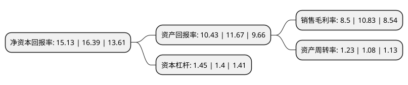

> 本页面由自动化程序生成于 2022年5月20日 01:23
> 内容可能存在错误，如有bug请提交issue至：https://github.com/Eroleice/doc-pi/issues
{.is-warning}

# 上市公司基本情况

## 基本资料

常州祥明智能动力股份有限公司（以下简称“祥明智能”）成立于1995年12月22日，常州市。于2022年03月25日在深交所创业板上市。

祥明智能注册资本6,800万元，公司主要从事微特电机，风机及智能化组件的研发，生产与销售，为HVACR(采暖，通风，空调，净化与冷冻)，交通车辆，通信系统，医疗健康等行业客户提供定制化，智能化，模块化的组件及整体解决方案。公司主要产品分为两类，第一类是微特电机，包括交流异步电机，直流有刷电机，直流无刷电机三大系列;第二类是风机，包括离心风机，横流风机，轴流风机，特种定制风机四大系列。以下是详细信息：

- 公司名称: 常州祥明智能动力股份有限公司
- 股票代码: 301226.SZ
- 所在地: 江苏 - 常州市
- 成立日期: 1995年12月22日
- 注册资本: 6,800万元
- 法定代表人: 张敏
- 主营业务: 公司主要从事微特电机，风机及智能化组件的研发，生产与销售，为HVACR(采暖，通风，空调，净化与冷冻)，交通车辆，通信系统，医疗健康等行业客户提供定制化，智能化，模块化的组件及整体解决方案公司主要产品分为两类，第一类是微特电机，包括交流异步电机，直流有刷电机，直流无刷电机三大系列;第二类是风机，包括离心风机，横流风机，轴流风机，特种定制风机四大系列
- 公司官网: www.xiangming.com
- 公司介绍: 常州祥明智能动力股份有限公司是国内专业从事设计、生产和销售各类电机和精密风机的领先企业之一。公司有较强的开发与创新能力，拥有一支长期从事微电机研制、设计、生产制造和质量管理的员工队伍，产品广泛应用于暖通工程、轨道交通车辆、汽车、军工航天、家电、医疗仪器设备、健身器材、厨卫设备、制冷机械、金融等领域，是一家具有自主研发和创新能力的国家高新技术企业。公司凭借多年深厚的技术积累、优异的产品质量、快速响应的服务体系，能够较好的响应不断变化的下游市场需求，主要客户群体包括国内外多家具有较强行业影响力的大型企业，如青岛海信、Valeo(法雷奥)、Panasonic(松下)等。

## 股东及高管情况

上市公司第一大股东为常州祥兴信息技术有限公司，持股34,969,576股，占比51.43%，为上市公司实际控制人。

截至2022年03月31日，上市公司的前十大股东中，共有3名自然人股东，7名机构股东，其中5%以上大股东共有2名。上市公司前十大股东明细如下：

> 截至2022年03月31日，上市公司前十大股东信息如下：

| 股东名称 | 持股数量（股） | 持股比例 |
| --- | --- | --- |
| 常州祥兴信息技术有限公司 | 34,969,576 | 51.43% |
| 常州祥光股权投资中心(普通合伙) | 4,754,237 | 6.99% |
| 深圳市前海生辉股权投资合伙企业(有限合伙) | 3,025,424 | 4.45% |
| 民生证券投资有限公司 | 2,358,101 | 3.47% |
| 常州祥华管理咨询有限公司 | 2,355,509 | 3.46% |
| 杨剑东 | 1,179,051 | 1.73% |
| 杨剑平 | 1,179,051 | 1.73% |
| 杨剑芬 | 1,179,051 | 1.73% |
| 华泰证券股份有限公司客户信用交易担保证券账户 | 167,012 | 0.25% |
| 国泰君安证券股份有限公司客户信用交易担保证券账户 | 125,862 | 0.19% |

## 利润表分析

上市公司2021年总收入为7.34亿元，净利润为0.62亿元，实现盈利。

## 杜邦分析

> 数据列示周期：2021年 | 2020年 | 2019年
{.is-info}

上市公司的净资产收益率在近一年有所下降，下降幅度为-7.69%，其变化情况分解如下：
- 上市公司的销售毛利率在近一年下降了-21.51%，可能是生产效率的下降、商品原材料价格上涨或商品价格的下跌所致。
- 上市公司的资产周转率在近一年上升了13.89%，可能是源自于更快的销售回款或库存管理效果提升。
- 上市公司的财务杠杆比率在近一年上升了3.57%，可能是增加负债扩大生产规模。

