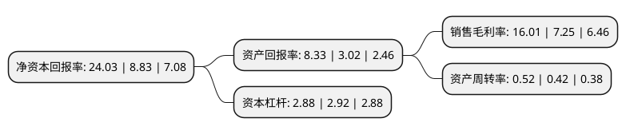

> 本页面由自动化程序生成于 2022年5月20日 01:24
> 内容可能存在错误，如有bug请提交issue至：https://github.com/Eroleice/doc-pi/issues
{.is-warning}

# 上市公司基本情况

## 基本资料

特变电工股份有限公司（以下简称“特变电工”）成立于1993年02月26日，昌吉回族自治州。于1997年06月18日在上交所主板上市。

特变电工注册资本378,855.029万元，主要业务:变压器，电线电缆及其辅助设备的制造与销售。以下是详细信息：

- 公司名称: 特变电工股份有限公司
- 股票代码: 600089.SH
- 所在地: 新疆 - 昌吉回族自治州
- 成立日期: 1993年02月26日
- 注册资本: 378,855.029万元
- 法定代表人: 张新
- 主营业务: 变压器，电线电缆及其辅助设备的制造与销售
- 公司官网: www.tbea.com
- 公司介绍: 公司是中国变压器行业首家上市公司，中国重大装备制造业的核心骨干企业，国家级企业技术中心和博士后科研工作站，是中国重大装备制造业首家获得“中国驰名商标”和“中国名牌产品”的企业集团。同时，也是中国重要的变压器、电线电缆、高压电子铝箔新材料、太阳能系统工程实施及太阳能核心控制部件的研发、制造和出口企业。公司始终专注于“输变电、新能源、新材料”三大产业的开拓与协同发展，公司是国内少有的具有自主知识产权的变压器制造企业，特别是超高压和直流变压器的核心技术已经达到了国际水平。在新能源产业方面，公司拥有多项自主知识产权技术，成功开发出大功率太阳能光伏电站系统、太阳能电池组件、太阳能级硅片等核心技术产品。

## 股东及高管情况

上市公司第一大股东为新疆特变电工集团有限公司，持股446,982,637股，占比11.79%，**疑似为**上市公司实际控制人。

截至2022年03月31日，上市公司的前十大股东中，共有1名机构股东，8个产品账户，1个海外主体，其中5%以上大股东共有1名。上市公司前十大股东明细如下：

> 未能通过持股比例判定出上市公司实际控制人（持股30%以上）
> 可能存在通过间接持股、联合持股、协议控制等方式拥有实际控制权的主体，具体请参考上市公司定期公告！
{.is-warning}

> 截至2022年03月31日，上市公司前十大股东信息如下：

| 股东名称 | 持股数量（股） | 持股比例 |
| --- | --- | --- |
| 新疆特变电工集团有限公司 | 446,982,637 | 11.79% |
| 香港中央结算有限公司(陆股通) | 77,166,126 | 2.04% |
| 嘉实基金-农业银行-嘉实中证金融资产管理计划 | 51,902,061 | 1.37% |
| 华夏基金-农业银行-华夏中证金融资产管理计划 | 51,902,061 | 1.37% |
| 银华基金-农业银行-银华中证金融资产管理计划 | 51,902,061 | 1.37% |
| 工银瑞信基金-农业银行-工银瑞信中证金融资产管理计划 | 51,902,061 | 1.37% |
| 易方达基金-农业银行-易方达中证金融资产管理计划 | 51,902,061 | 1.37% |
| 南方基金-农业银行-南方中证金融资产管理计划 | 51,902,061 | 1.37% |
| 博时基金-农业银行-博时中证金融资产管理计划 | 51,902,061 | 1.37% |
| 广发基金-农业银行-广发中证金融资产管理计划 | 51,902,061 | 1.37% |

## 利润表分析

上市公司2021年总收入为613.7亿元，净利润为98.13亿元，实现盈利。

## 杜邦分析

> 数据列示周期：2021年 | 2020年 | 2019年
{.is-info}

上市公司的净资产收益率在近一年有所上升，上升幅度为172.14%，其变化情况分解如下：
- 上市公司的销售毛利率在近一年上升了120.83%，可能是生产效率的提升、商品原材料价格下跌或商品价格的上涨所致。
- 上市公司的资产周转率在近一年上升了23.81%，可能是源自于更快的销售回款或库存管理效果提升。
- 上市公司的财务杠杆比率在近一年下降了-1.37%，可能是减少负债降低财务费用。

