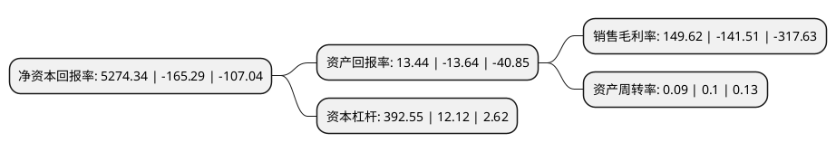

> 本页面由自动化程序生成于 2022年5月20日 01:24
> 内容可能存在错误，如有bug请提交issue至：https://github.com/Eroleice/doc-pi/issues
{.is-warning}

# 上市公司基本情况

## 基本资料

贵州长征天成控股股份有限公司（以下简称“*ST天成”）成立于1997年11月13日，遵义市。于1997年11月27日在上交所主板上市。

*ST天成注册资本50,920万元，主要产品:高，低压电器元件和成套装置。以下是详细信息：

- 公司名称: 贵州长征天成控股股份有限公司
- 股票代码: 600112.SH
- 所在地: 贵州 - 遵义市
- 成立日期: 1997年11月13日
- 注册资本: 50,920万元
- 法定代表人: 高健
- 主营业务: 主要产品:高，低压电器元件和成套装置
- 公司官网: www.tckg.cn
- 公司介绍: 公司是主要从事高、低压电器元件、继电保护、成套电器设备等产品制造与销售的国家大型一档企业，是西南地区最大的工业电器生产基地。目前已形成以电气设备、金融以及矿业开发三大产业为支柱的产业集团。高压电气产品的直接用户是各类变压器厂商，销售模式主要以直销为主，主要通过投标方式获取订单，经销商模式占比很小。公司通过参股设立贵州遵义汇川农村商业银行股份有限公司、贵阳贵银金融租赁有限公司以及大爱人寿保险股份有限公司来实现在金融行业多个领域的全面布局，从而获取投资收益并获得相应的金融牌照，为公司打造综合性金融平台奠定基础。公司通过参股海外锆钛矿企业香港长城矿业开发有限公司获取投资收益。香港长城主要从事矿产资源勘探，对非洲莫桑比克中部省份的沿海锆钛矿5004C矿区进行开采，加工提炼及一般进出口贸易，目前的主要产品为锆中矿和钛精矿。

## 股东及高管情况

上市公司第一大股东为广西铁路发展投资基金(有限合伙)，持股61,600,000股，占比12.1%，**疑似为**上市公司实际控制人。

截至2022年03月31日，上市公司的前十大股东中，共有8名自然人股东，1名机构股东，1个产品账户，其中5%以上大股东共有1名。上市公司前十大股东明细如下：

> 未能通过持股比例判定出上市公司实际控制人（持股30%以上）
> 可能存在通过间接持股、联合持股、协议控制等方式拥有实际控制权的主体，具体请参考上市公司定期公告！
{.is-warning}

> 截至2022年03月31日，上市公司前十大股东信息如下：

| 股东名称 | 持股数量（股） | 持股比例 |
| --- | --- | --- |
| 广西铁路发展投资基金(有限合伙) | 61,600,000 | 12.1% |
| 李陆军 | 12,000,000 | 2.36% |
| 银河天成集团有限公司 | 11,000,000 | 2.16% |
| 金雷 | 3,990,000 | 0.78% |
| 刘卫 | 2,887,300 | 0.57% |
| 段永州 | 2,878,400 | 0.57% |
| 高天鹏 | 2,783,500 | 0.55% |
| 陈国玲 | 2,349,700 | 0.46% |
| 陈长春 | 2,062,000 | 0.4% |
| 李博文 | 1,951,500 | 0.38% |

## 杜邦分析

> 数据列示周期：2021年 | 2020年 | 2019年
{.is-info}

上市公司的净资产收益率在近一年有所下降，下降幅度为-3290.96%，其变化情况分解如下：
- 上市公司的销售毛利率在近一年下降了-205.73%，可能是生产效率的下降、商品原材料价格上涨或商品价格的下跌所致。
- 上市公司的资产周转率在近一年下降了-10%，可能是源自于更慢的销售回款或库存管理效果下降。
- 上市公司的财务杠杆比率在近一年上升了3138.86%，可能是增加负债扩大生产规模。

