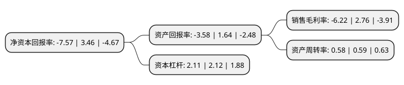

> 本页面由自动化程序生成于 2022年5月20日 01:24
> 内容可能存在错误，如有bug请提交issue至：https://github.com/Eroleice/doc-pi/issues
{.is-warning}

# 上市公司基本情况

## 基本资料

维科技术股份有限公司（以下简称“维科技术”）成立于1993年07月28日，宁波市。于1998年06月09日在上交所主板上市。

维科技术注册资本52,490.456万元，主营业务:家纺类，纱线类，服装类，染整加工，贸易类。以下是详细信息：

- 公司名称: 维科技术股份有限公司
- 股票代码: 600152.SH
- 所在地: 浙江 - 宁波市
- 成立日期: 1993年07月28日
- 注册资本: 52,490.456万元
- 法定代表人: 何承命
- 主营业务: 主营业务:家纺类，纱线类，服装类，染整加工，贸易类
- 公司官网: www.veken-tech.com
- 公司介绍: 公司是以纺织为主业，地产开发、资本投资、能源新材料综合发展的大型企业集团上市公司，是中国家纺行业首家A股上市企业。历经半个多世纪的发展与积淀，公司相继组建了家纺、经编、纱线、针织服装、梭织面料等内部产业群，从棉花基地到产品研发、设计、纺纱、织造、印染、整理、缝制、加工、成品直到内销、外贸等，组成了中国纺织界最完整的垂直一体化产业链，是中国纺织行业少数能够掌握上下游供应链的大型企业集团之一，是中国纺织产业中的领军型企业。2017年，公司通过重大资产重组，直接及间接方式合计持有维科电池100%的股权，并直接持有维科新能源100%的股权，公司主营业务新增锂电池制造业务，维科电池专注于锂离子电池的研发、制造和销售，主要产品为手机用锂离子电池，少量生产平板电脑用锂离子电池及移动电源。

## 股东及高管情况

上市公司第一大股东为维科控股集团股份有限公司，持股152,778,214股，占比29.11%，**疑似为**上市公司实际控制人。

截至2022年03月31日，上市公司的前十大股东中，共有7名自然人股东，2名机构股东，1个产品账户，其中5%以上大股东共有3名。上市公司前十大股东明细如下：

> 未能通过持股比例判定出上市公司实际控制人（持股30%以上）
> 可能存在通过间接持股、联合持股、协议控制等方式拥有实际控制权的主体，具体请参考上市公司定期公告！
{.is-warning}

> 截至2022年03月31日，上市公司前十大股东信息如下：

| 股东名称 | 持股数量（股） | 持股比例 |
| --- | --- | --- |
| 维科控股集团股份有限公司 | 152,778,214 | 29.11% |
| 杨东文 | 36,686,775 | 6.99% |
| 宁波市工业投资有限责任公司 | 35,685,450 | 6.8% |
| 杨龙勇 | 17,164,257 | 3.27% |
| 张伟 | 6,363,885 | 1.21% |
| 李优良 | 4,914,300 | 0.94% |
| 李婷 | 4,403,700 | 0.84% |
| 肖道志 | 4,048,100 | 0.77% |
| 深圳明泉私募证券基金管理有限责任公司-明泉基金春天1号私募证券投资基金 | 3,588,907 | 0.68% |
| 孔凡波 | 3,580,000 | 0.68% |

## 利润表分析

上市公司2021年总收入为20.75亿元，净利润为-1.3亿元，**未实现盈利**。

## 杜邦分析

> 数据列示周期：2021年 | 2020年 | 2019年
{.is-info}

上市公司的净资产收益率在近一年有所下降，下降幅度为-318.79%，其变化情况分解如下：
- 上市公司的销售毛利率在近一年下降了-325.36%，可能是生产效率的下降、商品原材料价格上涨或商品价格的下跌所致。
- 上市公司的资产周转率在近一年下降了-1.69%，可能是源自于更慢的销售回款或库存管理效果下降。
- 上市公司的财务杠杆比率在近一年下降了-0.47%，可能是减少负债降低财务费用。

