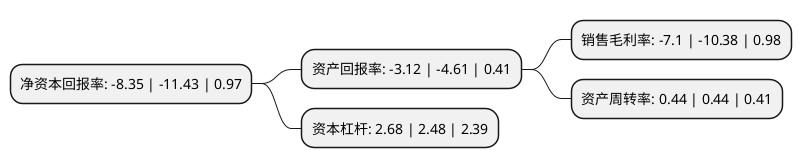

> 本页面由自动化程序生成于 2022年5月20日 01:25
> 内容可能存在错误，如有bug请提交issue至：https://github.com/Eroleice/doc-pi/issues
{.is-warning}

# 上市公司基本情况

## 基本资料

兰州长城电工股份有限公司（以下简称“长城电工”）成立于1998年12月10日，兰州市。于1998年12月24日在上交所主板上市。

长城电工注册资本44,174.8万元，主要产品:中高压开关设备，大中型电机及发电设备，工业控制及配电电器元件。以下是详细信息：

- 公司名称: 兰州长城电工股份有限公司
- 股票代码: 600192.SH
- 所在地: 甘肃 - 兰州市
- 成立日期: 1998年12月10日
- 注册资本: 44,174.8万元
- 法定代表人: 张志明
- 主营业务: 主要产品:中高压开关设备，大中型电机及发电设备，工业控制及配电电器元件
- 公司官网: www.chinagwe.com
- 公司介绍: 公司主营业务属机械工业中的电工电器行业，公司主要从事高中低压开关成套设备、高中低压电器元件、电气传动自动化装置、新能源装备等电工电器类产品的研发、生产与销售，以及果蔬汁加工，水电运营与管理等业务。销售区域遍布全国各省、市、自治区，并出口欧、亚、非、澳等六十多个国家和地区。公司还是我国风力发电设备制造行业的龙头企业。公司与清华大学合作，在大容量异步风电控制系统方面研发与同容量电机配套的变流器领域，屡创国内第一。并为新疆风能公司、广东南澳风电厂等提供发电机组，产品达到国外先进水平。此外，公司还涉足节能环保、燃料电池等领域。

## 股东及高管情况

上市公司第一大股东为甘肃电气装备集团有限公司，持股171,272,753股，占比38.77%，为上市公司实际控制人。

截至2022年03月31日，上市公司的前十大股东中，共有8名自然人股东，1名机构股东，1个海外主体，其中5%以上大股东共有1名。上市公司前十大股东明细如下：

> 截至2022年03月31日，上市公司前十大股东信息如下：

| 股东名称 | 持股数量（股） | 持股比例 |
| --- | --- | --- |
| 甘肃电气装备集团有限公司 | 171,272,753 | 38.77% |
| 董慧芬 | 3,446,500 | 0.78% |
| 冯文军 | 3,220,500 | 0.73% |
| 曲来生 | 3,208,516 | 0.73% |
| 刘占涛 | 2,257,278 | 0.51% |
| 金建明 | 1,400,000 | 0.32% |
| 安伟 | 1,300,000 | 0.29% |
| UBS AG | 1,077,060 | 0.24% |
| 郭绍山 | 914,900 | 0.21% |
| 冯源 | 888,100 | 0.2% |

## 利润表分析

上市公司2021年总收入为20.66亿元，净利润为-1.47亿元，**未实现盈利**。

## 杜邦分析

> 数据列示周期：2021年 | 2020年 | 2019年
{.is-info}

上市公司的净资产收益率在近一年有所下降，下降幅度为-26.95%，其变化情况分解如下：
- 上市公司的销售毛利率在近一年下降了-31.6%，可能是生产效率的下降、商品原材料价格上涨或商品价格的下跌所致。
- 上市公司的资产周转率在近一年下降了0%，可能是源自于更慢的销售回款或库存管理效果下降。
- 上市公司的财务杠杆比率在近一年上升了8.06%，可能是增加负债扩大生产规模。

