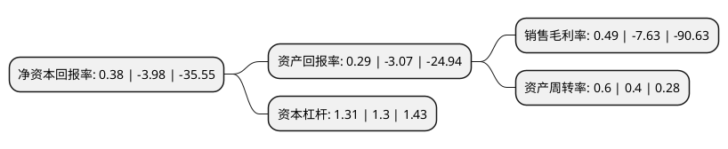

> 本页面由自动化程序生成于 2022年5月20日 01:25
> 内容可能存在错误，如有bug请提交issue至：https://github.com/Eroleice/doc-pi/issues
{.is-warning}

# 上市公司基本情况

## 基本资料

辽宁时代万恒股份有限公司（以下简称“ST时万”）成立于1999年03月29日，大连市。于2000年11月28日在上交所主板上市。

ST时万注册资本29,430.212万元，主营业务:林业资源开发，新能源电池制造以下是详细信息：

- 公司名称: 辽宁时代万恒股份有限公司
- 股票代码: 600241.SH
- 所在地: 辽宁 - 大连市
- 成立日期: 1999年03月29日
- 注册资本: 29,430.212万元
- 法定代表人: 李军
- 主营业务: 主营业务:林业资源开发，新能源电池制造
- 公司官网: www.shidaiwanheng.com
- 公司介绍: 公司的主要业务为林业资源开发、新能源电池制造，新能源电池制造为核心和重点业务，林业资源开发为辅助和补充业务。林业资源开发企业拥有优质的林地资源储备，产品渐被客户认可；九夷能源具有自创自建的研发体系，在技术、工艺方面行业领先，生产中将高质量与低成本和谐统一，保证了公司拥有极为优质的客户资源。

## 股东及高管情况

上市公司第一大股东为辽宁时代万恒控股集团有限公司，持股143,133,473股，占比48.63%，为上市公司实际控制人。

截至2022年03月31日，上市公司的前十大股东中，共有6名自然人股东，4名机构股东，其中5%以上大股东共有1名。上市公司前十大股东明细如下：

> 截至2022年03月31日，上市公司前十大股东信息如下：

| 股东名称 | 持股数量（股） | 持股比例 |
| --- | --- | --- |
| 辽宁时代万恒控股集团有限公司 | 143,133,473 | 48.63% |
| 辽宁交通投资有限责任公司 | 14,163,076 | 4.81% |
| 辽宁润中供水有限责任公司 | 5,920,181 | 2.01% |
| 何红军 | 2,810,337 | 0.95% |
| 吕志伟 | 2,103,700 | 0.71% |
| 谭丽 | 1,866,988 | 0.63% |
| 房茂文 | 1,474,200 | 0.5% |
| 韩茹 | 1,327,569 | 0.45% |
| 郭旭 | 1,311,500 | 0.45% |
| 武汉九通物流有限公司 | 1,196,700 | 0.41% |

## 利润表分析

上市公司2021年总收入为7.8亿元，净利润为0.03亿元，实现盈利。

## 杜邦分析

> 数据列示周期：2021年 | 2020年 | 2019年
{.is-info}

上市公司的净资产收益率在近一年有所下降，下降幅度为-109.55%，其变化情况分解如下：
- 上市公司的销售毛利率在近一年下降了-106.42%，可能是生产效率的下降、商品原材料价格上涨或商品价格的下跌所致。
- 上市公司的资产周转率在近一年上升了50%，可能是源自于更快的销售回款或库存管理效果提升。
- 上市公司的财务杠杆比率在近一年上升了0.77%，可能是增加负债扩大生产规模。

