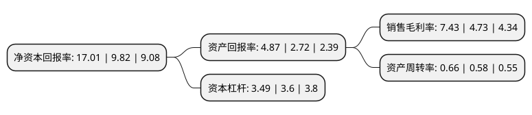

> 本页面由自动化程序生成于 2022年5月20日 01:25
> 内容可能存在错误，如有bug请提交issue至：https://github.com/Eroleice/doc-pi/issues
{.is-warning}

# 上市公司基本情况

## 基本资料

国电南京自动化股份有限公司（以下简称“国电南自”）成立于1999年09月22日，南京市。于1999年11月18日在上交所主板上市。

国电南自注册资本69,526.518万元，主要产品:电网保护及自动化类产品，电厂保护及自动化类产品。以下是详细信息：

- 公司名称: 国电南京自动化股份有限公司
- 股票代码: 600268.SH
- 所在地: 江苏 - 南京市
- 成立日期: 1999年09月22日
- 注册资本: 69,526.518万元
- 法定代表人: 王凤蛟
- 主营业务: 主要产品:电网保护及自动化类产品，电厂保护及自动化类产品
- 公司官网: www.sac-china.com
- 公司介绍: 公司是中国华电集团公司控股的高科技上市企业，主要从事高低压输配电线路保护、电力主设备保护、变电站综合自动化系统、电网调度自动化系统等的研发和生产，其产品广泛应用于电力、交通、水利、石化、煤炭、冶金、建筑等领域。目前公司已成为国内最大的电力系统静态保护、成套自动化设备、土工试验和大坝观测仪器以及电力测试仪表的国家大型骨干企业，公司产品跻身亚太地区的电力市场，先后在国际招标中赢得了巴基斯坦核电工程，尼泊尔首都城市电网项目等项目，并与俄罗斯和南非合作，成立销售点，建立生产基地。

## 股东及高管情况

上市公司第一大股东为华电集团南京电力自动化设备有限公司，持股379,295,472股，占比54.55%，为上市公司实际控制人。

截至2022年03月31日，上市公司的前十大股东中，共有4名自然人股东，5名机构股东，1个产品账户，其中5%以上大股东共有1名。上市公司前十大股东明细如下：

> 截至2022年03月31日，上市公司前十大股东信息如下：

| 股东名称 | 持股数量（股） | 持股比例 |
| --- | --- | --- |
| 华电集团南京电力自动化设备有限公司 | 379,295,472 | 54.55% |
| 泰康人寿保险有限责任公司-投连-创新动力 | 12,842,946 | 1.85% |
| 中国石油天然气集团公司企业年金计划-中国工商银行股份有限公司 | 4,669,045 | 0.67% |
| 尉氏纺织有限公司 | 4,100,000 | 0.59% |
| 中邮人寿保险股份有限公司-分红险委托泰康组合三 | 2,469,700 | 0.36% |
| 中邮人寿保险股份有限公司-分红二委托泰康组合三 | 2,332,700 | 0.34% |
| 胡晨 | 2,026,959 | 0.29% |
| 黄立明 | 1,598,900 | 0.23% |
| 冯民 | 1,400,000 | 0.2% |
| 任利红 | 1,399,000 | 0.2% |

## 利润表分析

上市公司2021年总收入为58.92亿元，净利润为4.37亿元，实现盈利。

## 杜邦分析

> 数据列示周期：2021年 | 2020年 | 2019年
{.is-info}

上市公司的净资产收益率在近一年有所上升，上升幅度为73.22%，其变化情况分解如下：
- 上市公司的销售毛利率在近一年上升了57.08%，可能是生产效率的提升、商品原材料价格下跌或商品价格的上涨所致。
- 上市公司的资产周转率在近一年上升了13.79%，可能是源自于更快的销售回款或库存管理效果提升。
- 上市公司的财务杠杆比率在近一年下降了-3.06%，可能是减少负债降低财务费用。

