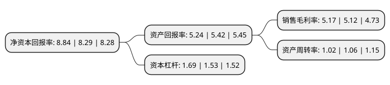

> 本页面由自动化程序生成于 2022年5月20日 01:26
> 内容可能存在错误，如有bug请提交issue至：https://github.com/Eroleice/doc-pi/issues
{.is-warning}

# 上市公司基本情况

## 基本资料

陕西宝光真空电器股份有限公司（以下简称“宝光股份”）成立于1997年12月31日，宝鸡市。于2002年01月16日在上交所主板上市。

宝光股份注册资本33,020.156万元，主要产品:真空开关设备及元器件。以下是详细信息：

- 公司名称: 陕西宝光真空电器股份有限公司
- 股票代码: 600379.SH
- 所在地: 陕西 - 宝鸡市
- 成立日期: 1997年12月31日
- 注册资本: 33,020.156万元
- 法定代表人: 刘武周
- 主营业务: 主要产品:真空开关设备及元器件
- 公司官网: www.baoguang.com.cn
- 公司介绍: 公司是我国生产真空灭弧室和真空开关设备的重点高新技术企业，拥有国内一流的技术装备和生产线，对核心零件的专有技术严格控制、全部自制。以智能化制造为目标，不断加大两化融合工作力度，拥有行业第一条真空灭弧室自动检测线、电子随工单系统及触头自动加工线。公司主要产品有真空灭弧室、真空开关设备等六大类三百多个品种，具有标准化、系列化、小型化、多样化等特点。多年来，公司与西安高压电器研究所、电力科学研究院、西安交通大学、华中理工大学、德国西门子公司、法国施耐德公司、日本三菱公司、韩国KCC公司、中国台湾稻叶公司及鼎技公司等一直保持着密切、友好的技术合作与交流。“宝光”牌系列产品科学的设计和卓越的质量，深受广大用户的肯定和欢迎，获得了多项荣誉。公司多个产品被列入国家级火炬计划和国家级重点新产品计划，获得省优、部优产品称号和科技成果奖70多项。“宝光牌”真空灭弧室多次荣获国家科技进步奖，被国家能源部确认为信得过产品，并荣获第五届亚太博览会金奖、莫斯科国际名优产品金奖和陕西省名牌产品称号。公司多次荣获国家、部委和省级优秀企业称号，被列入中国电子及通讯设备制造企业100家最佳经济效益企业。

## 股东及高管情况

上市公司第一大股东为陕西宝光集团有限公司，持股89,037,810股，占比26.96%，**疑似为**上市公司实际控制人。

截至2022年03月31日，上市公司的前十大股东中，共有3名自然人股东，2名机构股东，5个产品账户，其中5%以上大股东共有2名。上市公司前十大股东明细如下：

> 未能通过持股比例判定出上市公司实际控制人（持股30%以上）
> 可能存在通过间接持股、联合持股、协议控制等方式拥有实际控制权的主体，具体请参考上市公司定期公告！
{.is-warning}

> 截至2022年03月31日，上市公司前十大股东信息如下：

| 股东名称 | 持股数量（股） | 持股比例 |
| --- | --- | --- |
| 陕西宝光集团有限公司 | 89,037,810 | 26.96% |
| 西藏锋泓投资管理有限公司 | 46,856,600 | 14.19% |
| 程立祥 | 12,493,600 | 3.78% |
| 北京霆泉私募基金管理有限公司-锋泓新纪元一号私募证券投资基金 | 8,634,900 | 2.62% |
| 张敏 | 5,849,700 | 1.77% |
| 北京霆泉私募基金管理有限公司-漮泰一期私募证券投资基金 | 4,591,900 | 1.39% |
| 张宝玉 | 2,753,500 | 0.83% |
| 广州市玄元投资管理有限公司-玄元科新219号私募证券投资基金 | 2,750,000 | 0.83% |
| 广州市玄元投资管理有限公司-玄元科新218号私募证券投资基金 | 2,750,000 | 0.83% |
| 广州市玄元投资管理有限公司-玄元元和27号私募证券投资基金 | 2,749,940 | 0.83% |

## 利润表分析

上市公司2021年总收入为10.09亿元，净利润为0.52亿元，实现盈利。

## 杜邦分析

> 数据列示周期：2021年 | 2020年 | 2019年
{.is-info}

上市公司的净资产收益率在近一年有所上升，上升幅度为6.63%，其变化情况分解如下：
- 上市公司的销售毛利率在近一年上升了0.98%，可能是生产效率的提升、商品原材料价格下跌或商品价格的上涨所致。
- 上市公司的资产周转率在近一年下降了-3.77%，可能是源自于更慢的销售回款或库存管理效果下降。
- 上市公司的财务杠杆比率在近一年上升了10.46%，可能是增加负债扩大生产规模。

