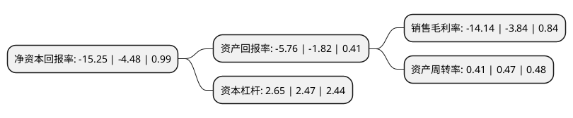

> 本页面由自动化程序生成于 2022年5月20日 01:26
> 内容可能存在错误，如有bug请提交issue至：https://github.com/Eroleice/doc-pi/issues
{.is-warning}

# 上市公司基本情况

## 基本资料

北京动力源科技股份有限公司（以下简称“动力源”）成立于1995年01月21日，北京市。于2004年04月01日在上交所主板上市。

动力源注册资本55,513.695万元，主要产品:通信电源，高压直流电源，工业电源，应急电源(EPS)，不间断电源(UPS)，光伏逆变器，功率优化器，高压变频器，合同能源管理服务，非车载充电产品，车载动力系统总成核心零部件，车载电源。主营业务:电力电子技术领域相关产品的研发，制造，销售以及相关技术服务并为客户提供系统集成解决方案。以下是详细信息：

- 公司名称: 北京动力源科技股份有限公司
- 股票代码: 600405.SH
- 所在地: 北京 - 北京市
- 成立日期: 1995年01月21日
- 注册资本: 55,513.695万元
- 法定代表人: 何振亚
- 主营业务: 主要产品:通信电源，高压直流电源，工业电源，应急电源(EPS)，不间断电源(UPS)，光伏逆变器，功率优化器，高压变频器，合同能源管理服务，非车载充电产品，车载动力系统总成核心零部件，车载电源主营业务:电力电子技术领域相关产品的研发，制造，销售以及相关技术服务并为客户提供系统集成解决方案
- 公司官网: www.dpc.com.cn
- 公司介绍: 公司致力于电力电子技术领域相关产品的研发、制造、销售以及相关技术服务并为客户提供系统集成解决方案。公司业务核心为使用电子元器件与软件控制技术对电能进行变换和控制，目前主要产品按技术方向分为直流电源、交流电源、高压变频器及综合节能服务、新能源汽车配套产品业务等。公司产品坚持以自主研发、制造为主，在产品销售方面以直接销售方式为主，部分产品采用直销+代理商销售；在综合节能服务领域以EPC模式开展合同能源管理业务；公司也在积极探索不同的销售业务模式以满足市场差异化需求，大力推进代理分销渠道建设、大客户营销及专网市场推广力度，培育基站(机房)动力环境系统集成能力以推动公司业务增长。

## 股东及高管情况

上市公司第一大股东为何振亚，持股62,138,615股，占比11.19%，**疑似为**上市公司实际控制人。

截至2022年03月31日，上市公司的前十大股东中，共有9名自然人股东，1名机构股东，其中5%以上大股东共有1名。上市公司前十大股东明细如下：

> 未能通过持股比例判定出上市公司实际控制人（持股30%以上）
> 可能存在通过间接持股、联合持股、协议控制等方式拥有实际控制权的主体，具体请参考上市公司定期公告！
{.is-warning}

> 截至2022年03月31日，上市公司前十大股东信息如下：

| 股东名称 | 持股数量（股） | 持股比例 |
| --- | --- | --- |
| 何振亚 | 62,138,615 | 11.19% |
| 周卫军 | 11,717,095 | 2.11% |
| 台林 | 7,270,000 | 1.31% |
| 吴琼 | 2,536,500 | 0.46% |
| 王婷 | 2,307,600 | 0.42% |
| 华泰证券股份有限公司 | 1,809,471 | 0.33% |
| 肖孟佳 | 1,568,138 | 0.28% |
| 李哲 | 1,319,077 | 0.24% |
| 刘献军 | 1,250,000 | 0.23% |
| 郭伟 | 1,110,239 | 0.2% |

## 利润表分析

上市公司2021年总收入为10.41亿元，净利润为-1.48亿元，**未实现盈利**。

## 杜邦分析

> 数据列示周期：2021年 | 2020年 | 2019年
{.is-info}

上市公司的净资产收益率在近一年有所上升，上升幅度为240.4%，其变化情况分解如下：
- 上市公司的销售毛利率在近一年上升了268.23%，可能是生产效率的提升、商品原材料价格下跌或商品价格的上涨所致。
- 上市公司的资产周转率在近一年下降了-12.77%，可能是源自于更慢的销售回款或库存管理效果下降。
- 上市公司的财务杠杆比率在近一年上升了7.29%，可能是增加负债扩大生产规模。

