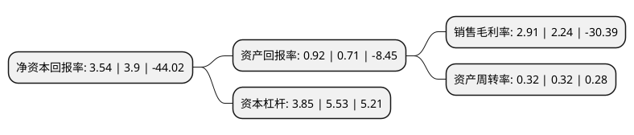

> 本页面由自动化程序生成于 2022年5月20日 01:26
> 内容可能存在错误，如有bug请提交issue至：https://github.com/Eroleice/doc-pi/issues
{.is-warning}

# 上市公司基本情况

## 基本资料

湘潭电机股份有限公司（以下简称“湘电股份”）成立于1999年12月26日，湘潭市。于2002年07月18日在上交所主板上市。

湘电股份注册资本115,495.19万元，主要产品:交流电机，直流电机，车辆，水泵。以下是详细信息：

- 公司名称: 湘潭电机股份有限公司
- 股票代码: 600416.SH
- 所在地: 湖南 - 湘潭市
- 成立日期: 1999年12月26日
- 注册资本: 115,495.19万元
- 法定代表人: 周健君
- 主营业务: 主要产品:交流电机，直流电机，车辆，水泵
- 公司官网: www.xemc.com.cn/xemc
- 公司介绍: 公司是我国电工行业大型骨干企业，是国家重大技术装备国产化基地，是电工行业产品配套能力、科研开发能力最强的企业之一。公司的主营业务是大中型交直流电机(含特种电机)、水泵、矿用采运设备(含特种车辆)和城市轨道交通车辆及电气成套设备的生产和销售，主要产品有直流电机、直流牵引电机、特种电机、水泵等。“湘电”已经成为“中国驰名商标”，是我国电工行业的大型骨干企业和国务院确立的国家重大装备国产化研制基地、国家高技术产业基地和国家创新型企业。被誉为“中国电工产品摇篮”、“中国民族工业脊梁”。公司是中国机电行业最具价值的品牌之一，先后荣获全球100强新能源企业、中国新能源企业30强、中国制造企业500强等称号。

## 股东及高管情况

上市公司第一大股东为湖南兴湘投资控股集团有限公司，持股225,929,169股，占比19.56%，**疑似为**上市公司实际控制人。

截至2022年03月31日，上市公司的前十大股东中，共有3名自然人股东，2名机构股东，5个产品账户，其中5%以上大股东共有3名。上市公司前十大股东明细如下：

> 未能通过持股比例判定出上市公司实际控制人（持股30%以上）
> 可能存在通过间接持股、联合持股、协议控制等方式拥有实际控制权的主体，具体请参考上市公司定期公告！
{.is-warning}

> 截至2022年03月31日，上市公司前十大股东信息如下：

| 股东名称 | 持股数量（股） | 持股比例 |
| --- | --- | --- |
| 湖南兴湘投资控股集团有限公司 | 225,929,169 | 19.56% |
| 湘电集团有限公司 | 180,990,081 | 15.67% |
| 湖南省国企并购重组基金管理有限公司-湖南兴湘并购重组股权投资基金企业(有限合伙) | 119,401,448 | 10.34% |
| 上海高毅资产管理合伙企业(有限合伙)-高毅邻山1号远望基金 | 38,000,000 | 3.29% |
| 全国社保基金五零三组合 | 32,000,000 | 2.77% |
| 交通银行股份有限公司-博时新兴成长混合型证券投资基金 | 14,554,512 | 1.26% |
| 卢源 | 13,348,660 | 1.16% |
| 蒋凤银 | 11,160,500 | 0.97% |
| 彭骞 | 10,595,000 | 0.92% |
| 中国银行股份有限公司-国投瑞银国家安全灵活配置混合型证券投资基金 | 10,124,340 | 0.88% |

## 利润表分析

上市公司2021年总收入为40.25亿元，净利润为1.17亿元，实现盈利。

## 杜邦分析

> 数据列示周期：2021年 | 2020年 | 2019年
{.is-info}

上市公司的净资产收益率在近一年有所下降，下降幅度为-9.23%，其变化情况分解如下：
- 上市公司的销售毛利率在近一年上升了29.91%，可能是生产效率的提升、商品原材料价格下跌或商品价格的上涨所致。
- 上市公司的资产周转率在近一年下降了0%，可能是源自于更慢的销售回款或库存管理效果下降。
- 上市公司的财务杠杆比率在近一年下降了-30.38%，可能是减少负债降低财务费用。

