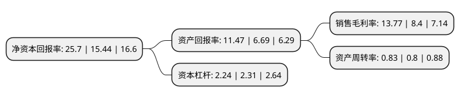

> 本页面由自动化程序生成于 2022年5月20日 01:26
> 内容可能存在错误，如有bug请提交issue至：https://github.com/Eroleice/doc-pi/issues
{.is-warning}

# 上市公司基本情况

## 基本资料

通威股份有限公司（以下简称“通威股份”）成立于1995年12月08日，成都市。于2004年03月02日在上交所主板上市。

通威股份注册资本450,154.818万元，水产饲料，畜禽饲料等的研究，生产和销售，多晶硅，太阳能电池的研发，生产，销售以下是详细信息：

- 公司名称: 通威股份有限公司
- 股票代码: 600438.SH
- 所在地: 四川 - 成都市
- 成立日期: 1995年12月08日
- 注册资本: 450,154.818万元
- 法定代表人: 谢毅
- 主营业务: 水产饲料，畜禽饲料等的研究，生产和销售，多晶硅，太阳能电池的研发，生产，销售
- 公司官网: www.tongwei.com.cn
- 公司介绍: 公司以饲料工业为主，同时涉足水产研究、水产养殖、动物保健、食品加工等相关领域的大型农业科技型上市公司，系农业产业化国家重点龙头企业。公司发展农业和新能源两大主业，其中农业主业以饲料工业为核心，全力延伸和完善水产及畜禽产业链条。同时，在新能源主业方面，公司已成为拥有从上游高纯晶硅生产、中游高效太阳能电池片生产、到终端光伏电站建设的垂直一体化光伏企业，已形成拥有自主知识产权的完整光伏新能源产业链条，并成为中国乃至全球光伏新能源产业发展的核心参与者和主要推动力量。近年来，并先后获得“中国驰名商标”、“中国名牌”等多项殊荣。

## 股东及高管情况

上市公司第一大股东为通威集团有限公司，持股1,974,022,515股，占比43.85%，为上市公司实际控制人。

截至2022年03月31日，上市公司的前十大股东中，共有1名自然人股东，1名机构股东，7个产品账户，1个海外主体，其中5%以上大股东共有2名。上市公司前十大股东明细如下：

> 截至2022年03月31日，上市公司前十大股东信息如下：

| 股东名称 | 持股数量（股） | 持股比例 |
| --- | --- | --- |
| 通威集团有限公司 | 1,974,022,515 | 43.85% |
| 香港中央结算有限公司(陆股通) | 240,098,221 | 5.33% |
| 中国人寿资管-中国银行-国寿资产-优势甄选2108保险资产管理产品 | 52,099,840 | 1.16% |
| 中国银行股份有限公司-华泰柏瑞中证光伏产业交易型开放式指数证券投资基金 | 32,690,520 | 0.73% |
| 杨林 | 29,081,700 | 0.65% |
| 全国社保基金一一零组合 | 29,038,133 | 0.65% |
| 中国人寿保险股份有限公司-传统-普通保险产品-005L-CT001沪 | 26,280,223 | 0.58% |
| 中信建投证券股份有限公司-天弘中证光伏产业指数型发起式证券投资基金 | 26,272,754 | 0.58% |
| 中国人寿资管-兴业银行-国寿资产-优势甄选2110保险资产管理产品 | 24,400,000 | 0.54% |
| 大成基金-华能信托·嘉月7号单一资金信托-大成基金卓越2号单一资产管理计划 | 23,080,314 | 0.51% |

## 利润表分析

上市公司2021年总收入为634.91亿元，净利润为87.42亿元，实现盈利。

## 杜邦分析

> 数据列示周期：2021年 | 2020年 | 2019年
{.is-info}

上市公司的净资产收益率在近一年有所上升，上升幅度为66.45%，其变化情况分解如下：
- 上市公司的销售毛利率在近一年上升了63.93%，可能是生产效率的提升、商品原材料价格下跌或商品价格的上涨所致。
- 上市公司的资产周转率在近一年上升了3.75%，可能是源自于更快的销售回款或库存管理效果提升。
- 上市公司的财务杠杆比率在近一年下降了-3.03%，可能是减少负债降低财务费用。

