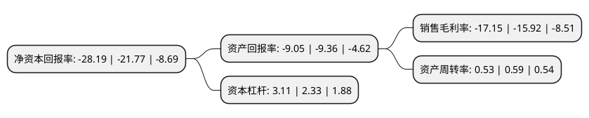

> 本页面由自动化程序生成于 2022年5月20日 01:27
> 内容可能存在错误，如有bug请提交issue至：https://github.com/Eroleice/doc-pi/issues
{.is-warning}

# 上市公司基本情况

## 基本资料

亿晶光电科技股份有限公司（以下简称“亿晶光电”）成立于1998年01月21日，宁波市。于2003年01月23日在上交所主板上市。

亿晶光电注册资本117,635.927万元，主营业务为晶体硅(单/多晶硅)太阳能电池片和电池组件的生产和销售以及光伏发电业务。主要产品包括:硅棒，硅片，太阳能电池片和太阳能电池组件。以下是详细信息：

- 公司名称: 亿晶光电科技股份有限公司
- 股票代码: 600537.SH
- 所在地: 浙江 - 宁波市
- 成立日期: 1998年01月21日
- 注册资本: 117,635.927万元
- 法定代表人: 杨庆忠
- 主营业务: 主营业务为晶体硅(单/多晶硅)太阳能电池片和电池组件的生产和销售以及光伏发电业务主要产品包括:硅棒，硅片，太阳能电池片和太阳能电池组件
- 公司官网: www.egingpv.com
- 公司介绍: 公司是中国第一家在上海A股上市的纯太阳能电池组件生产企业，是一家专业从事光伏发电产品的研发、生产和销售的高新技术企业，集晶棒拉制、硅片切割、电池制备、组件封装和光伏发电系统为一体，具有年产单(多)晶太阳能电池组件1000MW的生产能力。亿晶光电先后建立了江苏省(亿晶)光伏工程研究院、江苏省太阳能用材料工程技术研究中心、组件实验室和电池实验室(其中组件实验室获得了VDE的TDAP认证)江苏省企业技术中心、国家博士后科研工作站。除此之外，亿晶光电与上海交通大学以及江苏大学共建了联合研发中心和产学研基地。随着大批专业人才的加入，亿晶光电实现了跨越式发展，并形成了较强的研发实力。公司先后被评为江苏省高新技术企业、国家火炬计划重点高新技术企业、江苏省百强民营科技企业、常州市五星级企业、科技部国际科技合作基地等。公司还被国家科学技术部命名为“国际科技合作基地”。09年公司由原来福布斯“2008中国潜力企业榜”第13位跃居第2位，居全国入选的光伏企业首位。目前，研发中心承担多项国家级科技研发项目，拥有多项专利成果。通过不断的技术创新，亿晶光电电池组件产品的性能和质量不断提高，“EGingPV”已经成为国内外光伏行业的知名品牌。

## 股东及高管情况

上市公司第一大股东为深圳市勤诚达投资管理有限公司，持股254,696,214股，占比21.65%，**疑似为**上市公司实际控制人。

截至2022年03月31日，上市公司的前十大股东中，共有8名自然人股东，1名机构股东，1个产品账户，其中5%以上大股东共有2名。上市公司前十大股东明细如下：

> 未能通过持股比例判定出上市公司实际控制人（持股30%以上）
> 可能存在通过间接持股、联合持股、协议控制等方式拥有实际控制权的主体，具体请参考上市公司定期公告！
{.is-warning}

> 截至2022年03月31日，上市公司前十大股东信息如下：

| 股东名称 | 持股数量（股） | 持股比例 |
| --- | --- | --- |
| 深圳市勤诚达投资管理有限公司 | 254,696,214 | 21.65% |
| 荀建华 | 78,563,216 | 6.68% |
| 珠海回声资产管理有限公司-回声1号私募基金 | 26,015,617 | 2.21% |
| 陈国平 | 12,185,583 | 1.04% |
| 邓福胜 | 10,773,241 | 0.92% |
| 潘庆玲 | 10,259,100 | 0.87% |
| 夏重阳 | 9,020,000 | 0.77% |
| 王秋宝 | 8,770,000 | 0.75% |
| 朱瑞平 | 6,618,300 | 0.56% |
| 张浩 | 6,403,816 | 0.54% |

## 利润表分析

上市公司2021年总收入为40.83亿元，净利润为-7.01亿元，**未实现盈利**。

## 杜邦分析

> 数据列示周期：2021年 | 2020年 | 2019年
{.is-info}

上市公司的净资产收益率在近一年有所上升，上升幅度为29.49%，其变化情况分解如下：
- 上市公司的销售毛利率在近一年上升了7.73%，可能是生产效率的提升、商品原材料价格下跌或商品价格的上涨所致。
- 上市公司的资产周转率在近一年下降了-10.17%，可能是源自于更慢的销售回款或库存管理效果下降。
- 上市公司的财务杠杆比率在近一年上升了33.48%，可能是增加负债扩大生产规模。

