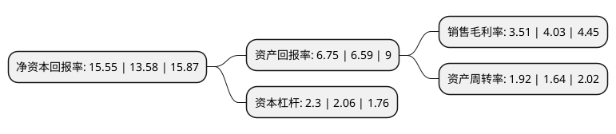

> 本页面由自动化程序生成于 2022年5月20日 01:27
> 内容可能存在错误，如有bug请提交issue至：https://github.com/Eroleice/doc-pi/issues
{.is-warning}

# 上市公司基本情况

## 基本资料

铜陵精达特种电磁线股份有限公司（以下简称“精达股份”）成立于2000年07月12日，铜陵市。于2002年09月11日在上交所主板上市。

精达股份注册资本199,570.442万元，主营业务为漆包电磁线，裸铜线和电线电缆的制造和销售。主要产品:漆包线，微细线，裸铜线，束绞线，毛细铜管，无氧铜杆，裸铝丝。以下是详细信息：

- 公司名称: 铜陵精达特种电磁线股份有限公司
- 股票代码: 600577.SH
- 所在地: 安徽 - 铜陵市
- 成立日期: 2000年07月12日
- 注册资本: 199,570.442万元
- 法定代表人: 李晓
- 主营业务: 主营业务为漆包电磁线，裸铜线和电线电缆的制造和销售主要产品:漆包线，微细线，裸铜线，束绞线，毛细铜管，无氧铜杆，裸铝丝
- 公司官网: www.jingda.cn
- 公司介绍: 公司为国家重点高新技术企业，是特种电磁线行业的龙头企业、位列全球前三位的特种电磁线制造商。公司在质量、品牌、技术、规模、战略布局等方面具有明显的优势。主要生产设备、检测仪器从意大利、德国、奥地利、美国、丹麦等国家和中国台湾地区引进，自动化程度高，具有当代国际先进水平。公司主要产品广泛适用于家用电器、电子材料、电力设备、通讯仪器、汽车电机、电动工具等行业产品配套。形成了安徽、广东、天津、江苏四大生产基地，产品覆盖长三角、珠三角和环渤海地区，并有部分产品销往欧美、南亚地区。公司是电磁线行业国家标准起草单位，并参与了电线电缆行业“十二五”规划的编制工作。公司通过了ISO9001标准认证、TS16949、ISO14001环境管理体系认证、OHSAS18001职业健康安全管理体系等管理认证。

## 股东及高管情况

上市公司第一大股东为特华投资控股有限公司，持股250,258,383股，占比12.54%，**疑似为**上市公司实际控制人。

截至2022年03月31日，上市公司的前十大股东中，共有1名自然人股东，4名机构股东，4个产品账户，1个海外主体，其中5%以上大股东共有2名。上市公司前十大股东明细如下：

> 未能通过持股比例判定出上市公司实际控制人（持股30%以上）
> 可能存在通过间接持股、联合持股、协议控制等方式拥有实际控制权的主体，具体请参考上市公司定期公告！
{.is-warning}

> 截至2022年03月31日，上市公司前十大股东信息如下：

| 股东名称 | 持股数量（股） | 持股比例 |
| --- | --- | --- |
| 特华投资控股有限公司 | 250,258,383 | 12.54% |
| 华安财产保险股份有限公司-传统保险产品 | 195,395,729 | 9.79% |
| 南京瑞椿投资管理合伙企业(有限合伙) | 84,043,007 | 4.21% |
| 香港中央结算有限公司(陆股通) | 72,991,223 | 3.66% |
| 中国建设银行股份有限公司-东方红启东三年持有期混合型证券投资基金 | 63,346,626 | 3.17% |
| 铜陵精达铜材(集团)有限责任公司 | 61,519,130 | 3.08% |
| 广州市特华投资管理有限公司 | 35,741,674 | 1.79% |
| 上海盘京投资管理中心(有限合伙)-盛信2期私募证券投资基金 | 19,478,820 | 0.98% |
| 沈军 | 15,630,000 | 0.78% |
| 中国工商银行股份有限公司-海富通改革驱动灵活配置混合型证券投资基金 | 15,325,311 | 0.77% |

## 利润表分析

上市公司2021年总收入为183.29亿元，净利润为6.44亿元，实现盈利。

## 杜邦分析

> 数据列示周期：2021年 | 2020年 | 2019年
{.is-info}

上市公司的净资产收益率在近一年有所上升，上升幅度为14.51%，其变化情况分解如下：
- 上市公司的销售毛利率在近一年下降了-12.9%，可能是生产效率的下降、商品原材料价格上涨或商品价格的下跌所致。
- 上市公司的资产周转率在近一年上升了17.07%，可能是源自于更快的销售回款或库存管理效果提升。
- 上市公司的财务杠杆比率在近一年上升了11.65%，可能是增加负债扩大生产规模。

