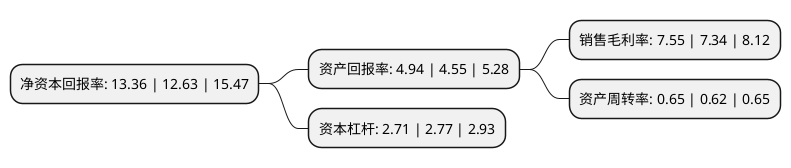

> 本页面由自动化程序生成于 2022年5月20日 01:27
> 内容可能存在错误，如有bug请提交issue至：https://github.com/Eroleice/doc-pi/issues
{.is-warning}

# 上市公司基本情况

## 基本资料

卧龙电气驱动集团股份有限公司（以下简称“卧龙电驱”）成立于1998年10月21日，绍兴市。于2002年06月06日在上交所主板上市。

卧龙电驱注册资本131,526.259万元，主要产品:工业驱动及控制电机，中高压电机，家用电器电机，微电机，电动自行车，蓄电池。以下是详细信息：

- 公司名称: 卧龙电气驱动集团股份有限公司
- 股票代码: 600580.SH
- 所在地: 浙江 - 绍兴市
- 成立日期: 1998年10月21日
- 注册资本: 131,526.259万元
- 法定代表人: 庞欣元
- 主营业务: 主要产品:工业驱动及控制电机，中高压电机，家用电器电机，微电机，电动自行车，蓄电池
- 公司官网: www.wolong.com.cn
- 公司介绍: 公司属国家重点高新技术企业，集电机与控制、输变电、电源电池三大产品链，产品涵盖各类微特电机及控制、低压电机及控制、高压电机及控制、电源电池及输变设备等40大系列3000多个品种，主导产品引领国际国内主流市场并配套诸多国家重点工程项目，各项经济指标连续多年居国内同行首位。生产基地遍布中国上虞、绍兴、杭州、上海、淮安、北京、银川、武汉、济南、青岛、烟台、芜湖、南阳、郴州；奥地利努斯特瑙、斯皮尔伯格；英国伯明翰、哈德斯菲尔德、诺维奇、利兹市；德国诺登汉姆、门兴格拉德巴赫、韦尔茨海姆；塞尔维亚博尔、苏博蒂察；波兰塔尔努夫；意大利摩德纳。公司在杭州、日本大阪、荷兰埃因霍温三地建有三个电机及驱动控制技术研究机构。是国家重点高新技术企业，设有博士后科研工作站和国家重点实验室，建立了省级电气研究院和国家级企业技术中心。

## 股东及高管情况

上市公司第一大股东为浙江卧龙舜禹投资有限公司，持股422,798,480股，占比32.15%，为上市公司实际控制人。

截至2022年03月31日，上市公司的前十大股东中，共有1名自然人股东，3名机构股东，5个产品账户，1个海外主体，其中5%以上大股东共有1名。上市公司前十大股东明细如下：

> 截至2022年03月31日，上市公司前十大股东信息如下：

| 股东名称 | 持股数量（股） | 持股比例 |
| --- | --- | --- |
| 浙江卧龙舜禹投资有限公司 | 422,798,480 | 32.15% |
| 卧龙控股集团有限公司 | 61,699,513 | 4.69% |
| 招商银行股份有限公司-兴全合润混合型证券投资基金 | 28,869,795 | 2.19% |
| 兴业银行股份有限公司-兴全趋势投资混合型证券投资基金 | 23,708,041 | 1.8% |
| 陈建成 | 21,149,956 | 1.61% |
| 兴业银行股份有限公司-兴全新视野灵活配置定期开放混合型发起式证券投资基金 | 19,857,447 | 1.51% |
| 香港中央结算有限公司(陆股通) | 18,556,722 | 1.41% |
| 绍兴市上虞区国有资本投资运营有限公司 | 18,311,142 | 1.39% |
| 中国光大银行股份有限公司-兴全商业模式优选混合型证券投资基金(LOF) | 17,360,619 | 1.32% |
| 中国工商银行股份有限公司-海富通改革驱动灵活配置混合型证券投资基金 | 16,228,236 | 1.23% |

## 杜邦分析

> 数据列示周期：2021年 | 2020年 | 2019年
{.is-info}

上市公司的净资产收益率在近一年有所上升，上升幅度为5.78%，其变化情况分解如下：
- 上市公司的销售毛利率在近一年上升了2.86%，可能是生产效率的提升、商品原材料价格下跌或商品价格的上涨所致。
- 上市公司的资产周转率在近一年上升了4.84%，可能是源自于更快的销售回款或库存管理效果提升。
- 上市公司的财务杠杆比率在近一年下降了-2.17%，可能是减少负债降低财务费用。

