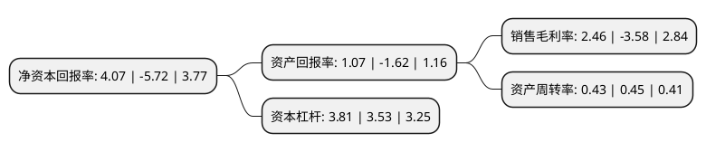

> 本页面由自动化程序生成于 2022年5月20日 01:27
> 内容可能存在错误，如有bug请提交issue至：https://github.com/Eroleice/doc-pi/issues
{.is-warning}

# 上市公司基本情况

## 基本资料

泰豪科技股份有限公司（以下简称“泰豪科技”）成立于1996年03月20日，南昌市。于2002年07月03日在上交所主板上市。

泰豪科技注册资本85,286.975万元，主营业务为智能电力，装备信息，智能节能，电机产业四大类。以下是详细信息：

- 公司名称: 泰豪科技股份有限公司
- 股票代码: 600590.SH
- 所在地: 江西 - 南昌市
- 成立日期: 1996年03月20日
- 注册资本: 85,286.975万元
- 法定代表人: 李自强
- 主营业务: 主营业务为智能电力，装备信息，智能节能，电机产业四大类
- 公司官网: www.tellhow.com
- 公司介绍: 公司是在江西省和清华大学“省校合作”推动下，在南昌国家高新开发区设立的高科技公司。公司致力于军工装备、智慧能源领域的产业发展。军工装备业务围绕通信指挥系统、光电探测产品、导航产品的研制与服务，重点开展军工信息技术的研究与应用；智慧能源业务围绕能源互联网、电力信息化、智能应急电源的产品研制与服务，重点开展能源互联网技术的研究与应用。同时，积极关注相关领域的并购机会，使公司成为军工装备领域的规模化企业和智慧能源领域的专家型企业。公司被国家首批认定为“高新技术企业”，入选“国家级创新型企业”，并拥有“国家认定企业技术中心”等荣誉称号。

## 股东及高管情况

上市公司第一大股东为同方股份有限公司，持股167,315,574股，占比19.62%，**疑似为**上市公司实际控制人。

截至2022年03月31日，上市公司的前十大股东中，共有5名自然人股东，5名机构股东，其中5%以上大股东共有3名。上市公司前十大股东明细如下：

> 未能通过持股比例判定出上市公司实际控制人（持股30%以上）
> 可能存在通过间接持股、联合持股、协议控制等方式拥有实际控制权的主体，具体请参考上市公司定期公告！
{.is-warning}

> 截至2022年03月31日，上市公司前十大股东信息如下：

| 股东名称 | 持股数量（股） | 持股比例 |
| --- | --- | --- |
| 同方股份有限公司 | 167,315,574 | 19.62% |
| 泰豪集团有限公司 | 128,569,272 | 15.07% |
| 中国海外控股集团有限公司 | 51,996,672 | 6.1% |
| 胡健 | 18,631,655 | 2.18% |
| 杨剑 | 6,370,000 | 0.75% |
| 四川泽瑞投资有限公司 | 4,858,417 | 0.57% |
| 张涛 | 3,754,226 | 0.44% |
| 徐宏伟 | 3,000,000 | 0.35% |
| 浙江中赢资本投资合伙企业(有限合伙) | 2,832,427 | 0.33% |
| 罗飞杰 | 2,800,000 | 0.33% |

## 利润表分析

上市公司2021年总收入为60.62亿元，净利润为1.49亿元，实现盈利。

## 杜邦分析

> 数据列示周期：2021年 | 2020年 | 2019年
{.is-info}

上市公司的净资产收益率在近一年有所下降，下降幅度为-171.15%，其变化情况分解如下：
- 上市公司的销售毛利率在近一年下降了-168.72%，可能是生产效率的下降、商品原材料价格上涨或商品价格的下跌所致。
- 上市公司的资产周转率在近一年下降了-4.44%，可能是源自于更慢的销售回款或库存管理效果下降。
- 上市公司的财务杠杆比率在近一年上升了7.93%，可能是增加负债扩大生产规模。

