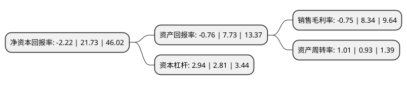

> 本页面由自动化程序生成于 2022年5月20日 01:28
> 内容可能存在错误，如有bug请提交issue至：https://github.com/Eroleice/doc-pi/issues
{.is-warning}

# 上市公司基本情况

## 基本资料

上海爱旭新能源股份有限公司（以下简称“爱旭股份”）成立于1996年08月12日，上海市。于1996年08月16日在上交所主板上市。

爱旭股份注册资本203,632.919万元，商品房销售，商品房出租。以下是详细信息：

- 公司名称: 上海爱旭新能源股份有限公司
- 股票代码: 600732.SH
- 所在地: 上海 - 上海市
- 成立日期: 1996年08月12日
- 注册资本: 203,632.919万元
- 法定代表人: 陈刚
- 主营业务: 商品房销售，商品房出租
- 公司官网: www.aikosolar.com
- 公司介绍: 上市公司前身为上海港机股份有限公司，主要从事大型港口设备、工程船舶和大型金属结构及其部件、配件的设计、建造和销售。经过收购重组后，2003年公司名称由“上海港机股份有限公司”变更为“上海新梅置业股份有限公司”。2019年经过资产置换，上市公司的主营业务由房地产开发与经营转型进入太阳能光伏行业。置入资产爱旭科技成立于2009年，一直从事太阳能晶硅电池的研发、生产和销售，凭借光伏行业十年耕耘的深厚积累，爱旭科技形成了优秀的管理团队和专业的研发团队。未来，爱旭科技的盈利能力和资产规模有望进一步提升，为上市公司的持续经营提供坚实保障。

## 股东及高管情况

上市公司第一大股东为陈刚，持股655,755,511股，占比32.2%，为上市公司实际控制人。

截至2022年03月31日，上市公司的前十大股东中，共有1名自然人股东，6名机构股东，3个产品账户，其中5%以上大股东共有2名。上市公司前十大股东明细如下：

> 截至2022年03月31日，上市公司前十大股东信息如下：

| 股东名称 | 持股数量（股） | 持股比例 |
| --- | --- | --- |
| 陈刚 | 655,755,511 | 32.2% |
| 义乌奇光股权投资合伙企业(有限合伙) | 568,754,374 | 27.93% |
| 上海新达浦宏投资合伙企业(有限合伙) | 98,434,491 | 4.83% |
| 天津天创海河先进装备制造产业基金合伙企业(有限合伙) | 71,210,246 | 3.5% |
| 佛山市嘉时企业管理合伙企业(有限合伙) | 33,334,499 | 1.64% |
| 江苏南通沿海创业投资基金(有限合伙) | 13,932,887 | 0.68% |
| 江苏新材料产业创业投资企业(有限合伙) | 13,873,987 | 0.68% |
| 江苏疌泉金茂新材料创业投资合伙企业(有限合伙) | 11,845,574 | 0.58% |
| 华泰柏瑞中证光伏产业交易型开放式指数证券投资基金 | 9,875,280 | 0.48% |
| 深圳天诚一号投资企业(有限合伙) | 9,129,864 | 0.45% |

## 利润表分析

上市公司2021年总收入为154.7亿元，净利润为-1.16亿元，**未实现盈利**。

## 杜邦分析

> 数据列示周期：2021年 | 2020年 | 2019年
{.is-info}

上市公司的净资产收益率在近一年有所下降，下降幅度为-110.22%，其变化情况分解如下：
- 上市公司的销售毛利率在近一年下降了-108.99%，可能是生产效率的下降、商品原材料价格上涨或商品价格的下跌所致。
- 上市公司的资产周转率在近一年上升了8.6%，可能是源自于更快的销售回款或库存管理效果提升。
- 上市公司的财务杠杆比率在近一年上升了4.63%，可能是增加负债扩大生产规模。

