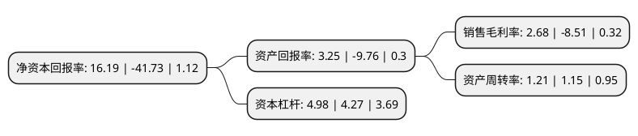

> 本页面由自动化程序生成于 2022年5月20日 01:29
> 内容可能存在错误，如有bug请提交issue至：https://github.com/Eroleice/doc-pi/issues
{.is-warning}

# 上市公司基本情况

## 基本资料

远东智慧能源股份有限公司（以下简称“远东股份”）成立于1995年01月25日，西宁市。于1995年02月06日在上交所主板上市。

远东股份注册资本221,935.275万元，主要产品:电力电缆，电气装备用电线电缆，裸导线，碳纤维复合芯软铝导线等以下是详细信息：

- 公司名称: 远东智慧能源股份有限公司
- 股票代码: 600869.SH
- 所在地: 青海 - 西宁市
- 成立日期: 1995年01月25日
- 注册资本: 221,935.275万元
- 法定代表人: 蒋锡培
- 主营业务: 主要产品:电力电缆，电气装备用电线电缆，裸导线，碳纤维复合芯软铝导线等
- 公司官网: www.600869.com
- 公司介绍: 公司致力于成为全球领先的智慧能源、智慧城市服务商，主营智慧能源和智慧城市技术、产品与服务及其互联网、物联网应用的研发、制造与销售；智慧能源和智慧城市项目规划设计、投资建设及能效管理与服务；智慧能源和智慧城市工程总承包；包括智能分布式电源技术和产品、数码电芯、高性能动力锂电池组、新能源汽车等。公司拥有博士后科研工作站、院士专家工作站、江苏省企业研究生工作站、国家级企业技术中心、国家级认可实验室、江西省锂电池工程研究中心等科研基地。公司以“创造价值，服务社会”为使命，秉持“诚信务实、创新创优、和灵共赢”的价值理念，致力成为备受员工热爱、备受社会尊敬的全球领先的智慧能源、智慧城市服务商。

## 股东及高管情况

上市公司第一大股东为远东控股集团有限公司，持股1,072,589,351股，占比48.33%，为上市公司实际控制人。

截至2022年03月31日，上市公司的前十大股东中，共有1名自然人股东，2名机构股东，7个产品账户，其中5%以上大股东共有2名。上市公司前十大股东明细如下：

> 截至2022年03月31日，上市公司前十大股东信息如下：

| 股东名称 | 持股数量（股） | 持股比例 |
| --- | --- | --- |
| 远东控股集团有限公司 | 1,072,589,351 | 48.33% |
| 宜兴国远投资合伙企业(有限合伙) | 161,579,892 | 7.28% |
| 中国建设银行股份有限公司-华夏能源革新股票型证券投资基金 | 32,705,948 | 1.47% |
| 中国银行股份有限公司-华夏行业景气混合型证券投资基金 | 32,677,779 | 1.47% |
| 中国银行股份有限公司-上投摩根远见两年持有期混合型证券投资基金 | 30,617,132 | 1.38% |
| 中国农业银行股份有限公司-上投摩根新兴动力混合型证券投资基金 | 25,058,520 | 1.13% |
| 上海通怡投资管理有限公司-通怡海川13号私募证券投资基金 | 23,000,000 | 1.04% |
| 中国工商银行股份有限公司-华安安康灵活配置混合型证券投资基金 | 14,010,200 | 0.63% |
| 蔡道国 | 12,765,401 | 0.58% |
| 上海通怡投资管理有限公司-通怡海川5号私募证券投资基金 | 12,710,000 | 0.57% |

## 利润表分析

上市公司2021年总收入为208.71亿元，净利润为5.6亿元，实现盈利。

## 杜邦分析

> 数据列示周期：2021年 | 2020年 | 2019年
{.is-info}

上市公司的净资产收益率在近一年有所下降，下降幅度为-138.8%，其变化情况分解如下：
- 上市公司的销售毛利率在近一年下降了-131.49%，可能是生产效率的下降、商品原材料价格上涨或商品价格的下跌所致。
- 上市公司的资产周转率在近一年上升了5.22%，可能是源自于更快的销售回款或库存管理效果提升。
- 上市公司的财务杠杆比率在近一年上升了16.63%，可能是增加负债扩大生产规模。

