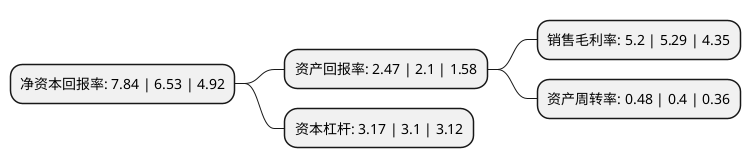

> 本页面由自动化程序生成于 2022年5月20日 01:29
> 内容可能存在错误，如有bug请提交issue至：https://github.com/Eroleice/doc-pi/issues
{.is-warning}

# 上市公司基本情况

## 基本资料

东方电气股份有限公司（以下简称“东方电气”）成立于1993年12月28日，成都市。于1995年10月10日在上交所主板上市。

东方电气注册资本311,900.113万元，主要产品为火力发电设备，水力发电设备，风力发电设备，核能发电设备以及燃气发电设备等。以下是详细信息：

- 公司名称: 东方电气股份有限公司
- 股票代码: 600875.SH
- 所在地: 四川 - 成都市
- 成立日期: 1993年12月28日
- 注册资本: 311,900.113万元
- 法定代表人: 俞培根
- 主营业务: 主要产品为火力发电设备，水力发电设备，风力发电设备，核能发电设备以及燃气发电设备等
- 公司官网: www.dec-ltd.cn
- 公司介绍: 公司是中国东方电气集团有限公司控股特大型企业。东方电气秉承“求实、创新、人和、图强”的企业精神，历经半个多世纪的磨砺，已成为全球最大的发电设备供应商和电站工程总承包商之一。目前，东方电气的产品已经逐渐扩展到美国、加拿大、印度、巴基斯坦、越南、印度尼西亚、沙特、波黑、瑞典、巴西等60多个国家和地区。东方电气作为国家重大技术装备国产化基地、国家级企业技术中心，拥有中国发电设备制造行业中一流的综合技术开发能力。通过自主开发、产学研合作，形成了一批拥有自主知识产权的重大技术装备产品，具备了大型水电、火电、核电、风电、燃机及太阳能发电设备的开发、设计、制造、销售、设备供应及电站工程总承包能力。

## 股东及高管情况

上市公司第一大股东为中国东方电气集团有限公司，持股1,727,919,826股，占比55.4%，为上市公司实际控制人。

截至2022年03月31日，上市公司的前十大股东中，共有1名机构股东，7个产品账户，2个海外主体，其中5%以上大股东共有2名。上市公司前十大股东明细如下：

> 截至2022年03月31日，上市公司前十大股东信息如下：

| 股东名称 | 持股数量（股） | 持股比例 |
| --- | --- | --- |
| 中国东方电气集团有限公司 | 1,727,919,826 | 55.4% |
| 香港中央结算(代理人)有限公司 | 305,564,017 | 9.8% |
| 中国工商银行股份有限公司-广发多因子灵活配置混合型证券投资基金 | 18,950,289 | 0.61% |
| Brown Brothers Harriman & Co. | 15,323,886 | 0.49% |
| 易方达基金-农业银行-易方达中证金融资产管理计划 | 8,480,400 | 0.27% |
| 大成基金-农业银行-大成中证金融资产管理计划 | 8,480,400 | 0.27% |
| 广发基金-农业银行-广发中证金融资产管理计划 | 8,480,400 | 0.27% |
| 中欧基金-农业银行-中欧中证金融资产管理计划 | 8,480,400 | 0.27% |
| 南方基金-农业银行-南方中证金融资产管理计划 | 8,480,400 | 0.27% |
| 博时基金-农业银行-博时中证金融资产管理计划 | 8,480,400 | 0.27% |

## 利润表分析

上市公司2021年总收入为478.19亿元，净利润为24.29亿元，实现盈利。

## 杜邦分析

> 数据列示周期：2021年 | 2020年 | 2019年
{.is-info}

上市公司的净资产收益率在近一年有所上升，上升幅度为20.06%，其变化情况分解如下：
- 上市公司的销售毛利率在近一年下降了-1.7%，可能是生产效率的下降、商品原材料价格上涨或商品价格的下跌所致。
- 上市公司的资产周转率在近一年上升了20%，可能是源自于更快的销售回款或库存管理效果提升。
- 上市公司的财务杠杆比率在近一年上升了2.26%，可能是增加负债扩大生产规模。

