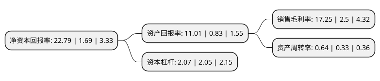

> 本页面由自动化程序生成于 2022年5月20日 01:29
> 内容可能存在错误，如有bug请提交issue至：https://github.com/Eroleice/doc-pi/issues
{.is-warning}

# 上市公司基本情况

## 基本资料

宁波杉杉股份有限公司（以下简称“杉杉股份”）成立于1992年12月14日，宁波市。于1996年01月30日在上交所主板上市。

杉杉股份注册资本214,291.994万元，西服，休闲服，锂离子电池材料，衬衫以下是详细信息：

- 公司名称: 宁波杉杉股份有限公司
- 股票代码: 600884.SH
- 所在地: 浙江 - 宁波市
- 成立日期: 1992年12月14日
- 注册资本: 214,291.994万元
- 法定代表人: 郑永刚
- 主营业务: 西服，休闲服，锂离子电池材料，衬衫
- 公司官网: www.ssgf.net
- 公司介绍: 宁波杉杉股份有限公司成立于1992年，公司自1996年A股上市以来由国内第一家上市的服装企业转型为新能源产业领军企业，现有业务覆盖锂离子电池材料、电池系统集成(包括锂离子电容、动力电池PACK)、能源管理服务和充电桩建设及新能源汽车运营等新能源业务，以及服装、创投和融资租赁等业务，其中新能源业务已经成为公司主要的业绩来源及未来发展重点。经过多年发展，杉杉股份已经成为全球规模最大的锂离子电池材料综合供应商，并一直致力于将公司打造成为全球新能源产业的领导者。2021年，杉杉股份成功并购LG化学偏光片，驶入极具价值的“黄金赛道”，形成“双主业、双驱动”发展新格局。

## 股东及高管情况

上市公司第一大股东为杉杉集团有限公司，持股737,522,036股，占比34.42%，为上市公司实际控制人。

截至2022年03月31日，上市公司的前十大股东中，共有6名机构股东，3个产品账户，1个海外主体，其中5%以上大股东共有3名。上市公司前十大股东明细如下：

> 截至2022年03月31日，上市公司前十大股东信息如下：

| 股东名称 | 持股数量（股） | 持股比例 |
| --- | --- | --- |
| 杉杉集团有限公司 | 737,522,036 | 34.42% |
| 宁波朋泽贸易有限公司 | 205,264,756 | 9.58% |
| 杉杉控股有限公司 | 116,912,189 | 5.46% |
| 宁波市鄞州捷伦投资有限公司 | 77,873,254 | 3.63% |
| 香港中央结算有限公司(陆股通) | 56,705,268 | 2.65% |
| 天安财产保险股份有限公司-保赢1号 | 54,450,098 | 2.54% |
| 百联集团有限公司 | 30,743,625 | 1.43% |
| 中国邮政储蓄银行有限责任公司-东方增长中小盘混合型开放式证券投资基金 | 26,381,020 | 1.23% |
| 中国银行股份有限公司-信诚新兴产业混合型证券投资基金 | 23,176,236 | 1.08% |
| 中国建设银行股份有限公司-创金合信新能源汽车主题股票型发起式证券投资基金 | 14,800,090 | 0.69% |

## 利润表分析

上市公司2021年总收入为206.99亿元，净利润为35.7亿元，实现盈利。

## 杜邦分析

> 数据列示周期：2021年 | 2020年 | 2019年
{.is-info}

上市公司的净资产收益率在近一年有所上升，上升幅度为1248.52%，其变化情况分解如下：
- 上市公司的销售毛利率在近一年上升了590%，可能是生产效率的提升、商品原材料价格下跌或商品价格的上涨所致。
- 上市公司的资产周转率在近一年上升了93.94%，可能是源自于更快的销售回款或库存管理效果提升。
- 上市公司的财务杠杆比率在近一年上升了0.98%，可能是增加负债扩大生产规模。

