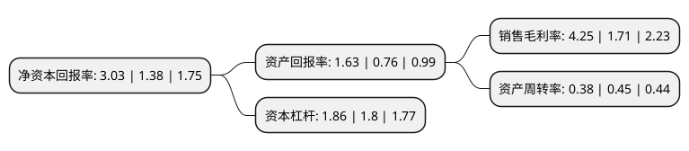

> 本页面由自动化程序生成于 2022年5月20日 01:30
> 内容可能存在错误，如有bug请提交issue至：https://github.com/Eroleice/doc-pi/issues
{.is-warning}

# 上市公司基本情况

## 基本资料

中国西电电气股份有限公司（以下简称“中国西电”）成立于2008年04月30日，西安市。于2010年01月28日在上交所主板上市。

中国西电注册资本512,588.235万元，主要产品:公司的主导产品是110kV及以上电压等级的高压开关(GIS，GCB，隔离开关，接地开关)，变压器(电力变压器，换流变压器)，电抗器(平波电抗器，并联电抗器)，电力电容器，互感器(CVT，CT，PT)，绝缘子(电站电瓷产品，复合材料绝缘子产品)，套管，氧化锌避雷器，直流输电换流阀等。主营业务:本公司的主营业务为输配电及控制设备研发，设计，制造，销售，检测，相关设备成套，技术研究，服务与工程承包，核心业务为高压，超高压及特高压交直流输配电设备制造，研发和检测。以下是详细信息：

- 公司名称: 中国西电电气股份有限公司
- 股票代码: 601179.SH
- 所在地: 陕西 - 西安市
- 成立日期: 2008年04月30日
- 注册资本: 512,588.235万元
- 法定代表人: 丁小林
- 主营业务: 主要产品:公司的主导产品是110kV及以上电压等级的高压开关(GIS，GCB，隔离开关，接地开关)，变压器(电力变压器，换流变压器)，电抗器(平波电抗器，并联电抗器)，电力电容器，互感器(CVT，CT，PT)，绝缘子(电站电瓷产品，复合材料绝缘子产品)，套管，氧化锌避雷器，直流输电换流阀等主营业务:本公司的主营业务为输配电及控制设备研发，设计，制造，销售，检测，相关设备成套，技术研究，服务与工程承包，核心业务为高压，超高压及特高压交直流输配电设备制造，研发和检测
- 公司官网: www.xdect.com.cn
- 公司介绍: 公司是我国最具规模的高压、超高压及特高压输配电成套设备研究开发、生产制造和试验检测的重要基地，是目前我国高压、超高压及特高压交直流成套输配电设备生产制造企业中产品电压等级最高、产品品种最多、工程成套能力最强的企业。公司主导产品是110kV及以上电压等级的高压开关、变压器、电抗器、电力电容器、互感器、直流输电换流阀等。产品已在西北750kV示范工程成功运行，国内首台800kV双断口罐式断路器在银川东变电站已经投入运行。国际市场上，产品和技术已出口40多个国家和地区，并成功地进入了德国、美国、新加坡、中国香港等发达国家和地区市场。

## 股东及高管情况

上市公司第一大股东为中国西电集团有限公司，持股2,611,325,701股，占比50.94%，为上市公司实际控制人。

截至2022年03月31日，上市公司的前十大股东中，共有5名机构股东，4个产品账户，1个海外主体，其中5%以上大股东共有2名。上市公司前十大股东明细如下：

> 截至2022年03月31日，上市公司前十大股东信息如下：

| 股东名称 | 持股数量（股） | 持股比例 |
| --- | --- | --- |
| 中国西电集团有限公司 | 2,611,325,701 | 50.94% |
| GE SMALLWORLD(SINGAPORE)PTE LTD | 768,882,352 | 15% |
| 中信建投证券股份有限公司客户信用交易担保证券账户 | 23,707,203 | 0.46% |
| 中国银河证券股份有限公司客户信用交易担保证券账户 | 19,476,016 | 0.38% |
| 华泰证券股份有限公司客户信用交易担保证券账户 | 19,083,123 | 0.37% |
| 申万宏源证券有限公司客户信用交易担保证券账户 | 16,399,508 | 0.32% |
| 广发基金-农业银行-广发中证金融资产管理计划 | 15,446,300 | 0.3% |
| 博时基金-农业银行-博时中证金融资产管理计划 | 15,446,300 | 0.3% |
| 易方达基金-农业银行-易方达中证金融资产管理计划 | 15,446,300 | 0.3% |
| 大成基金-农业银行-大成中证金融资产管理计划 | 15,446,300 | 0.3% |

## 利润表分析

上市公司2021年总收入为143.85亿元，净利润为6.02亿元，实现盈利。

## 杜邦分析

> 数据列示周期：2021年 | 2020年 | 2019年
{.is-info}

上市公司的净资产收益率在近一年有所上升，上升幅度为119.57%，其变化情况分解如下：
- 上市公司的销售毛利率在近一年上升了148.54%，可能是生产效率的提升、商品原材料价格下跌或商品价格的上涨所致。
- 上市公司的资产周转率在近一年下降了-15.56%，可能是源自于更慢的销售回款或库存管理效果下降。
- 上市公司的财务杠杆比率在近一年上升了3.33%，可能是增加负债扩大生产规模。

