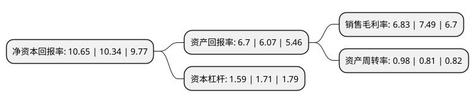

> 本页面由自动化程序生成于 2022年5月20日 01:31
> 内容可能存在错误，如有bug请提交issue至：https://github.com/Eroleice/doc-pi/issues
{.is-warning}

# 上市公司基本情况

## 基本资料

骆驼集团股份有限公司（以下简称“骆驼股份”）成立于1994年07月02日，襄阳市。于2011年06月02日在上交所主板上市。

骆驼股份注册资本117,314.612万元，主营业务为蓄电池研究，开发，制造，销售和回收处理，主要产品系应用于汽车起动，电动道路车辆牵引，电动助力车等领域的铅酸蓄电池。以下是详细信息：

- 公司名称: 骆驼集团股份有限公司
- 股票代码: 601311.SH
- 所在地: 湖北 - 襄阳市
- 成立日期: 1994年07月02日
- 注册资本: 117,314.612万元
- 法定代表人: 刘长来
- 主营业务: 主营业务为蓄电池研究，开发，制造，销售和回收处理，主要产品系应用于汽车起动，电动道路车辆牵引，电动助力车等领域的铅酸蓄电池
- 公司官网: www.chinacamel.com
- 公司介绍: 公司为一家专业从事先进电池研发、生产、销售、回收的综合性高新技术企业。多年来，公司面向市场，奋力拼搏，已成长为一个大型企业集团，逐渐发展壮大为国内最大的蓄电池制造公司之一。主要从事蓄电池的制造和销售，主要产品是用于汽车起动、电动道路车辆牵引、电动助力车动力用的铅酸蓄电池。公司拥有省级技术中心和研发中心，多项产品与技术为行业内首创，在技术上处于领先地位。公司已建立了完善的销售与服务网络，已成为东风汽车、神龙汽车、一汽大众、上海大众、福特、通用、北京现代、江淮汽车、重庆长安等家国内汽车生产厂商的主要供应商之一。在出口市场方面，公司海外市场的拓展和销售已初见成效，产品出口至俄罗斯、澳大利亚、意大利、沙特及南非等40多个国家。公司是国家重点支持的高新技术企业，“骆驼”商标已被国家工商总局认定为“驰名商标”。另外，公司还先后获得“国家权威检测合格产品证书”、“中国电器工业最具影响力品牌”、“中国市场品牌质量信誉竞争力调查”十佳品牌、“全国守合同重信用企业”、“质量信誉AAA等级”等多项荣誉或称号。

## 股东及高管情况

上市公司第一大股东为刘国本，持股278,373,337股，占比23.73%，**疑似为**上市公司实际控制人。

截至2022年03月31日，上市公司的前十大股东中，共有5名自然人股东，1名机构股东，3个产品账户，1个海外主体，其中5%以上大股东共有2名。上市公司前十大股东明细如下：

> 未能通过持股比例判定出上市公司实际控制人（持股30%以上）
> 可能存在通过间接持股、联合持股、协议控制等方式拥有实际控制权的主体，具体请参考上市公司定期公告！
{.is-warning}

> 截至2022年03月31日，上市公司前十大股东信息如下：

| 股东名称 | 持股数量（股） | 持股比例 |
| --- | --- | --- |
| 刘国本 | 278,373,337 | 23.73% |
| 湖北驼峰投资有限公司 | 150,382,009 | 12.82% |
| 刘长来 | 28,888,694 | 2.46% |
| 上海睿亿投资发展中心(有限合伙)-睿亿投资揽月六期私募证券投资基金A | 16,000,000 | 1.36% |
| 香港中央结算有限公司(陆股通) | 14,936,641 | 1.27% |
| 李文植 | 10,193,318 | 0.87% |
| 林霞 | 9,534,745 | 0.81% |
| 谭文萍 | 8,720,535 | 0.74% |
| 中国工商银行股份有限公司-东方红沪港深灵活配置混合型证券投资基金 | 8,092,262 | 0.69% |
| 深圳前海博泰广溢投资管理有限公司-博泰广溢知临优选多策略1号私募证券投资基金 | 7,501,000 | 0.64% |

## 利润表分析

上市公司2021年总收入为124.03亿元，净利润为8.47亿元，实现盈利。

## 杜邦分析

> 数据列示周期：2021年 | 2020年 | 2019年
{.is-info}

上市公司的净资产收益率在近一年有所上升，上升幅度为3%，其变化情况分解如下：
- 上市公司的销售毛利率在近一年下降了-8.81%，可能是生产效率的下降、商品原材料价格上涨或商品价格的下跌所致。
- 上市公司的资产周转率在近一年上升了20.99%，可能是源自于更快的销售回款或库存管理效果提升。
- 上市公司的财务杠杆比率在近一年下降了-7.02%，可能是减少负债降低财务费用。

