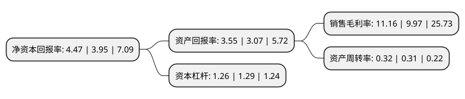

> 本页面由自动化程序生成于 2022年5月20日 01:31
> 内容可能存在错误，如有bug请提交issue至：https://github.com/Eroleice/doc-pi/issues
{.is-warning}

# 上市公司基本情况

## 基本资料

上海广电电气(集团)股份有限公司（以下简称“广电电气”）成立于1995年12月12日，上海市。于2011年02月01日在上交所主板上市。

广电电气注册资本93,557.5万元，主营业务为高低压成套设备及元器件产品的生产和销售，集研发，生产，销售，服务于一体，为各行各业用户提供整体配电解决方案，是国内知名的电气设备供应商。目前公司产品分为成套设备和元器件两大类型，共45个型号系列。公司产品主要集中于40。5kV及以下的电压等级，可实现电气开关控制及智能化终端控制等功能。以下是详细信息：

- 公司名称: 上海广电电气(集团)股份有限公司
- 股票代码: 601616.SH
- 所在地: 上海 - 上海市
- 成立日期: 1995年12月12日
- 注册资本: 93,557.5万元
- 法定代表人: 赵淑文
- 主营业务: 主营业务为高低压成套设备及元器件产品的生产和销售，集研发，生产，销售，服务于一体，为各行各业用户提供整体配电解决方案，是国内知名的电气设备供应商目前公司产品分为成套设备和元器件两大类型，共45个型号系列公司产品主要集中于405kV及以下的电压等级，可实现电气开关控制及智能化终端控制等功能
- 公司官网: www.sgeg.cn
- 公司介绍: 公司是以高低压成套设备及元器件产品的生产和销售为主营业务的公司，集研发、生产、销售、服务于一体，为各行各业用户提供整体配电解决方案，是国内知名的电气设备供应商。公司产品分为成套设备和元器件两大类型，共45个型号系列。公司产品主要集中于40.5kV及以下的电压等级，可实现电气开关控制及智能化终端控制等功能。公司是国内少数可以全系列提供40.5kV及以下电压等级输配电成套产品的企业之一，是上海电器行业协会副会长单位，一直致力于推动国内电气产品和电气技术的发展。公司产品先后荣获上海电器行业名优产品、上海名牌产品、上海市著名商标、中国名牌产品、国家免检产品等荣誉称号。

## 股东及高管情况

上市公司第一大股东为新余旻杰投资管理有限公司，持股213,474,250股，占比22.82%，**疑似为**上市公司实际控制人。

截至2022年03月31日，上市公司的前十大股东中，共有8名自然人股东，1名机构股东，1个海外主体，其中5%以上大股东共有1名。上市公司前十大股东明细如下：

> 未能通过持股比例判定出上市公司实际控制人（持股30%以上）
> 可能存在通过间接持股、联合持股、协议控制等方式拥有实际控制权的主体，具体请参考上市公司定期公告！
{.is-warning}

> 截至2022年03月31日，上市公司前十大股东信息如下：

| 股东名称 | 持股数量（股） | 持股比例 |
| --- | --- | --- |
| 新余旻杰投资管理有限公司 | 213,474,250 | 22.82% |
| ZHAO SHU WEN | 25,100,820 | 2.68% |
| 李忠琴 | 20,100,000 | 2.15% |
| 张秀 | 5,122,800 | 0.55% |
| 张素芬 | 5,100,000 | 0.55% |
| 朱光明 | 4,623,776 | 0.49% |
| 黄燕 | 4,323,800 | 0.46% |
| 施玲玲 | 3,612,500 | 0.39% |
| 董安军 | 3,445,800 | 0.37% |
| 郭卿 | 3,229,000 | 0.35% |

## 利润表分析

上市公司2021年总收入为10.04亿元，净利润为1.12亿元，实现盈利。

## 杜邦分析

> 数据列示周期：2021年 | 2020年 | 2019年
{.is-info}

上市公司的净资产收益率在近一年有所上升，上升幅度为13.16%，其变化情况分解如下：
- 上市公司的销售毛利率在近一年上升了11.94%，可能是生产效率的提升、商品原材料价格下跌或商品价格的上涨所致。
- 上市公司的资产周转率在近一年上升了3.23%，可能是源自于更快的销售回款或库存管理效果提升。
- 上市公司的财务杠杆比率在近一年下降了-2.33%，可能是减少负债降低财务费用。

