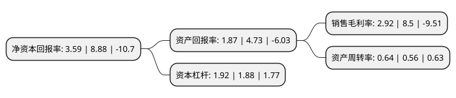

> 本页面由自动化程序生成于 2022年5月20日 01:31
> 内容可能存在错误，如有bug请提交issue至：https://github.com/Eroleice/doc-pi/issues
{.is-warning}

# 上市公司基本情况

## 基本资料

常熟风范电力设备股份有限公司（以下简称“风范股份”）成立于1993年07月15日，苏州市。于2011年01月18日在上交所主板上市。

风范股份注册资本113,323.2万元，主营业务为输电线路铁塔的研发，设计，生产和销售以及变电构支架和通讯铁塔的生产和销售。此外，公司还研发了复合材料绝缘杆塔，首批已挂网运行。主要产品有输电线路铁塔，变电构支架。以下是详细信息：

- 公司名称: 常熟风范电力设备股份有限公司
- 股票代码: 601700.SH
- 所在地: 江苏 - 苏州市
- 成立日期: 1993年07月15日
- 注册资本: 113,323.2万元
- 法定代表人: 范立义
- 主营业务: 主营业务为输电线路铁塔的研发，设计，生产和销售以及变电构支架和通讯铁塔的生产和销售此外，公司还研发了复合材料绝缘杆塔，首批已挂网运行主要产品有输电线路铁塔，变电构支架
- 公司官网: www.cstower.cn
- 公司介绍: 公司主要从事输电线路铁塔和复合材料绝缘杆塔的研发、设计、生产和销售，专业生产1000kV及以下各类超高压输电线路角塔、钢管组合塔、各类管道、变电站构支架、220kV以下钢管及各类钢结构件等产品；房地产业主要开发销售商业、民用住房的营销业务；商业贸易主要经营钢材、有色金属的销售业务。公司拥有世界领先的各种自动化铁塔加工生产线，热镀锌生产线，金属切削设备，计量理化精密仪器等，是国内较具规模，技术装备先进，检测手段先进，综合实力很强的铁构件制造公司。公司是国内拥有自主知识产权并生产复合材料绝缘杆塔的企业，在超高和特高输电线路铁塔方面处于行业领先地位，在铁塔结构计算放样领域始终保持着国内领先水平。

## 股东及高管情况

上市公司第一大股东为范建刚，持股308,790,000股，占比27.06%，**疑似为**上市公司实际控制人。

截至2022年03月31日，上市公司的前十大股东中，共有9名自然人股东，1个海外主体，其中5%以上大股东共有2名。上市公司前十大股东明细如下：

> 未能通过持股比例判定出上市公司实际控制人（持股30%以上）
> 可能存在通过间接持股、联合持股、协议控制等方式拥有实际控制权的主体，具体请参考上市公司定期公告！
{.is-warning}

> 截至2022年03月31日，上市公司前十大股东信息如下：

| 股东名称 | 持股数量（股） | 持股比例 |
| --- | --- | --- |
| 范建刚 | 308,790,000 | 27.06% |
| 范立义 | 240,975,000 | 21.12% |
| 范岳英 | 47,357,700 | 4.15% |
| 张军 | 3,042,000 | 0.27% |
| 赵金元 | 2,873,660 | 0.25% |
| 于金东 | 2,627,000 | 0.23% |
| 孙金兵 | 2,473,550 | 0.22% |
| JPMORGAN CHASE BANK,NATIONAL   ASSOCIATION | 2,080,313 | 0.18% |
| 赵月华 | 2,040,625 | 0.18% |
| 杨俊 | 2,000,000 | 0.18% |

## 利润表分析

上市公司2021年总收入为31.97亿元，净利润为0.93亿元，实现盈利。

## 杜邦分析

> 数据列示周期：2021年 | 2020年 | 2019年
{.is-info}

上市公司的净资产收益率在近一年有所下降，下降幅度为-59.57%，其变化情况分解如下：
- 上市公司的销售毛利率在近一年下降了-65.65%，可能是生产效率的下降、商品原材料价格上涨或商品价格的下跌所致。
- 上市公司的资产周转率在近一年上升了14.29%，可能是源自于更快的销售回款或库存管理效果提升。
- 上市公司的财务杠杆比率在近一年上升了2.13%，可能是增加负债扩大生产规模。

