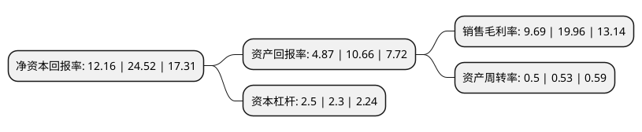

> 本页面由自动化程序生成于 2022年5月20日 01:31
> 内容可能存在错误，如有bug请提交issue至：https://github.com/Eroleice/doc-pi/issues
{.is-warning}

# 上市公司基本情况

## 基本资料

浙江正泰电器股份有限公司（以下简称“正泰电器”）成立于1997年08月05日，温州市。于2010年01月21日在上交所主板上市。

正泰电器注册资本214,997.355万元，主营业务:低压电器研发，制造，销售。主要产品有配电电器，终端电器，控制电器，电源电器，电子电器等低压电器。以下是详细信息：

- 公司名称: 浙江正泰电器股份有限公司
- 股票代码: 601877.SH
- 所在地: 浙江 - 温州市
- 成立日期: 1997年08月05日
- 注册资本: 214,997.355万元
- 法定代表人: 南存辉
- 主营业务: 主营业务:低压电器研发，制造，销售主要产品有配电电器，终端电器，控制电器，电源电器，电子电器等低压电器
- 公司官网: www.chint.net
- 公司介绍: 公司是低压电器市场的龙头企业，主要从事配电电器、终端电器、控制电器、电源电器、电子电器五大类低压电器产品的研发、生产和销售。公司历经由小及大的发展，建立了经验丰富的管理、研发、生产及营销团队，使“CHNT”、“正泰”成为了中国著名的低压电器品牌。2016年，公司经过重大资产重组注入光伏发电业务及资产，主营业务将由现有的低压电器及相关产品的研发、生产和销售扩展至光伏电站的开发、建设、运营、EPC工程总包及太阳能电池组件的制造及销售业务。公司被授予“全国产品和服务质量诚信示范企业”、“浙江省信用管理示范企业”、“温州市自营生产出口龙头企业”、“温州市外经工作先进单位”等荣誉称号。正泰新能源荣获全国分布式光伏应用创新金奖“最佳分布式光伏投资商金奖”，10.3MWp(兆瓦)分布式光伏电站项目获得“最佳分布式光伏EPC金奖”。

## 股东及高管情况

上市公司第一大股东为正泰集团股份有限公司，持股884,950,971股，占比41.16%，为上市公司实际控制人。

截至2022年03月31日，上市公司的前十大股东中，共有2名自然人股东，2名机构股东，5个产品账户，1个海外主体，其中5%以上大股东共有2名。上市公司前十大股东明细如下：

> 截至2022年03月31日，上市公司前十大股东信息如下：

| 股东名称 | 持股数量（股） | 持股比例 |
| --- | --- | --- |
| 正泰集团股份有限公司 | 884,950,971 | 41.16% |
| 浙江正泰新能源投资有限公司 | 180,311,496 | 8.39% |
| 南存辉 | 74,228,331 | 3.45% |
| 香港中央结算有限公司(陆股通) | 68,581,191 | 3.19% |
| 全国社保基金一一三组合 | 40,988,928 | 1.91% |
| 上海浦东发展银行股份有限公司-广发高端制造股票型发起式证券投资基金 | 34,650,595 | 1.61% |
| 基本养老保险基金八零二组合 | 32,074,913 | 1.49% |
| 中国民生银行股份有限公司-广发行业严选三年持有期混合型证券投资基金 | 28,387,090 | 1.32% |
| 中国建设银行股份有限公司-广发科技先锋混合型证券投资基金 | 20,435,828 | 0.95% |
| 朱信敏 | 17,866,179 | 0.83% |

## 利润表分析

上市公司2021年总收入为388.64亿元，净利润为37.66亿元，实现盈利。

## 杜邦分析

> 数据列示周期：2021年 | 2020年 | 2019年
{.is-info}

上市公司的净资产收益率在近一年有所下降，下降幅度为-50.41%，其变化情况分解如下：
- 上市公司的销售毛利率在近一年下降了-51.45%，可能是生产效率的下降、商品原材料价格上涨或商品价格的下跌所致。
- 上市公司的资产周转率在近一年下降了-5.66%，可能是源自于更慢的销售回款或库存管理效果下降。
- 上市公司的财务杠杆比率在近一年上升了8.7%，可能是增加负债扩大生产规模。

