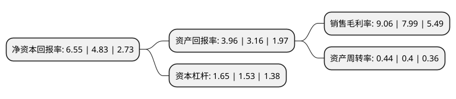

> 本页面由自动化程序生成于 2022年5月20日 01:32
> 内容可能存在错误，如有bug请提交issue至：https://github.com/Eroleice/doc-pi/issues
{.is-warning}

# 上市公司基本情况

## 基本资料

宁波弘讯科技股份有限公司（以下简称“弘讯科技”）成立于2001年09月05日，宁波市。于2015年03月03日在上交所主板上市。

弘讯科技注册资本40,421.9万元，公司主营业务为塑料机械自动化产品的研发，生产和销售。产品主要有塑机控制系统，伺服节能系统及相关嵌入式软件和塑机网络管理系统。以下是详细信息：

- 公司名称: 宁波弘讯科技股份有限公司
- 股票代码: 603015.SH
- 所在地: 浙江 - 宁波市
- 成立日期: 2001年09月05日
- 注册资本: 40,421.9万元
- 法定代表人: 熊钰麟
- 主营业务: 公司主营业务为塑料机械自动化产品的研发，生产和销售产品主要有塑机控制系统，伺服节能系统及相关嵌入式软件和塑机网络管理系统
- 公司官网: www.techmation.com.cn
- 公司介绍: 公司专注工业自动化行业多年，依托中国台湾地区的科技和产业优势，与国内优秀团队的共同努力，积累了深厚的技术底蕴和行业经验。掌握运动控制技术、工业总线技术、伺服驱动技术、工业机器人技术等智能制造相关的软硬件核心技术，为海内外客户提供工业控制类、伺服系统类、机器人类产品及系统集成解决方案。其中塑机控制系统产品在国内市场份额居首，是国内知名的塑机控制解决方案供应商。公司是中国塑料机械工业协会副会长单位，是国家第二批“制造业单项冠军培育企业”，连续被评为“中国塑料机械行业优势企业”。公司上市后，于2016年收购意大利EEI，进入新能源行业。公司是“省级专利示范企业”，并完成多项行业标准、国家标准的起草编制。

## 股东及高管情况

上市公司第一大股东为RED FACTOR LIMITED，持股161,131,400股，占比39.86%，为上市公司实际控制人。

截至2022年03月31日，上市公司的前十大股东中，共有3名自然人股东，4名机构股东，2个产品账户，1个海外主体，其中5%以上大股东共有2名。上市公司前十大股东明细如下：

> 截至2022年03月31日，上市公司前十大股东信息如下：

| 股东名称 | 持股数量（股） | 持股比例 |
| --- | --- | --- |
| RED FACTOR LIMITED | 161,131,400 | 39.86% |
| 宁波帮帮忙贸易有限公司 | 59,500,000 | 14.72% |
| 一园科技股份有限公司 | 4,341,800 | 1.07% |
| 张淑文 | 2,903,919 | 0.72% |
| 嘉兴市秀洲区天丰小额贷款有限公司 | 2,350,000 | 0.58% |
| 韦红 | 1,321,400 | 0.33% |
| 梁世增 | 1,253,300 | 0.31% |
| 中国民生银行股份有限公司-金元顺安元启灵活配置混合型证券投资基金 | 1,100,000 | 0.27% |
| 宁波和圆投资管理合伙企业(有限合伙) | 845,400 | 0.21% |
| 阳光资产-工商银行-主动量化1号资产管理产品 | 700,000 | 0.17% |

## 利润表分析

上市公司2021年总收入为9.34亿元，净利润为0.84亿元，实现盈利。

## 杜邦分析

> 数据列示周期：2021年 | 2020年 | 2019年
{.is-info}

上市公司的净资产收益率在近一年有所上升，上升幅度为35.61%，其变化情况分解如下：
- 上市公司的销售毛利率在近一年上升了13.39%，可能是生产效率的提升、商品原材料价格下跌或商品价格的上涨所致。
- 上市公司的资产周转率在近一年上升了10%，可能是源自于更快的销售回款或库存管理效果提升。
- 上市公司的财务杠杆比率在近一年上升了7.84%，可能是增加负债扩大生产规模。

