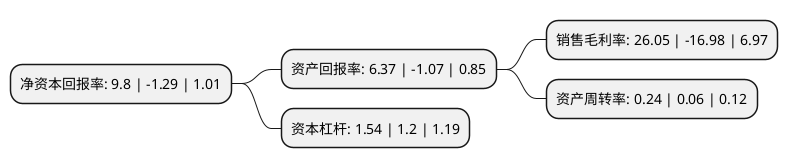

> 本页面由自动化程序生成于 2022年5月20日 01:32
> 内容可能存在错误，如有bug请提交issue至：https://github.com/Eroleice/doc-pi/issues
{.is-warning}

# 上市公司基本情况

## 基本资料

德力西新疆交通运输集团股份有限公司（以下简称“德新交运”）成立于2003年05月28日，乌鲁木齐市。于2017年01月05日在上交所主板上市。

德新交运注册资本16,733.8万元，主营业务:一直致力于道路旅客运输行业的经营，主要包括道路旅客运输业务和客运汽车站业务以下是详细信息：

- 公司名称: 德力西新疆交通运输集团股份有限公司
- 股票代码: 603032.SH
- 所在地: 新疆 - 乌鲁木齐市
- 成立日期: 2003年05月28日
- 注册资本: 16,733.8万元
- 法定代表人: 宋国强
- 主营业务: 主营业务:一直致力于道路旅客运输行业的经营，主要包括道路旅客运输业务和客运汽车站业务
- 公司官网: www.xjdxjy.com
- 公司介绍: 公司是新疆道路旅客运输行业骨干企业，是全国道路交通运输行业百强企业。主营国内国际道路旅客运输产业及多元化衍生产业---物流快递、冷藏运输、车辆维修、仓储服务等。经过多年的累积发展，已迅猛成长为自治区道路客运产业领军企业，位列全国道路交通运输行业百强榜单，名列自治区道路旅客运输行业首位。集团安全生产工作运行良好，累计投入更新车辆资金上亿元，调整优化和壮大车辆运力结构。投入上百万元资金创建了新疆首府地区客运企业首家GPS监控平台系统。全面导入质量管理体系认证，用体系标准规范管理。通过了新疆道路运输行业管理部门质量信誉考核，是交通运输企业安全生产标准化一级达标企业，安全三项指标均远远低于交通运输部颁布标准。

## 股东及高管情况

上市公司第一大股东为德力西新疆投资集团有限公司，持股80,000,020股，占比47.81%，为上市公司实际控制人。

截至2022年03月31日，上市公司的前十大股东中，共有5名自然人股东，2名机构股东，3个产品账户，其中5%以上大股东共有2名。上市公司前十大股东明细如下：

> 截至2022年03月31日，上市公司前十大股东信息如下：

| 股东名称 | 持股数量（股） | 持股比例 |
| --- | --- | --- |
| 德力西新疆投资集团有限公司 | 80,000,020 | 47.81% |
| 新疆维吾尔自治区国有资产投资经营有限责任公司 | 14,045,750 | 8.39% |
| 郑智仙 | 8,336,005 | 4.98% |
| 丁炳芝 | 6,585,945 | 3.94% |
| 冯建 | 2,488,300 | 1.49% |
| 何怡 | 2,464,300 | 1.47% |
| 中国银行股份有限公司-鹏华汇智优选混合型证券投资基金 | 2,362,760 | 1.41% |
| 中国银行股份有限公司-鹏华高质量增长混合型证券投资基金 | 1,852,980 | 1.11% |
| 付海民 | 1,605,500 | 0.96% |
| 中国建设银行股份有限公司-鹏华价值优势混合型证券投资基金(LOF) | 1,332,413 | 0.8% |

## 利润表分析

上市公司2021年总收入为2.71亿元，净利润为0.7亿元，实现盈利。

## 杜邦分析

> 数据列示周期：2021年 | 2020年 | 2019年
{.is-info}

上市公司的净资产收益率在近一年有所下降，下降幅度为-859.69%，其变化情况分解如下：
- 上市公司的销售毛利率在近一年下降了-253.42%，可能是生产效率的下降、商品原材料价格上涨或商品价格的下跌所致。
- 上市公司的资产周转率在近一年上升了300%，可能是源自于更快的销售回款或库存管理效果提升。
- 上市公司的财务杠杆比率在近一年上升了28.33%，可能是增加负债扩大生产规模。

