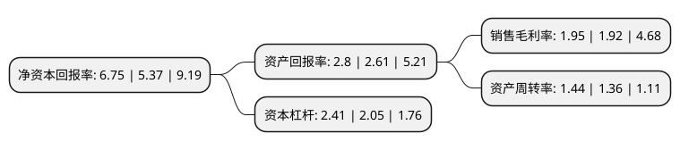

> 本页面由自动化程序生成于 2022年5月20日 01:32
> 内容可能存在错误，如有bug请提交issue至：https://github.com/Eroleice/doc-pi/issues
{.is-warning}

# 上市公司基本情况

## 基本资料

福达合金材料股份有限公司（以下简称“福达合金”）成立于1999年04月05日，温州市。于2018年05月17日在上交所主板上市。

福达合金注册资本13,762万元，公司的主营业务为电接触材料的研发，生产和销售，是我国电接触材料行业的领先企业。电接触材料被广泛应用于继电器，断路器，接触器，传感器，工业控制等产品。目前公司的主要产品为触头材料，复层触头及触头元件，能够为客户提供电接触材料一体化全面解决方案。以下是详细信息：

- 公司名称: 福达合金材料股份有限公司
- 股票代码: 603045.SH
- 所在地: 浙江 - 温州市
- 成立日期: 1999年04月05日
- 注册资本: 13,762万元
- 法定代表人: 王达武
- 主营业务: 公司的主营业务为电接触材料的研发，生产和销售，是我国电接触材料行业的领先企业电接触材料被广泛应用于继电器，断路器，接触器，传感器，工业控制等产品目前公司的主要产品为触头材料，复层触头及触头元件，能够为客户提供电接触材料一体化全面解决方案
- 公司官网: www.china-fuda.com
- 公司介绍: 公司创办于1994年，是一家集科研、生产、销售为一体的专业化电接触材料制造企业。公司主导产品包括触头材料、复层触头、触头组件三大系列，应用范围覆盖绝大部分涉及电接触的场合。公司产销量多年居行业首位，主要配套服务于正泰、德力西、宏发、ABB、施耐德、西门子等国内外客户。产品销往欧洲、美洲、亚洲等全球二十多个国家和地区。公司先后荣获：国家企业技术中心、国家知识产权优势企业、浙江省重点企业研究院、浙江省创新型示范企业、浙江省标准创新型企业等殊荣；三项产品列入国家火炬计划或国家重点新产品计划，多项成果荣获浙江省及温州市科技进步奖；公司先后通过了ISO9001质量管理体系、IATF16949质量管理体系、ISO14001环境管理体系、OHSAS18001职业健康安全管理体系的认证，以及CNAS认可实验室。通过了众多国内外知名企业的现场、体系、产线的审核，多次获得顾客授予的“优秀供应商”称号。

## 股东及高管情况

上市公司第一大股东为王达武，持股36,248,706股，占比26.34%，**疑似为**上市公司实际控制人。

截至2022年03月31日，上市公司的前十大股东中，共有8名自然人股东，1名机构股东，1个产品账户，其中5%以上大股东共有1名。上市公司前十大股东明细如下：

> 未能通过持股比例判定出上市公司实际控制人（持股30%以上）
> 可能存在通过间接持股、联合持股、协议控制等方式拥有实际控制权的主体，具体请参考上市公司定期公告！
{.is-warning}

> 截至2022年03月31日，上市公司前十大股东信息如下：

| 股东名称 | 持股数量（股） | 持股比例 |
| --- | --- | --- |
| 王达武 | 36,248,706 | 26.34% |
| 胡晓凯 | 2,885,300 | 2.1% |
| 林万焕 | 2,749,800 | 2% |
| 北京山证并购资本投资合伙企业(有限合伙) | 2,176,160 | 1.58% |
| 福达合金材料股份有限公司回购专用证券账户 | 2,174,845 | 1.58% |
| 钱朝斌 | 2,143,400 | 1.56% |
| 王中男 | 2,032,800 | 1.48% |
| 周士元 | 2,000,000 | 1.45% |
| 张奇敏 | 1,892,400 | 1.38% |
| 王烁烽 | 1,627,100 | 1.18% |

## 利润表分析

上市公司2021年总收入为29.31亿元，净利润为0.57亿元，实现盈利。

## 杜邦分析

> 数据列示周期：2021年 | 2020年 | 2019年
{.is-info}

上市公司的净资产收益率在近一年有所上升，上升幅度为25.7%，其变化情况分解如下：
- 上市公司的销售毛利率在近一年上升了1.56%，可能是生产效率的提升、商品原材料价格下跌或商品价格的上涨所致。
- 上市公司的资产周转率在近一年上升了5.88%，可能是源自于更快的销售回款或库存管理效果提升。
- 上市公司的财务杠杆比率在近一年上升了17.56%，可能是增加负债扩大生产规模。

