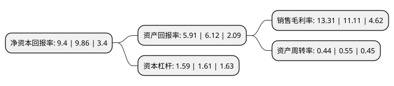

> 本页面由自动化程序生成于 2022年5月20日 01:32
> 内容可能存在错误，如有bug请提交issue至：https://github.com/Eroleice/doc-pi/issues
{.is-warning}

# 上市公司基本情况

## 基本资料

深圳市禾望电气股份有限公司（以下简称“禾望电气”）成立于2007年04月20日，深圳市。于2017年07月28日在上交所主板上市。

禾望电气注册资本43,660.3万元，主要业务包括风电变流器，太阳能光伏逆变器，通用型和工程型变频器等电力电子设备的研发，制造，销售和服务。主要产品:风电变流器，光伏逆变器，风电，光伏配套产品，电网监测设备，电气传动类产品。以下是详细信息：

- 公司名称: 深圳市禾望电气股份有限公司
- 股票代码: 603063.SH
- 所在地: 广东 - 深圳市
- 成立日期: 2007年04月20日
- 注册资本: 43,660.3万元
- 法定代表人: 韩玉
- 主营业务: 主要业务包括风电变流器，太阳能光伏逆变器，通用型和工程型变频器等电力电子设备的研发，制造，销售和服务主要产品:风电变流器，光伏逆变器，风电，光伏配套产品，电网监测设备，电气传动类产品
- 公司官网: www.hopewind.com
- 公司介绍: 公司专注于新能源和电气传动产品的研发、生产、销售和服务，主要产品包括风力发电产品、光伏发电产品和工业传动产品等，拥有完整的大功率电力电子装置及监控系统的自主开发及测试平台。公司通过技术和服务上的创新，不断为客户创造价值，现已成为国内新能源领域最具竞争力的电气企业之一。在新能源领域，禾望产品系列覆盖国内850kW～8.0MW风电变流器、3kW～1.25MW光伏逆变器及1.0MW～5.0MW光伏并网逆变房等主流机型；在工业传动领域，禾望提供0.4kW～60MW的传动成套解决方案，可广泛应用于冶金、石油、化工及其他各种工业应用场合；在电能质量改善和治理领域，禾望为您提供单机30kvar~40Mvar的APF、SVG和特种电源产品，其广泛应用于地铁、广电、冶金、石油、汽车制造、造纸、机房等多个领域和行业；在港口码头领域，禾望提供0.5kW～20MW的变频电源岸电系统，可广泛应用于大型港口、大型游轮码头以及各种专用码头的变频变压供电场合；在电动车行业，禾望提供4kW～20kW充电模块及30kW～320kW充电机，结合风光一体技术，可为城市交通提供清洁动力。

## 股东及高管情况

上市公司第一大股东为深圳市平启科技有限公司，持股87,019,400股，占比19.92%，**疑似为**上市公司实际控制人。

截至2022年03月31日，上市公司的前十大股东中，共有5名自然人股东，1名机构股东，4个产品账户，其中5%以上大股东共有2名。上市公司前十大股东明细如下：

> 未能通过持股比例判定出上市公司实际控制人（持股30%以上）
> 可能存在通过间接持股、联合持股、协议控制等方式拥有实际控制权的主体，具体请参考上市公司定期公告！
{.is-warning}

> 截至2022年03月31日，上市公司前十大股东信息如下：

| 股东名称 | 持股数量（股） | 持股比例 |
| --- | --- | --- |
| 深圳市平启科技有限公司 | 87,019,400 | 19.92% |
| 盛小军 | 31,836,000 | 7.29% |
| 招商银行股份有限公司-朱雀恒心一年持有期混合型证券投资基金 | 16,000,000 | 3.66% |
| 柳国英 | 13,612,000 | 3.12% |
| 朱雀基金-陕西煤业股份有限公司-陕煤朱雀新能源产业单一资产管理计划 | 10,500,000 | 2.4% |
| 吕一航 | 10,255,800 | 2.35% |
| 夏泉波 | 10,000,000 | 2.29% |
| 广发证券股份有限公司-朱雀企业优选股票型证券投资基金 | 8,753,602 | 2% |
| 招商银行股份有限公司-朱雀产业臻选混合型证券投资基金 | 8,168,450 | 1.87% |
| 周党生 | 6,660,443 | 1.52% |

## 利润表分析

上市公司2021年总收入为21.03亿元，净利润为2.79亿元，实现盈利。

## 杜邦分析

> 数据列示周期：2021年 | 2020年 | 2019年
{.is-info}

上市公司的净资产收益率在近一年有所下降，下降幅度为-4.67%，其变化情况分解如下：
- 上市公司的销售毛利率在近一年上升了19.8%，可能是生产效率的提升、商品原材料价格下跌或商品价格的上涨所致。
- 上市公司的资产周转率在近一年下降了-20%，可能是源自于更慢的销售回款或库存管理效果下降。
- 上市公司的财务杠杆比率在近一年下降了-1.24%，可能是减少负债降低财务费用。

