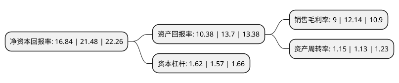

> 本页面由自动化程序生成于 2022年5月20日 01:32
> 内容可能存在错误，如有bug请提交issue至：https://github.com/Eroleice/doc-pi/issues
{.is-warning}

## 股东及高管情况

上市公司第一大股东为张孝金，持股84,000,000股，占比52.5%，为上市公司实际控制人。

截至2022年05月12日，上市公司的前十大股东中，共有5名自然人股东，3名机构股东，2个产品账户，其中5%以上大股东共有2名。上市公司前十大股东明细如下：

> 截至2022年05月12日，上市公司前十大股东信息如下：

| 股东名称 | 持股数量（股） | 持股比例 |
| --- | --- | --- |
| 张孝金 | 84,000,000 | 52.5% |
| 张孝保 | 16,000,000 | 10% |
| 张晨晨 | 8,000,000 | 5% |
| 徐州市铜山区众和商务信息服务中心(有限合伙) | 4,050,000 | 2.53% |
| 徐州市铜山区久泰商务信息服务中心(有限合伙) | 3,950,000 | 2.47% |
| 张孝玉 | 2,000,000 | 1.25% |
| 张孝银 | 2,000,000 | 1.25% |
| 甬兴证券有限公司 | 205,062 | 0.13% |
| 中国建设银行股份有限公司企业年金计划-中国工商银行股份有限公司 | 5,376 | 0.0034% |
| 中国石油化工集团公司企业年金计划-中国工商银行股份有限公司 | 4,992 | 0.0031% |

## 杜邦分析

> 数据列示周期：2021年 | 2020年 | 2019年
{.is-info}

上市公司的净资产收益率在近一年有所下降，下降幅度为-21.6%，其变化情况分解如下：
- 上市公司的销售毛利率在近一年下降了-25.86%，可能是生产效率的下降、商品原材料价格上涨或商品价格的下跌所致。
- 上市公司的资产周转率在近一年上升了1.77%，可能是源自于更快的销售回款或库存管理效果提升。
- 上市公司的财务杠杆比率在近一年上升了3.18%，可能是增加负债扩大生产规模。

