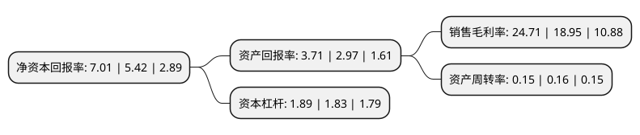

> 本页面由自动化程序生成于 2022年5月20日 01:32
> 内容可能存在错误，如有bug请提交issue至：https://github.com/Eroleice/doc-pi/issues
{.is-warning}

# 上市公司基本情况

## 基本资料

浙江芯能光伏科技股份有限公司（以下简称“芯能科技”）成立于2008年07月09日，嘉兴市。于2018年07月09日在上交所主板上市。

芯能科技注册资本50,000万元，分布式光伏解决方案提供，分布式光伏电站投资运营以及光伏产品研发，制造。以下是详细信息：

- 公司名称: 浙江芯能光伏科技股份有限公司
- 股票代码: 603105.SH
- 所在地: 浙江 - 嘉兴市
- 成立日期: 2008年07月09日
- 注册资本: 50,000万元
- 法定代表人: 张利忠
- 主营业务: 分布式光伏解决方案提供，分布式光伏电站投资运营以及光伏产品研发，制造
- 公司官网: www.sunorensolar.com
- 公司介绍: 公司成立于2008年，是国家级高新技术企业。公司深耕光伏行业多年，秉承“让天更蓝，水更淸，让生活更美好”的愿景，“依托以太阳能分布式为核心的清洁能源，向用户提供更高效、更便捷、更智慧的能源服务”使命，历经行业风雨洗礼，实现跨跃式发展，奠定了公司在分布式领域的领先地位。公司主营业务包括分布式光伏电站投资运营、分布式光伏解决方案提供以及光伏产品研发制造。旗下拥有数十家专注于分布式光伏电站投资运营的子公司和三大生产基地，业务覆盖华东、华南、华中等区域。公司将围绕分布式业务获取的客户群，结合物联网、大数据、云计算向公司主营业务相关方向延伸，积极探索光伏产业的新型经营模式，整合各项竞争优势，实现公司在新能源产业中的蓬勃发展。

## 股东及高管情况

上市公司第一大股东为海宁市正达经编有限公司，持股69,920,000股，占比13.98%，**疑似为**上市公司实际控制人。

截至2022年03月31日，上市公司的前十大股东中，共有6名自然人股东，4名机构股东，其中5%以上大股东共有5名。上市公司前十大股东明细如下：

> 未能通过持股比例判定出上市公司实际控制人（持股30%以上）
> 可能存在通过间接持股、联合持股、协议控制等方式拥有实际控制权的主体，具体请参考上市公司定期公告！
{.is-warning}

> 截至2022年03月31日，上市公司前十大股东信息如下：

| 股东名称 | 持股数量（股） | 持股比例 |
| --- | --- | --- |
| 海宁市正达经编有限公司 | 69,920,000 | 13.98% |
| 张利忠 | 49,280,000 | 9.86% |
| 杭州鼎晖新趋势股权投资合伙企业(有限合伙) | 36,526,000 | 7.31% |
| 张震豪 | 28,560,000 | 5.71% |
| 张文娟 | 25,200,000 | 5.04% |
| 戴建康 | 21,731,400 | 4.35% |
| 海宁市乾潮投资有限公司 | 12,600,000 | 2.52% |
| 潘国琦 | 7,500,000 | 1.5% |
| 张佳颖 | 5,000,000 | 1% |
| 泰康人寿保险有限责任公司-分红-个人分红-019L-FH002沪 | 4,880,900 | 0.98% |

## 利润表分析

上市公司2021年总收入为4.45亿元，净利润为1.1亿元，实现盈利。

## 杜邦分析

> 数据列示周期：2021年 | 2020年 | 2019年
{.is-info}

上市公司的净资产收益率在近一年有所上升，上升幅度为29.34%，其变化情况分解如下：
- 上市公司的销售毛利率在近一年上升了30.4%，可能是生产效率的提升、商品原材料价格下跌或商品价格的上涨所致。
- 上市公司的资产周转率在近一年下降了-6.25%，可能是源自于更慢的销售回款或库存管理效果下降。
- 上市公司的财务杠杆比率在近一年上升了3.28%，可能是增加负债扩大生产规模。

